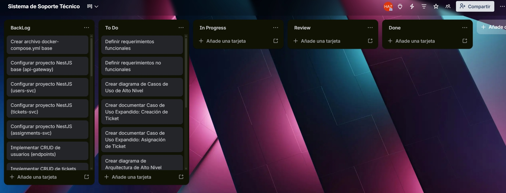

## Documentación Sprint - Fase 1 (Práctica 7 - Diseño y Documentación)

**📅 Inicio:** 01/04/2026 | **📅 Finalización:** 03/04/2026

---

## 📌 Sprint Planning

### Sprint Backlog

| No. | Tarea | Prioridad | Responsable | Estado |
|-----|-------|-----------|-------------|--------|
| 1 | Definir y documentar requerimientos funcionales | 🔴 Alta | 201908327 | To Do |
| 2 | Definir y documentar requerimientos no funcionales | 🔴 Alta | 201908327 | To Do |
| 3 | Crear diagrama de Casos de Uso de Alto Nivel | 🔴 Alta | 202106538 | To Do |
| 4 | Documentar Caso de Uso Expandido: Creación de Ticket | 🔴 Alta | 202106538 | To Do |
| 5 | Documentar Caso de Uso Expandido: Asignación de Ticket | 🔴 Alta | 202106538 | To Do |
| 6 | Crear diagrama de Arquitectura de Alto Nivel | 🔴 Alta | 201504070 | To Do |
| 7 | Crear diagrama de Despliegue | 🔴 Alta | 201504070 | To Do |
| 8 | Crear diagrama de Actividades | 🟠 Media | 201908327 | To Do |
| 9 | Crear diagrama de Secuencias | 🟠 Media | 202106538 | To Do |
| 10 | Diseñar Diagrama Entidad-Relación (ER) | 🔴 Alta | 201908327 | To Do |
| 11 | Justificación técnica del stack tecnológico | 🔴 Alta | 201504070 | To Do |
| 12 | Actualizar bitácora de actividades Sprint 1 | 🟠 Media | Equipo | To Do |
| 13 | Crear archivo docker-compose.yml base | 🟠 Media | 201908327 | BackLog |
| 14 | Configurar proyecto NestJS base (api-gateway) | 🔴 Alta | 201504070 | BackLog |
| 15 | Configurar proyecto NestJS (users-svc) | 🔴 Alta | 202106538 | BackLog |
| 16 | Configurar proyecto NestJS (tickets-svc) | 🔴 Alta | 201504070 | BackLog |
| 17 | Configurar proyecto NestJS (assignments-svc) | 🔴 Alta | 201908327 | BackLog |
| 18 | Implementar CRUD de usuarios (endpoints) | 🔴 Alta | 202106538 | BackLog |
| 19 | Implementar CRUD de tickets (endpoints) | 🔴 Alta | 201504070 | BackLog |
| 20 | Implementar CRUD de asignaciones (endpoints) | 🔴 Alta | 201908327 | BackLog |
| 21 | Configurar MySQL en Docker para users-svc | 🟠 Media | 202106538 | BackLog |
| 22 | Configurar MySQL en Docker para tickets-svc | 🟠 Media | 201504070 | BackLog |
| 23 | Configurar MySQL en Docker para assignments-svc | 🟠 Media | 202106538 | BackLog |
| 24 | Crear Dockerfile para api-gateway | 🟠 Media | 201908327 | BackLog |
| 25 | Crear Dockerfile para users-svc | 🟠 Media | 201908327 | BackLog |
| 26 | Crear Dockerfile para tickets-svc | 🟠 Media | 201908327 | BackLog |
| 27 | Crear Dockerfile para assignments-svc | 🟠 Media | 201908327 | BackLog |
| 28 | Configurar RabbitMQ en docker-compose.yml | 🟠 Media | 201908327 | BackLog |
| 29 | Implementar publicación de evento ticket.created | 🔵 Baja | 201504070 | BackLog |
| 30 | Implementar consumo de evento ticket.created en assignments-svc | 🔵 Baja | 201504070 | BackLog |
| 31 | Implementar autenticación JWT en api-gateway | 🔴 Alta | 201504070 | BackLog |
| 32 | Documentar evidencia de principios SOLID en README | 🟠 Media | 202106538 | BackLog |
| 33 | Actualizar bitácora de actividades Sprint 2 | 🟠 Media | Equipo | BackLog |
| 34 | Probar levantamiento completo con docker-compose up | 🔴 Alta | Equipo | BackLog |
| 35 | Preparar documentación final | 🔴 Alta | Equipo | BackLog |

---

### Tablero previo al inicio del sprint

---

## 📝 Daily Standup 1

**Fecha:** 01/04/2026

| Responsable | Qué se hizo el día anterior | Qué se hará el día actual | Impedimentos |
|-------------|----------------------------|---------------------------|--------------|
| **202106538** | Inicio del análisis de casos de uso y definición de actores principales | Completar diagrama de casos de uso de alto nivel | Tiempo limitado por otras tareas académicas |
| **201504070** |  |  |  |
| **201908327** |  |  |  |

---

## 📝 Daily Standup 2

**Fecha:** 02/04/2026

| Responsable | Qué se hizo el día anterior | Qué se hará el día actual | Impedimentos |
|-------------|----------------------------|---------------------------|--------------|
| **202106538** | Se completó el diagrama de casos de uso de alto nivel | Desarrollar casos de uso expandidos (Creación y Asignación de Ticket) + iniciar diagrama de secuencias | Ninguno |
| **201504070** |  |  |  |
| **201908327** |  |  |  |

---