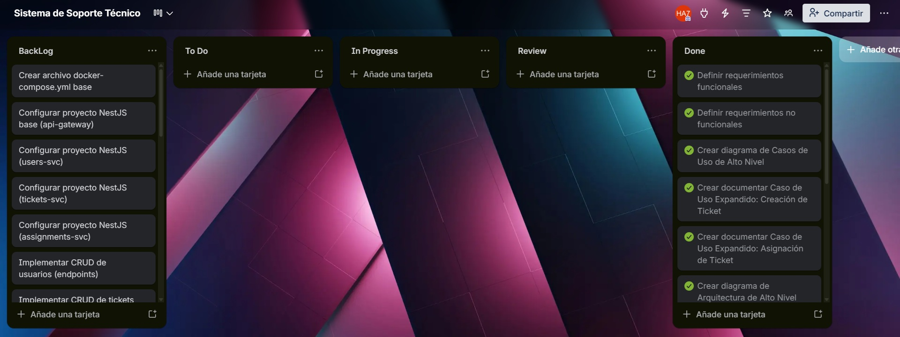

## Documentación Sprint - Fase 1 (Práctica 7 - Diseño y Documentación)

**📅 Inicio:** 01/04/2026 | **📅 Finalización:** 03/04/2026

---

## 📌 Sprint Planning

### Sprint Backlog

| No. | Tarea | Prioridad | Responsable | Estado |
|-----|-------|-----------|-------------|--------|
| 1 | Definir y documentar requerimientos funcionales | 🔴 Alta | 201908327 | To Do |
| 2 | Definir y documentar requerimientos no funcionales | 🔴 Alta | 201908327 | To Do |
| 3 | Crear diagrama de Casos de Uso de Alto Nivel | 🔴 Alta | 202106538 | To Do |
| 4 | Documentar Caso de Uso Expandido: Creación de Ticket | 🔴 Alta | 202106538 | To Do |
| 5 | Documentar Caso de Uso Expandido: Asignación de Ticket | 🔴 Alta | 202106538 | To Do |
| 6 | Crear diagrama de Arquitectura de Alto Nivel | 🔴 Alta | 201504070 | To Do |
| 7 | Crear diagrama de Despliegue | 🔴 Alta | 201504070 | To Do |
| 8 | Crear diagrama de Actividades | 🟠 Media | 201908327 | To Do |
| 9 | Crear diagrama de Secuencias | 🟠 Media | 202106538 | To Do |
| 10 | Diseñar Diagrama Entidad-Relación (ER) | 🔴 Alta | 201908327 | To Do |
| 11 | Justificación técnica del stack tecnológico | 🔴 Alta | 201504070 | To Do |
| 12 | Actualizar bitácora de actividades Sprint 1 | 🟠 Media | Equipo | To Do |
| 13 | Crear archivo docker-compose.yml base | 🟠 Media | 201908327 | BackLog |
| 14 | Configurar proyecto NestJS base (api-gateway) | 🔴 Alta | 201504070 | BackLog |
| 15 | Configurar proyecto NestJS (users-svc) | 🔴 Alta | 202106538 | BackLog |
| 16 | Configurar proyecto NestJS (tickets-svc) | 🔴 Alta | 201504070 | BackLog |
| 17 | Configurar proyecto NestJS (assignments-svc) | 🔴 Alta | 201908327 | BackLog |
| 18 | Implementar CRUD de usuarios (endpoints) | 🔴 Alta | 202106538 | BackLog |
| 19 | Implementar CRUD de tickets (endpoints) | 🔴 Alta | 201504070 | BackLog |
| 20 | Implementar CRUD de asignaciones (endpoints) | 🔴 Alta | 201908327 | BackLog |
| 21 | Configurar MySQL en Docker para users-svc | 🟠 Media | 202106538 | BackLog |
| 22 | Configurar MySQL en Docker para tickets-svc | 🟠 Media | 201504070 | BackLog |
| 23 | Configurar MySQL en Docker para assignments-svc | 🟠 Media | 202106538 | BackLog |
| 24 | Crear Dockerfile para api-gateway | 🟠 Media | 201908327 | BackLog |
| 25 | Crear Dockerfile para users-svc | 🟠 Media | 201908327 | BackLog |
| 26 | Crear Dockerfile para tickets-svc | 🟠 Media | 201908327 | BackLog |
| 27 | Crear Dockerfile para assignments-svc | 🟠 Media | 201908327 | BackLog |
| 28 | Configurar RabbitMQ en docker-compose.yml | 🟠 Media | 201908327 | BackLog |
| 29 | Implementar publicación de evento ticket.created | 🔵 Baja | 201504070 | BackLog |
| 30 | Implementar consumo de evento ticket.created en assignments-svc | 🔵 Baja | 201504070 | BackLog |
| 31 | Implementar autenticación JWT en api-gateway | 🔴 Alta | 201504070 | BackLog |
| 32 | Documentar evidencia de principios SOLID en README | 🟠 Media | 202106538 | BackLog |
| 33 | Actualizar bitácora de actividades Sprint 2 | 🟠 Media | Equipo | BackLog |
| 34 | Probar levantamiento completo con docker-compose up | 🔴 Alta | Equipo | BackLog |
| 35 | Preparar documentación final | 🔴 Alta | Equipo | BackLog |

---

### Tablero previo al inicio del sprint

---

## 📝 Daily Standup 1

**Fecha:** 01/04/2026

| Responsable | Qué se hizo el día anterior | Qué se hará el día actual | Impedimentos |
|-------------|----------------------------|---------------------------|--------------|
| **202106538** | Inicio del análisis de casos de uso y definición de actores principales | Completar diagrama de casos de uso de alto nivel | Tiempo limitado por otras tareas académicas |
| **201504070** | Investigación sobre arquitecturas de microservicios y tecnologías disponibles | Iniciar diseño de arquitectura de alto nivel | Ninguno |
| **201908327** | Inicio de análisis de requerimientos funcionales del sistema | Finalizar requerimientos funcionales | Falta claridad en algunos requerimientos no funcionales |

---

## 📝 Daily Standup 2

**Fecha:** 02/04/2026

| Responsable | Qué se hizo el día anterior | Qué se hará el día actual | Impedimentos |
|-------------|----------------------------|---------------------------|--------------|
| **202106538** | Se completó el diagrama de casos de uso de alto nivel | Desarrollar casos de uso expandidos (Creación y Asignación de Ticket) + iniciar diagrama de secuencias | Ninguno |
| **201504070** | Se avanzó parcialmente en la arquitectura de alto nivel | Finalizar arquitectura de alto nivel y comenzar diagrama de despliegue | Consultar ejemplo de topología en K3s |
| **201908327** | Se completaron los requerimientos funcionales | Finalizar requerimientos no funcionales y diseñar diagrama Entidad-Relación | Ninguno |

---

## 📝 Daily Standup 3

**Fecha:** 03/04/2026

| Responsable | Qué se hizo el día anterior | Qué se hará el día actual | Impedimentos |
|-------------|----------------------------|---------------------------|--------------|
| **202106538** | Se completaron los casos de uso expandidos (Creación y Asignación) | Finalizar diagrama de secuencias (mostrando eventos asíncronos) | Asegurar que el diagrama refleje correctamente RabbitMQ |
| **201504070** | Se finalizó el diagrama de arquitectura de alto nivel y se avanzó en despliegue | Terminar diagrama de despliegue y completar justificación técnica del stack | Ninguno |
| **201908327** | Se completaron los requerimientos no funcionales y el diagrama ER | Finalizar diagrama de actividades (flujo completo ticket) y actualizar bitácora del sprint | Ninguno |

---

## 🔄 Sprint Retrospective

| Integrante | ¿Qué se hizo bien durante el Sprint?                                                     | ¿Qué se hizo mal?                                                   | ¿Qué mejoras se deben implementar para el próximo sprint?      |
| ---------- | ---------------------------------------------------------------------------------------- | ------------------------------------------------------------------- | -------------------------------------------------------------- |
| 202106538  | Se lograron completar todos los diagramas asignados y hubo buena comunicación del equipo | Algunas tareas se retrasaron inicialmente por carga académica       | Mejorar la planificación del tiempo desde el inicio del sprint |
| 201504070  | Se completó correctamente la arquitectura y despliegue del sistema                       | El avance inicial fue lento debido a organización del equipo        | Definir prioridades claras desde el primer día                 |
| 201908327  | Se completaron todos los requerimientos y diagramas de apoyo                             | No se logró completar en menos días por falta de tiempo | Distribuir mejor las tareas y comenzar antes las actividades   |

---

### Imagen del tablero al finalizar el Sprint

[Link del tablero](https://trello.com/b/4MYI0zwc/sistema-de-soporte-tecnico)

---

## 📌 Resultado del Sprint Backlog

<table>
<tr>
<th>#</th>
<th>Tarea</th>
<th> Estado</th>
<th>Justificación </th>
</tr>

<tr><td>1</td><td>Definir y documentar requerimientos funcionales</td><td style="color: green;">Completado</td><td>Se completó en el segundo sprint tras ajustes iniciales</td></tr>
<tr><td>2</td><td>Definir y documentar requerimientos no funcionales</td><td style="color: green;">Completado</td><td>Finalizado en el tercer sprint</td></tr>
<tr><td>3</td><td>Crear diagrama de Casos de Uso de Alto Nivel</td><td style="color: green;">Completado</td><td>Completado en el segundo sprint</td></tr>
<tr><td>4</td><td>Crear Caso de Uso Expandido: Creación de Ticket</td><td style="color: green;">Completado</td><td>Finalizado en el tercer sprint</td></tr>
<tr><td>5</td><td>Crear Caso de Uso Expandido: Asignación de Ticket</td><td style="color: green;">Completado</td><td>Finalizado en el tercer sprint</td></tr>
<tr><td>6</td><td>Crear diagrama de Arquitectura de Alto Nivel</td><td style="color: green;">Completado</td><td>Completado en el segundo sprint</td></tr>
<tr><td>7</td><td>Crear diagrama de Despliegue</td><td style="color: green;">Completado</td><td>Finalizado en el tercer sprint</td></tr>
<tr><td>8</td><td>Crear diagrama de Actividades</td><td style="color: green;">Completado</td><td>Finalizado en el tercer sprint</td></tr>
<tr><td>9</td><td>Crear diagrama de Secuencias</td><td style="color: green;">Completado</td><td>Finalizado en el tercer sprint</td></tr>
<tr><td>10</td><td>Crear Diagrama Entidad-Relación</td><td style="color: green;">Completado</td><td>Completado en el tercer sprint</td></tr>
<tr><td>11</td><td>Justificación técnica del stack tecnológico</td><td style="color: green;">Completado</td><td>Finalizado en el tercer sprint</td></tr>
<tr><td>13</td><td>Actualizar bitácora de actividades Sprint 1</td><td style="color: green;">Completado</td><td>Se mantuvo actualizada durante todo el desarrollo</td></tr>

</table>