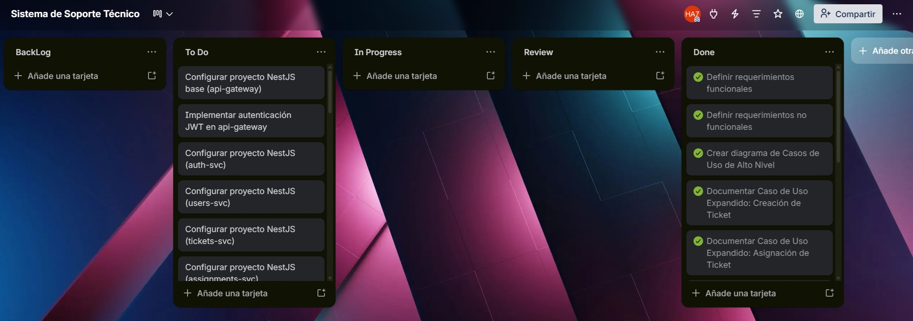

## Documentación Sprint - Fase 2 (Práctica 7 - Diseño y Documentación)

**📅 Inicio:** 04/04/2026 | **📅 Finalización:** 07/04/2026

---

## 📌 Sprint Planning

### Sprint Backlog

| No. | Tarea | Prioridad | Responsable | Estado |
|-----|-------|-----------|-------------|--------|
| 1 | Configurar proyecto NestJS base (api-gateway) | 🔴 Alta | 201504070 | To Do |
| 2 | Implementar autenticación JWT en api-gateway | 🔴 Alta | 201504070 | To Do |
| 3 | Configurar proyecto NestJS (auth-svc) | 🔴 Alta | 202106538 | To Do |
| 4 | Configurar proyecto NestJS (users-svc) | 🔴 Alta | 202106538 | To Do |
| 5 | Configurar proyecto NestJS (tickets-svc) | 🔴 Alta | 201504070 | To Do |
| 6 | Configurar proyecto NestJS (assignments-svc) | 🔴 Alta | 201908327 | To Do |
| 7 | Implementar CRUD de auth (endpoints) | 🔴 Alta | 202106538 | To Do |
| 8 | Implementar CRUD de usuarios (endpoints) | 🔴 Alta | 202106538 | To Do |
| 9 | Implementar CRUD de tickets (endpoints) | 🔴 Alta | 201504070 | To Do |
| 10 | Implementar CRUD de asignaciones (endpoints) | 🔴 Alta | 201908327 | To Do |
| 11 | Configurar MySQL en Docker para auth-svc | 🟠 Media | 202106538 | To Do |
| 12 | Configurar MySQL en Docker para users-svc | 🟠 Media | 202106538 | To Do |
| 13 | Configurar MySQL en Docker para tickets-svc | 🟠 Media | 201504070 | To Do |
| 14 | Configurar MySQL en Docker para assignments-svc | 🟠 Media | 202106538 | To Do |
| 15 | Crear Dockerfile para api-gateway | 🟠 Media | 201908327 | To Do |
| 16 | Crear Dockerfile para auth-svc | 🟠 Media | 201908327 | To Do |
| 17 | Crear Dockerfile para users-svc | 🟠 Media | 201908327 | To Do |
| 18 | Crear Dockerfile para tickets-svc | 🟠 Media | 201908327 | To Do |
| 19 | Crear Dockerfile para assignments-svc | 🟠 Media | 201908327 | To Do |
| 20 | Crear archivo docker-compose.yml base | 🟠 Media | 201908327 | To Do |
| 21 | Configurar RabbitMQ en docker-compose.yml | 🟠 Media | 201908327 | To Do |
| 22 | Implementar publicación de evento ticket.created | 🔵 Baja | 201504070 | To Do |
| 23 | Implementar consumo de evento ticket.created en assignments-svc | 🔵 Baja | 201504070 | To Do |
| 24 | Probar levantamiento completo con docker-compose up | 🔴 Alta | Equipo | To Do |
| 25 | Documentar evidencia de principios SOLID en README | 🟠 Media | 202106538 | To Do |
| 26 | Actualizar bitácora de actividades Sprint 2 | 🟠 Media | Equipo | To Do |
| 27 | Preparar documentación final | 🔴 Alta | Equipo | To Do |

---

## Tablero kanban previo al inicio del sprint

---

## 📝 Daily Standup 1

**Fecha:** 04/04/2026

| Responsable | Qué se hizo el día anterior | Qué se hará el día actual | Impedimentos |
|-------------|----------------------------|---------------------------|--------------|
| **202106538** | Se completó auth-svc, CRUD de users funcionando parcialmente | Terminar CRUD de usuarios + configurar MySQL para auth, users y assignments | Endpoint de registro no encripta contraseñas correctamente |
| **201504070** |  |  |  |
| **201908327** |  |  |  |

---

## 📝 Daily Standup 2

**Fecha:** 05/04/2026

| Responsable | Qué se hizo el día anterior | Qué se hará el día actual | Impedimentos |
|-------------|----------------------------|---------------------------|--------------|
| **202106538** | Se completaron auth-svc y users-svc, CRUD de auth funcionando parcialmente | Terminar CRUD de usuarios + configurar MySQL para auth, users y assignments | Endpoint de registro no encripta contraseñas correctamente |
| **201504070** |  |  |  |
| **201908327** |  |  |  |

---
