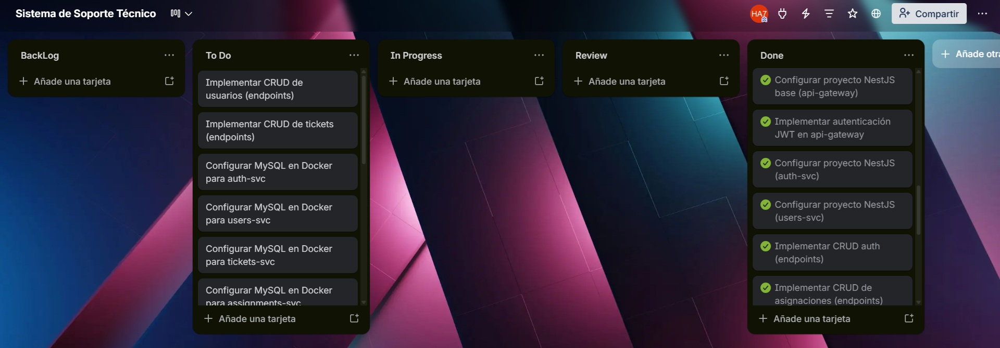
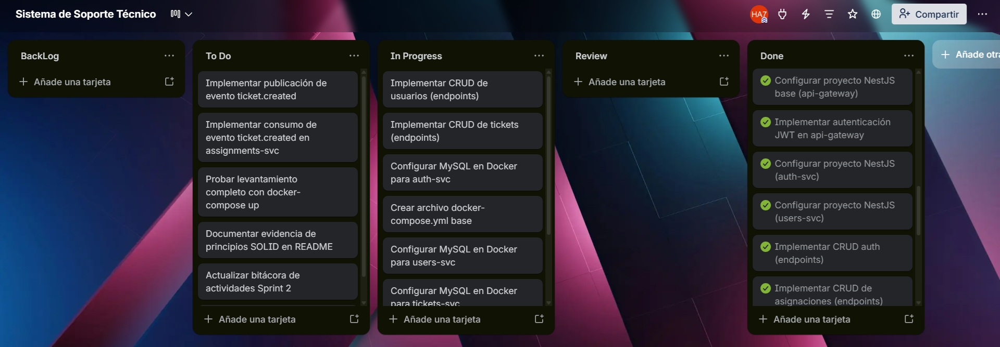
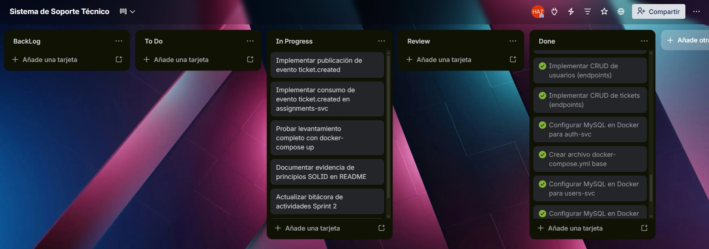
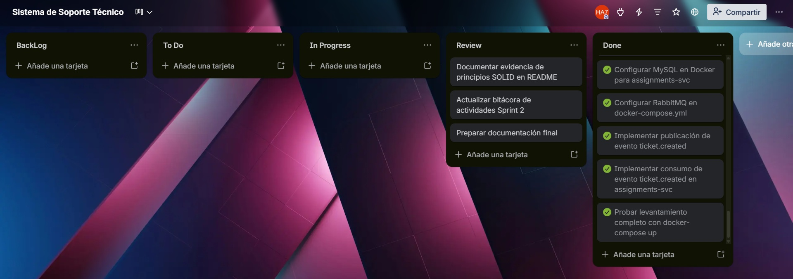
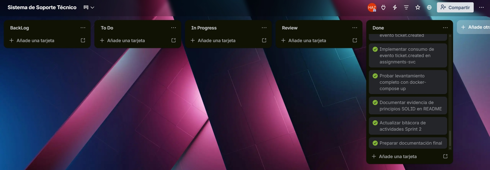

## Documentación Sprint - Fase 2 (Práctica 7 - Diseño y Documentación)

**📅 Inicio:** 04/04/2026 | **📅 Finalización:** 07/04/2026

---

## 📌 Sprint Planning

### Sprint Backlog

| No. | Tarea | Prioridad | Responsable | Estado |
|-----|-------|-----------|-------------|--------|
| 1 | Configurar proyecto NestJS base (api-gateway) | 🔴 Alta | 201504070 | To Do |
| 2 | Implementar autenticación JWT en api-gateway | 🔴 Alta | 201504070 | To Do |
| 3 | Configurar proyecto NestJS (auth-svc) | 🔴 Alta | 202106538 | To Do |
| 4 | Configurar proyecto NestJS (users-svc) | 🔴 Alta | 202106538 | To Do |
| 5 | Configurar proyecto NestJS (tickets-svc) | 🔴 Alta | 201504070 | To Do |
| 6 | Configurar proyecto NestJS (assignments-svc) | 🔴 Alta | 201908327 | To Do |
| 7 | Implementar CRUD de auth (endpoints) | 🔴 Alta | 202106538 | To Do |
| 8 | Implementar CRUD de usuarios (endpoints) | 🔴 Alta | 202106538 | To Do |
| 9 | Implementar CRUD de tickets (endpoints) | 🔴 Alta | 201504070 | To Do |
| 10 | Implementar CRUD de asignaciones (endpoints) | 🔴 Alta | 201908327 | To Do |
| 11 | Configurar MySQL en Docker para auth-svc | 🟠 Media | 202106538 | To Do |
| 12 | Configurar MySQL en Docker para users-svc | 🟠 Media | 202106538 | To Do |
| 13 | Configurar MySQL en Docker para tickets-svc | 🟠 Media | 201504070 | To Do |
| 14 | Configurar MySQL en Docker para assignments-svc | 🟠 Media | 202106538 | To Do |
| 15 | Crear Dockerfile para api-gateway | 🟠 Media | 201908327 | To Do |
| 16 | Crear Dockerfile para auth-svc | 🟠 Media | 201908327 | To Do |
| 17 | Crear Dockerfile para users-svc | 🟠 Media | 201908327 | To Do |
| 18 | Crear Dockerfile para tickets-svc | 🟠 Media | 201908327 | To Do |
| 19 | Crear Dockerfile para assignments-svc | 🟠 Media | 201908327 | To Do |
| 20 | Crear archivo docker-compose.yml base | 🟠 Media | 201908327 | To Do |
| 21 | Configurar RabbitMQ en docker-compose.yml | 🟠 Media | 201908327 | To Do |
| 22 | Implementar publicación de evento ticket.created | 🔵 Baja | 201504070 | To Do |
| 23 | Implementar consumo de evento ticket.created en assignments-svc | 🔵 Baja | 201504070 | To Do |
| 24 | Probar levantamiento completo con docker-compose up | 🔴 Alta | Equipo | To Do |
| 25 | Documentar evidencia de principios SOLID en README | 🟠 Media | 202106538 | To Do |
| 26 | Actualizar bitácora de actividades Sprint 2 | 🟠 Media | Equipo | To Do |
| 27 | Preparar documentación final | 🔴 Alta | Equipo | To Do |

---

## Tablero kanban previo al inicio del sprint

---

## 📝 Daily Standup 1

**Fecha:** 04/04/2026

| Responsable | Qué se hizo el día anterior | Qué se hará el día actual | Impedimentos |
|-------------|----------------------------|---------------------------|--------------|
| **202106538** | Revisión de la documentación del Sprint 1 y preparación del entorno de desarrollo | Configurar proyectos auth-svc y users-svc + iniciar CRUD de auth | Problemas con la versión de Node.js en el entorno local |
| **201504070** | Análisis de la integración entre api-gateway y los microservicios | Configurar api-gateway y tickets-svc + comenzar JWT | Ninguno |
| **201908327** | Estudio de docker-compose y RabbitMQ para eventos asíncronos | Crear CRUD de assignments-svc y crear Dockerfiles iniciales | Falta de claridad en la comunicación entre contenedores |

---

## Tablero kanban daily 1

---

## 📝 Daily Standup 2

**Fecha:** 05/04/2026

| Responsable | Qué se hizo el día anterior | Qué se hará el día actual | Impedimentos |
|-------------|----------------------------|---------------------------|--------------|
| **202106538** | Se completó auth-svc, CRUD de users funcionando parcialmente | Terminar CRUD de usuarios + configurar MySQL para auth, users y assignments | Endpoint de registro no encripta contraseñas correctamente |
| **201504070** | Api-gateway y tickets-svc configurados, JWT en progreso | Finalizar JWT + implementar CRUD de tickets, Configurar MySQL tickets | Conflictos de rutas entre api-gateway y auth-svc |
| **201908327** | Assignments-svc configurado, Dockerfiles creados para 4 servicios | Crear docker-compose.yml y configurar RabbitMQ | Ninguno |

---

## Tablero kanban daily 2

---

## 📝 Daily Standup 3

**Fecha:** 06/04/2026

| Responsable | Qué se hizo el día anterior | Qué se hará el día actual | Impedimentos |
|-------------|----------------------------|---------------------------|--------------|
| **202106538** | CRUD de usuarios completado, MySQL funcionando para auth, users y assignments | Documentar principios SOLID + actualizar bitácora | Algunos principios SOLID no se reflejan claramente en el código |
| **201504070** | JWT implementado y validado, CRUD de tickets listo, MySQL tickets terminado | Implementar evento ticket.created y su consumo en assignments-svc | RabbitMQ no reconoce la cola automáticamente |
| **201908327** | docker-compose.yml funcional, RabbitMQ corriendo | Probar levantamiento completo con docker-compose up + ajustes finales | El servicio assignments-svc no conecta con RabbitMQ |

---

## Tablero kanban daily 3

---

## 📝 Daily Standup 4

**Fecha:** 07/04/2026

| Responsable | Qué se hizo el día anterior | Qué se hará el día actual | Impedimentos |
|-------------|----------------------------|---------------------------|--------------|
| **202106538** | Documentación SOLID completada, bitácora actualizada | Preparar documentación final junto al equipo | Ninguno |
| **201504070** | Evento ticket.created publicado y consumido exitosamente | Validar integración completa y ayudar con documentación final | Ninguno |
| **201908327** | Se solucionó la conexión a RabbitMQ, levante completo exitoso | Ejecutar pruebas finales y preparar entrega | Ninguno |

---

## Tablero kanban daily 4

---

## 🔄 Sprint Retrospective

| Integrante | ¿Qué se hizo bien durante el Sprint? | ¿Qué se hizo mal? | ¿Qué mejoras se deben implementar para el próximo sprint? |
| ---------- | ------------------------------------ | ----------------- | --------------------------------------------------------- |
| 202106538 | Se logró configurar todos los servicios y CRUDs a tiempo | La documentación SOLID se dejó para el final, causando presión adicional | Documentar principios de diseño desde el inicio del desarrollo |
| 201504070 | La integración de JWT y eventos asíncronos con RabbitMQ funcionó correctamente | Hubo conflictos de rutas entre servicios que retrasaron tareas | Definir un estándar de rutas antes de comenzar a codificar |
| 201908327 | El levantamiento completo con docker-compose funcionó sin errores críticos | La configuración inicial de RabbitMQ fue confusa y consumió tiempo | Incluir ejemplos de configuración de colas en la documentación interna |

---

## Imagen del tablero kanban al finalizar el Sprint

[Link del tablero](https://trello.com/b/4MYI0zwc/sistema-de-soporte-tecnico)

---

## 📌 Resultado del Sprint Backlog

| # | Tarea | Estado | Justificación |
|---|-------|--------|----------------|
| 1 | Configurar proyecto NestJS base (api-gateway) | ✅ Completado | Finalizado el primer día del sprint |
| 2 | Implementar autenticación JWT en api-gateway | ✅ Completado | Completado el segundo día tras resolver conflictos de rutas |
| 3 | Configurar proyecto NestJS (auth-svc) | ✅ Completado | Finalizado el primer día del sprint |
| 4 | Configurar proyecto NestJS (users-svc) | ✅ Completado | Finalizado el primer día del sprint |
| 5 | Configurar proyecto NestJS (tickets-svc) | ✅ Completado | Finalizado el primer día del sprint |
| 6 | Configurar proyecto NestJS (assignments-svc) | ✅ Completado | Finalizado el primer día del sprint |
| 7 | Implementar CRUD de auth (endpoints) | ✅ Completado | Finalizado con ajustes menores en el segundo día |
| 8 | Implementar CRUD de usuarios (endpoints) | ✅ Completado | Finalizado el segundo día del sprint |
| 9 | Implementar CRUD de tickets (endpoints) | ✅ Completado | Finalizado el segundo día del sprint |
| 10 | Implementar CRUD de asignaciones (endpoints) | ✅ Completado | Finalizado el segundo día del sprint |
| 11 | Configurar MySQL en Docker para auth-svc | ✅ Completado | Finalizado el segundo día del sprint |
| 12 | Configurar MySQL en Docker para users-svc | ✅ Completado | Finalizado el segundo día del sprint |
| 13 | Configurar MySQL en Docker para tickets-svc | ✅ Completado | Finalizado el segundo día del sprint |
| 14 | Configurar MySQL en Docker para assignments-svc | ✅ Completado | Finalizado el segundo día del sprint |
| 15 | Crear Dockerfile para api-gateway | ✅ Completado | Finalizado el primer día del sprint |
| 16 | Crear Dockerfile para auth-svc | ✅ Completado | Finalizado el primer día del sprint |
| 17 | Crear Dockerfile para users-svc | ✅ Completado | Finalizado el primer día del sprint |
| 18 | Crear Dockerfile para tickets-svc | ✅ Completado | Finalizado el primer día del sprint |
| 19 | Crear Dockerfile para assignments-svc | ✅ Completado | Finalizado el primer día del sprint |
| 20 | Crear archivo docker-compose.yml base | ✅ Completado | Finalizado el tercer día del sprint |
| 21 | Configurar RabbitMQ en docker-compose.yml | ✅ Completado | Finalizado el tercer día del sprint |
| 22 | Implementar publicación de evento ticket.created | ✅ Completado | Finalizado el tercer día del sprint |
| 23 | Implementar consumo de evento ticket.created en assignments-svc | ✅ Completado | Finalizado el tercer día del sprint |
| 24 | Probar levantamiento completo con docker-compose up | ✅ Completado | Finalizado el cuarto día del sprint |
| 25 | Documentar evidencia de principios SOLID en README | ✅ Completado | Finalizado el tercer día del sprint |
| 26 | Actualizar bitácora de actividades Sprint 2 | ✅ Completado | Se mantuvo actualizada durante todo el desarrollo |
| 27 | Preparar documentación final | ✅ Completado | Finalizado el cuarto día del sprint |