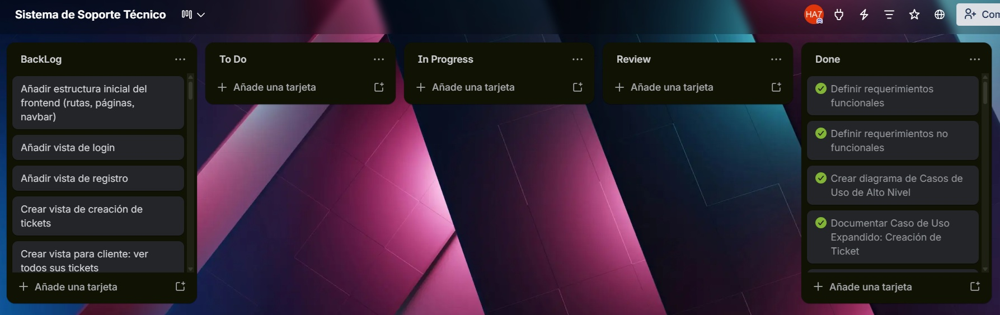
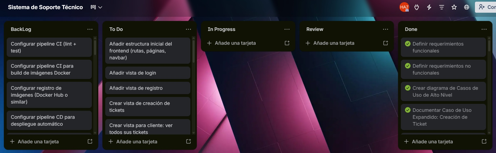
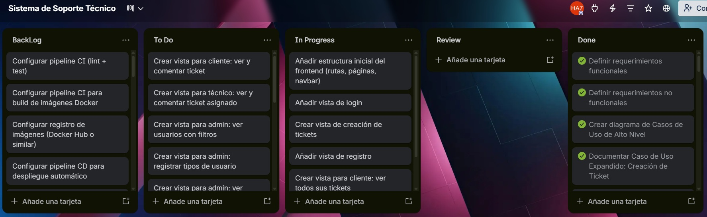
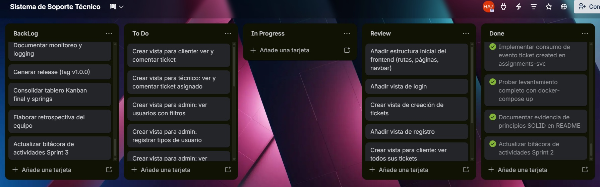
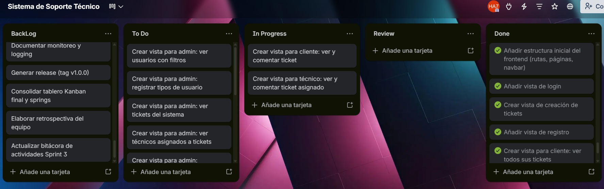
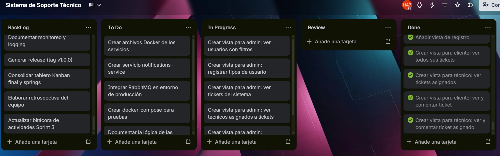
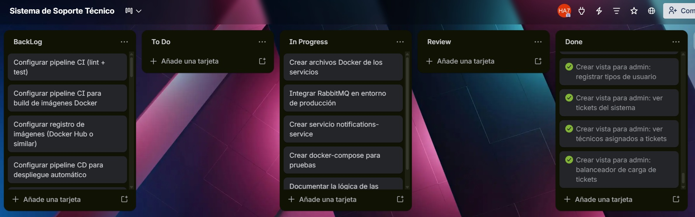
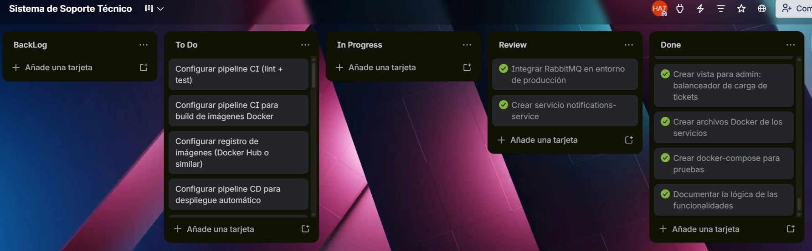
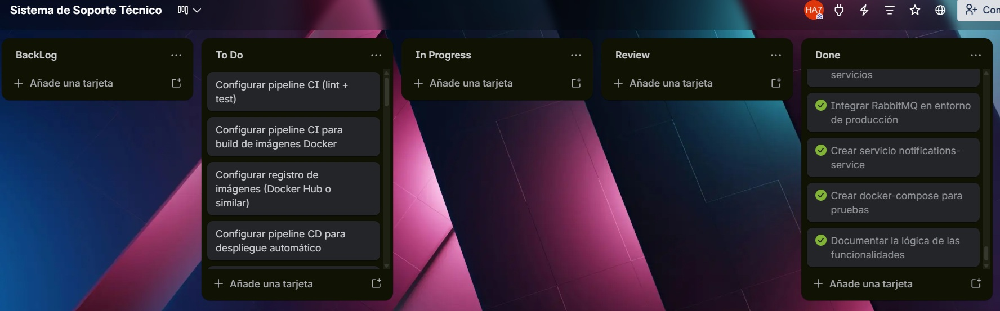

## Documentación Sprint - Fase 2 (Práctica 7 - Diseño y Documentación)

**📅 Inicio:** 12/04/2026 | **📅 Finalización:** 22/04/2026

---

## 📌 Sprint Planning

## Tablero kanban con el backlog de las tareas

### 📋 Sprint Backlog

| No. | Tarea | Prioridad | Responsable | Estado |
|:---:|-------|:---------:|:-----------:|:------:|
| 1 | Añadir estructura inicial del frontend (rutas, páginas, navbar) | 🔴 Alta | 201504070 | To Do |
| 2 | Añadir vista de login | 🔴 Alta | 201504070 | To Do |
| 3 | Añadir vista de registro | 🔴 Alta | 201504070 | To Do |
| 4 | Crear vista de creación de tickets | 🔴 Alta | 201504070 | To Do |
| 5 | Crear vista para cliente: ver todos sus tickets | 🟠 Media | 201504070 | To Do |
| 6 | Crear vista para cliente: ver y comentar ticket | 🟠 Media | 201504070 | To Do |
| 7 | Crear vista para técnico: ver tickets asignados | 🟠 Media | 201504070 | To Do |
| 8 | Crear vista para técnico: ver y comentar ticket asignado | 🟠 Media | 201504070 | To Do |
| 9 | Crear vista para admin: ver usuarios con filtros | 🔵 Baja | 201504070 | To Do |
| 10 | Crear vista para admin: registrar tipos de usuario | 🟠 Media | 201504070 | To Do |
| 11 | Crear vista para admin: ver tickets del sistema | 🟠 Media | 201504070 | To Do |
| 12 | Crear vista para admin: ver técnicos asignados a tickets | 🔵 Baja | 201504070 | To Do |
| 13 | Crear vista para admin: balanceador de carga de tickets | 🔴 Alta | 201504070 | To Do |
| 14 | Crear archivos Docker de los servicios | 🔴 Alta | 201504070 | To Do |
| 15 | Crear servicio notifications-service | 🔴 Alta | 201504070 | To Do |
| 16 | Integrar RabbitMQ en entorno de producción | 🔴 Alta | 201504070 | To Do |
| 17 | Crear docker-compose para pruebas | 🔴 Alta | 201504070 | To Do |
| 18 | Documentar la lógica de las funcionalidades | 🔵 Baja | 201504070 | To Do |
| 19 | Configurar pipeline CI (lint + test) | 🔴 Alta | 202106538 | To Do |
| 20 | Configurar pipeline CI para build de imágenes Docker | 🔴 Alta | 202106538 | To Do |
| 21 | Configurar registro de imágenes (Docker Hub o similar) | 🔴 Alta | 202106538 | To Do |
| 22 | Configurar pipeline CD para despliegue automático | 🔴 Alta | 202106538 | To Do |
| 23 | Configurar triggers de pipeline (push, PR) | 🔵 Baja | 202106538 | To Do |
| 24 | Configurar clúster K3s/Kubernetes | 🔴 Alta | 201908327 | To Do |
| 25 | Crear manifiestos Kubernetes (Deployments) | 🔴 Alta | 201908327 | To Do |
| 26 | Crear Services (ClusterIP/NodePort) | 🔴 Alta | 201908327 | To Do |
| 27 | Configurar Ingress Controller | 🔴 Alta | 201908327 | To Do |
| 28 | Configurar variables de entorno (Secrets/ConfigMaps) | 🔴 Alta | 201908327 | To Do |
| 29 | Desplegar microservicios en Kubernetes | 🔴 Alta | 201908327 | To Do |
| 30 | Validar comunicación entre microservicios | 🔴 Alta | 201908327 | To Do |
| 31 | Desplegar Prometheus en el clúster | 🟠 Media | 202106538 | To Do |
| 32 | Configurar recolección de métricas | 🟠 Media | 202106538 | To Do |
| 33 | Desplegar Grafana | 🟠 Media | 202106538 | To Do |
| 34 | Crear dashboard de métricas (CPU, RAM, tráfico) | 🔵 Baja | 202106538 | To Do |
| 35 | Configurar sistema de logging (ELK o similar) | 🟠 Media | 201908327 | To Do |
| 36 | Centralizar logs de microservicios | 🟠 Media | 201908327 | To Do |
| 37 | Configurar visualización en Kibana | 🔵 Baja | 201908327 | To Do |
| 38 | Configurar dominio o IP pública del sistema | 🔴 Alta | 201908327 | To Do |
| 39 | Pruebas de despliegue completo (end-to-end) | 🔴 Alta | 202106538 | To Do |
| 40 | Validar CI/CD automático con cambios reales | 🔴 Alta | 202106538 | To Do |
| 41 | Documentar pipelines CI/CD | 🔵 Baja | 202106538 | To Do |
| 42 | Documentar arquitectura final desplegada | 🟠 Media | 201908327 | To Do |
| 43 | Documentar monitoreo y logging | 🔵 Baja | 202106538 | To Do |
| 44 | Generar release (tag v1.0.0) | 🟠 Media | 202106538 | To Do |
| 45 | Consolidar tablero Kanban final y springs | 🔵 Baja | Todos | To Do |
| 46 | Elaborar retrospectiva del equipo | 🔵 Baja | Todos | To Do |

---

## Tablero kanban previo al inicio del sprint

---

## 📝 Daily Standup 1

**Fecha:** 12/04/2026

| Responsable | Qué se hizo el día anterior | Qué se hará el día actual | No. Tarea | Impedimentos |
|-------------|-----------------------------|---------------------------|-----------|--------------|
| **201504070** | Lectura y entendimiento del proyecto | Añadir estructura inicial del frontend, vistas para login, registro, cliente y técnico | 1, 2, 3, 4, 7 | Ninguno |

## Tablero kanban daily 1

---

## 📝 Daily Standup 2

**Fecha:** 13/04/2026

| Responsable | Qué se hizo el día anterior | Qué se hará el día actual | No. Tarea | Impedimentos |
|-------------|-----------------------------|---------------------------|-----------|--------------|
| **201504070** | Añadir estructura inicial del frontend, vistas para login, registro, cliente y técnico | Corregir fallos en algunas funcionalidades | 1, 2, 3, 4, 7 | Falta de tiempo |

## Tablero kanban daily 2

---

## 📝 Daily Standup 3

**Fecha:** 14/04/2026

| Responsable | Qué se hizo el día anterior | Qué se hará el día actual | No. Tarea | Impedimentos |
|-------------|-----------------------------|---------------------------|-----------|--------------|
| **201504070** | Corregir fallos en algunas funcionalidades | Crear vista para cliente y técnico: ver y comentar ticket | 6 y 8 | Ninguno |

## Tablero kanban daily 3

---

## 📝 Daily Standup 4

**Fecha:** 17/04/2026

| Responsable | Qué se hizo el día anterior | Qué se hará el día actual | No. Tarea | Impedimentos |
|-------------|-----------------------------|---------------------------|-----------|--------------|
| **201504070** | Crear vista para cliente y técnico: ver y comentar ticket | Crear vista para admin: ver usuarios con filtros, Crear vista para admin: registrar tipos de usuario, Crear vista para admin: ver tickets del sistema, Crear vista para admin: ver técnicos asignados a tickets, Crear vista para admin: balanceador de carga de tickets | 9, 10, 11, 12, 13 | Ninguno |

## Tablero kanban daily 4

---

## 📝 Daily Standup 5

**Fecha:** 17/04/2026

| Responsable | Qué se hizo el día anterior | Qué se hará el día actual | No. Tarea | Impedimentos |
|-------------|-----------------------------|---------------------------|-----------|--------------|
| **201504070** | Crear vista para admin: ver usuarios con filtros, Crear vista para admin: registrar tipos de usuario, Crear vista para admin: ver tickets del sistema, Crear vista para admin: ver técnicos asignados a tickets, Crear vista para admin: balanceador de carga de tickets | Crear archivos Docker de los servicios, Crear servicio notifications-service, Integrar RabbitMQ en entorno de producción, Crear docker-compose para pruebas y Documentar la lógica de las funcionalidades | 14, 15, 16, 17 y 18 | Ninguno |

## Tablero kanban daily 5

---

## 📝 Daily Standup 6

**Fecha:** 18/04/2026

| Responsable | Qué se hizo el día anterior | Qué se hará el día actual | No. Tarea | Impedimentos |
|-------------|-----------------------------|---------------------------|-----------|--------------|
| **201504070** | Crear archivos Docker de los servicios, Crear servicio notifications-service, Integrar RabbitMQ en entorno de producción, Crear docker-compose para pruebas y Documentar la lógica de las funcionalidades | Correcciones de envío de correos | 15, 16 | Ninguno |

## Tablero kanban daily 6

---

## 📝 Daily Standup 7

**Fecha:** 20/04/2026

| Responsable | Qué se hizo el día anterior | Qué se hará el día actual | No. Tarea | Impedimentos |
|-------------|-----------------------------|---------------------------|-----------|--------------|
| **202106538** |  |  |  | Ninguno |
| **201908327** |  |  |  | Ninguno |

## Tablero kanban daily 7

---

