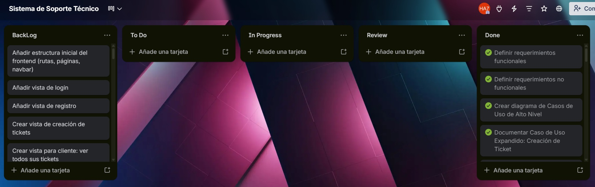
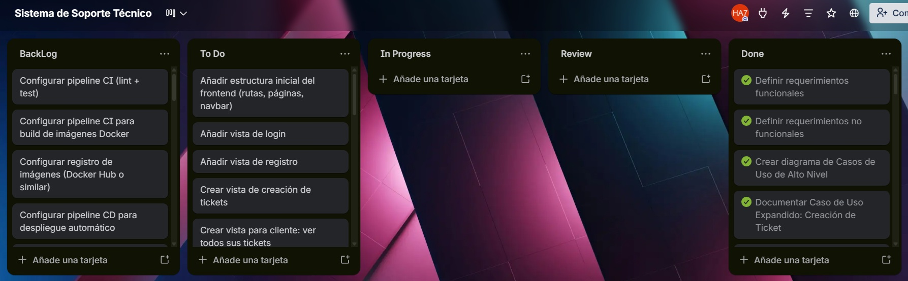
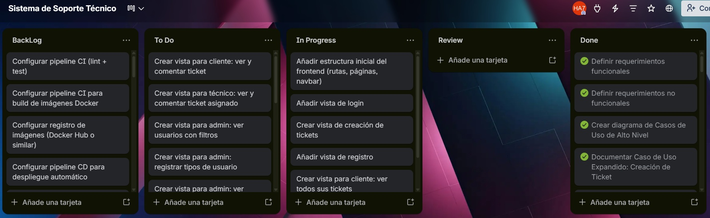
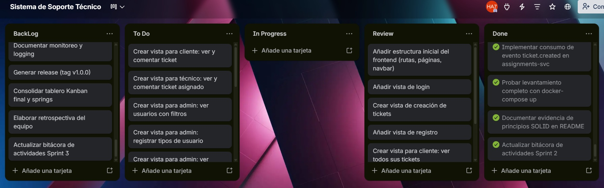
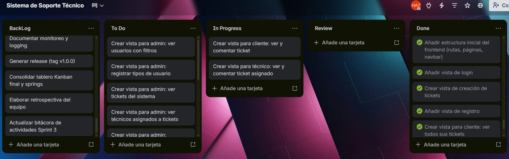
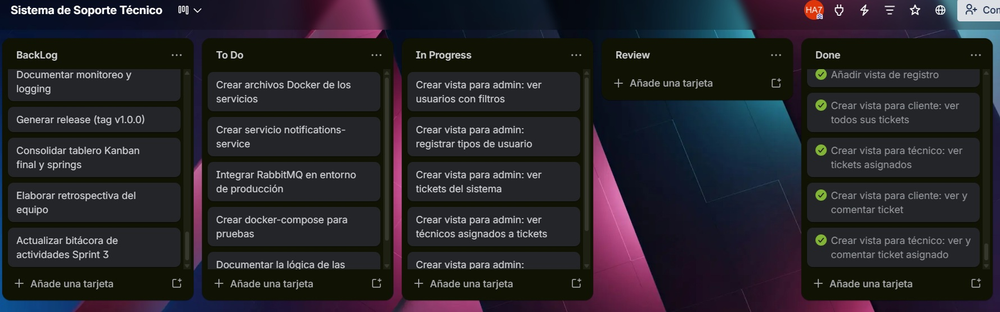
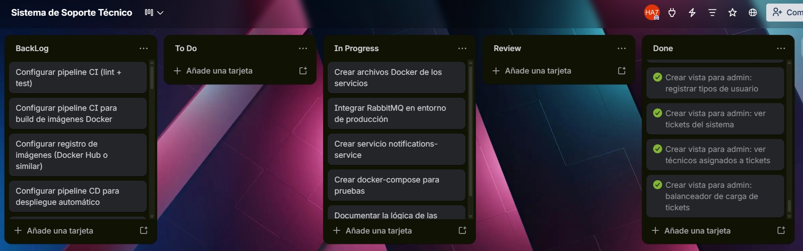
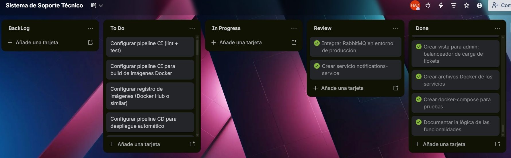
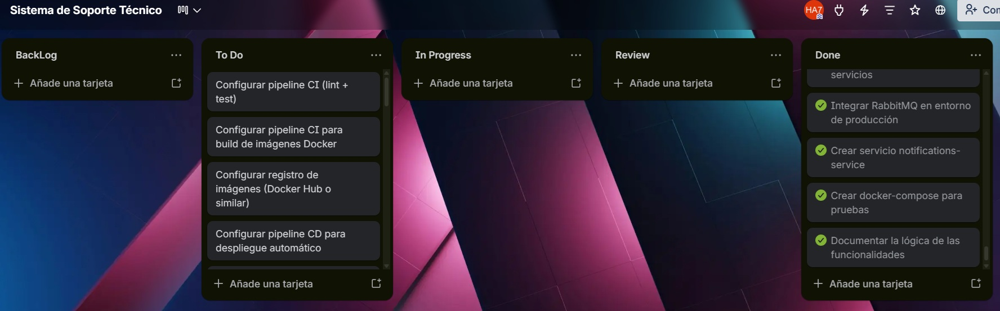
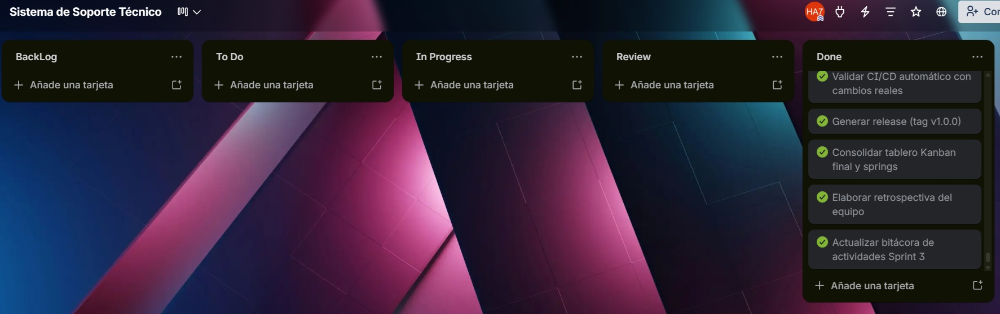

## Documentación Sprint - Fase 2 (Práctica 7 - Diseño y Documentación)

**📅 Inicio:** 12/04/2026 | **📅 Finalización:** 22/04/2026

---

## 📌 Sprint Planning

## Tablero kanban con el backlog de las tareas

### 📋 Sprint Backlog

| No. | Tarea | Prioridad | Responsable | Estado |
|:---:|-------|:---------:|:-----------:|:------:|
| 1 | Añadir estructura inicial del frontend (rutas, páginas, navbar) | 🔴 Alta | 201504070 | To Do |
| 2 | Añadir vista de login | 🔴 Alta | 201504070 | To Do |
| 3 | Añadir vista de registro | 🔴 Alta | 201504070 | To Do |
| 4 | Crear vista de creación de tickets | 🔴 Alta | 201504070 | To Do |
| 5 | Crear vista para cliente: ver todos sus tickets | 🟠 Media | 201504070 | To Do |
| 6 | Crear vista para cliente: ver y comentar ticket | 🟠 Media | 201504070 | To Do |
| 7 | Crear vista para técnico: ver tickets asignados | 🟠 Media | 201504070 | To Do |
| 8 | Crear vista para técnico: ver y comentar ticket asignado | 🟠 Media | 201504070 | To Do |
| 9 | Crear vista para admin: ver usuarios con filtros | 🔵 Baja | 201504070 | To Do |
| 10 | Crear vista para admin: registrar tipos de usuario | 🟠 Media | 201504070 | To Do |
| 11 | Crear vista para admin: ver tickets del sistema | 🟠 Media | 201504070 | To Do |
| 12 | Crear vista para admin: ver técnicos asignados a tickets | 🔵 Baja | 201504070 | To Do |
| 13 | Crear vista para admin: balanceador de carga de tickets | 🔴 Alta | 201504070 | To Do |
| 14 | Crear archivos Docker de los servicios | 🔴 Alta | 201504070 | To Do |
| 15 | Crear servicio notifications-service | 🔴 Alta | 201504070 | To Do |
| 16 | Integrar RabbitMQ en entorno de producción | 🔴 Alta | 201504070 | To Do |
| 17 | Crear docker-compose para pruebas | 🔴 Alta | 201504070 | To Do |
| 18 | Documentar la lógica de las funcionalidades | 🔵 Baja | 201504070 | To Do |
| 19 | Configurar pipeline CI (lint + test) | 🔴 Alta | 202106538 | To Do |
| 20 | Configurar pipeline CI para build de imágenes Docker | 🔴 Alta | 202106538 | To Do |
| 21 | Configurar registro de imágenes (Docker Hub o similar) | 🔴 Alta | 202106538 | To Do |
| 22 | Configurar pipeline CD para despliegue automático | 🔴 Alta | 202106538 | To Do |
| 23 | Configurar triggers de pipeline (push, PR) | 🔵 Baja | 202106538 | To Do |
| 24 | Configurar clúster K3s/Kubernetes | 🔴 Alta | 201908327 | To Do |
| 25 | Crear manifiestos Kubernetes (Deployments) | 🔴 Alta | 201908327 | To Do |
| 26 | Crear Services (ClusterIP/NodePort) | 🔴 Alta | 201908327 | To Do |
| 27 | Configurar Ingress Controller | 🔴 Alta | 201908327 | To Do |
| 28 | Configurar variables de entorno (Secrets/ConfigMaps) | 🔴 Alta | 201908327 | To Do |
| 29 | Desplegar microservicios en Kubernetes | 🔴 Alta | 201908327 | To Do |
| 30 | Validar comunicación entre microservicios | 🔴 Alta | 201908327 | To Do |
| 31 | Desplegar Prometheus en el clúster | 🟠 Media | 202106538 | To Do |
| 32 | Configurar recolección de métricas | 🟠 Media | 202106538 | To Do |
| 33 | Desplegar Grafana | 🟠 Media | 202106538 | To Do |
| 34 | Crear dashboard de métricas (CPU, RAM, tráfico) | 🔵 Baja | 202106538 | To Do |
| 35 | Configurar sistema de logging (ELK o similar) | 🟠 Media | 201908327 | To Do |
| 36 | Centralizar logs de microservicios | 🟠 Media | 201908327 | To Do |
| 37 | Configurar visualización en Kibana | 🔵 Baja | 201908327 | To Do |
| 38 | Configurar dominio o IP pública del sistema | 🔴 Alta | 201908327 | To Do |
| 39 | Pruebas de despliegue completo (end-to-end) | 🔴 Alta | 202106538 | To Do |
| 40 | Validar CI/CD automático con cambios reales | 🔴 Alta | 202106538 | Test |
| 41 | Documentar pipelines CI/CD | 🔵 Baja | 202106538 | To Do |
| 42 | Documentar arquitectura final desplegada | 🟠 Media | 201908327 | To Do |
| 43 | Documentar monitoreo y logging | 🔵 Baja | 202106538 | To Do |
| 44 | Generar release (tag v1.0.0) | 🟠 Media | 202106538 | To Do |
| 45 | Consolidar tablero Kanban final y springs | 🔵 Baja | Todos | To Do |
| 46 | Elaborar retrospectiva del equipo | 🔵 Baja | Todos | To Do |

---

## Tablero kanban previo al inicio del sprint

---

## 📝 Daily Standup 1

**Fecha:** 16/04/2026

| Responsable | Qué se hizo el día anterior | Qué se hará el día actual | Impedimentos |
|-------------|-----------------------------|---------------------------|--------------|
| **201504070** | Lectura y entendimiento de la practica 10 | Testear estructura inicial del frontend, vistas para login, registro, cliente y técnico  Ninguno |
| **202106538** | Practica 9 | Avances con terraform | Ninguno |
| **201908327** | Practica 9 | Configuracion de kubernetes | Estamos intentando ver una situacion con el despliegue|

## Tablero kanban daily 1

---

## 📝 Daily Standup 2

**Fecha:** 17/04/2026

| Responsable | Qué se hizo el día anterior | Qué se hará el día actual | Impedimentos |
|-------------|----------------------------|---------------------------|--------------|
| **202106538** | Inicio de terraform | Creacion de archivos .tf  necesarios | Ninguno |
| **201504070** |Testear estructura inicial del frontend | Testeo completo, prueba E2E del servicio  | No logramos probarlo por fallos en kubernetes |
| **201908327** |Configuracion de kubernetes | Seguir con la configuracion | No logramos avanzar con la situación del despliegue|

## Tablero kanban daily 2

---

## 📝 Daily Standup 3

**Fecha:** 18/04/2026

| Responsable | Qué se hizo el día anterior | Qué se hará el día actual | Impedimentos |
|-------------|----------------------------|---------------------------|--------------|
| **202106538** | No hubo mayor avance | Se inicio con los jobs de CI | Ninguno |
| **201504070** |Ninguno | Se dio inicio a las configuraciones del CD de despliegue continuo  | No logramos probarlo por fallos en kubernetes |
| **201908327** | No se hizo ninguna tarea | Investigar | No logramos avanzar con la situación del despliegue|

## Tablero kanban daily 3

---

## 📝 Daily Standup 4

**Fecha:** 19/04/2026

| Responsable | Qué se hizo el día anterior | Qué se hará el día actual | Impedimentos |
|-------------|----------------------------|---------------------------|--------------|
| **202106538** | No hubo mayor avance | Se inicio con los jobs de CI | Ninguno |
| **201504070** |Ninguno | Se dio inicio a las configuraciones del CD de despliegue continuo  | No logramos probarlo por fallos en kubernetes |
| **201908327** | No se hizo ninguna tarea | Investigar | No logramos avanzar con la situación del despliegue|

## Tablero kanban daily 4

---

## 📝 Daily Standup 5

**Fecha:** 20/04/2026

| Responsable | Qué se hizo el día anterior | Qué se hará el día actual | Impedimentos |
|-------------|----------------------------|---------------------------|--------------|
| **202106538** | Se inicio con los jobs de CI | Completar el CD | No logramos probarlo por fallos en kubernetes |
| **201504070** | Se dio inicio a las configuraciones del CD de despliegue continuo | Terminar el CD | No logramos probarlo por fallos en kubernetes |
| **201908327** | Investigaciones | Intentar solucionar el problema con kubernetes | No logramos avanzar con la situación del despliegue|

## Tablero kanban daily 5

---

## 📝 Daily Standup 6

**Fecha:** 21/04/2026

| Responsable | Qué se hizo el día anterior | Qué se hará el día actual | Impedimentos |
|-------------|----------------------------|---------------------------|--------------|
| **202106538** | Se completó el espacio para integración continua | Esperar a solucionar el problema con kubernetes | No logramos probarlo por fallos en kubernetes |
| **201504070** | Se finalizao con los job spara el CD de despliegue continuo | Esperar a solucionar el problema con kubernetes | No logramos probarlo por fallos en kubernetes |
| **201908327** | Sin avances | Intentar solucionar el problema con kubernetes | No logramos avanzar con la situación del despliegue|

## Tablero kanban daily 6

---

## 📝 Daily Standup 7

**Fecha:** 22/04/2026

| Responsable | Qué se hizo el día anterior | Qué se hará el día actual | No. Tarea | Impedimentos |
|-------------|-----------------------------|---------------------------|-----------|--------------|
| **202106538** |  |  |  | Ninguno |
| **201908327** |  |  |  | Ninguno |

## Tablero kanban daily 7

---

---

## Imagen del tablero kanban al finalizar el Sprint

[Link del tablero](https://trello.com/b/4MYI0zwc/sistema-de-soporte-tecnico)

---

## 🔄 Sprint Retrospective

| Integrante | ¿Qué se hizo bien durante el Sprint? | ¿Qué se hizo mal? | ¿Qué mejoras se deben implementar para el próximo sprint? |
| ---------- | ------------------------------------ | ----------------- | --------------------------------------------------------- |
| **202106538** | Creacion del espacio de CI | No se logró poner a prueba por falta de tiempo | DTener un plan B por si algo falla |
| **201504070** | Completacionde comandos de CD | No se logró poner a prueba por falta de tiempo | Establecer una breve reunión diaria (Daily) para reportar impedimentos |
| **201908327** | Trabajo en equipo y comunicación de las adversidades en cuanto al proyecto | No logré realizar el monitoreo por falta de tiempo. | Organizar mejor el tiempo con otros trabajos para evitar faltas de avance |

---

## 📌 Resultado del Sprint Backlog

| # | Tarea | Estado | Justificación |
|---|-------|--------|----------------|
| 1 | Integración continua | Incompleto | Elaborado más no probado por faltas |
| 2 | Despliegue Continup | Incompleto | No se logró realizar por falta de tiempo |
| 3 | Monitoroeo y observabilidad| Incompleto | No se logró realizar por falta de tiempo |
| 4 | Documentacion final | Completo | Finalizado el 20/04 tras correcciones de funcionalidad |

---