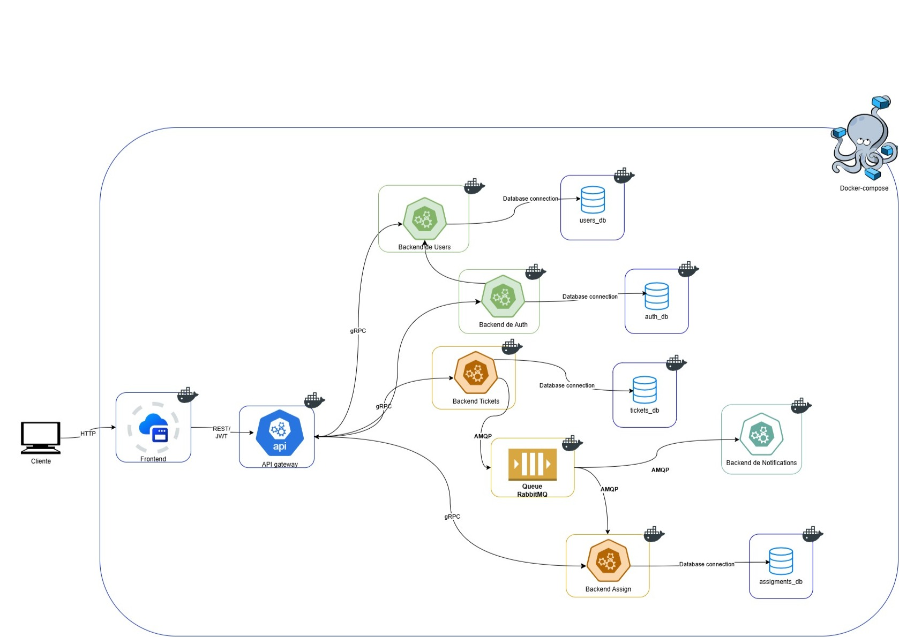
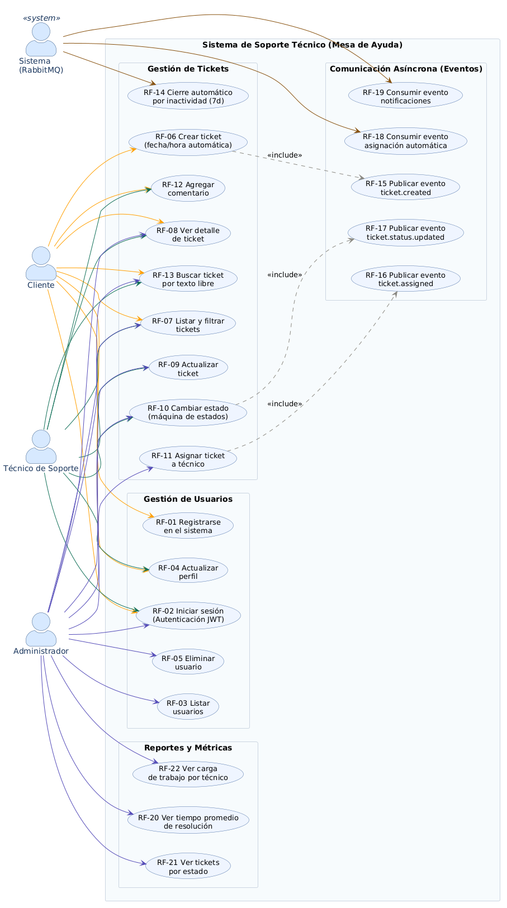
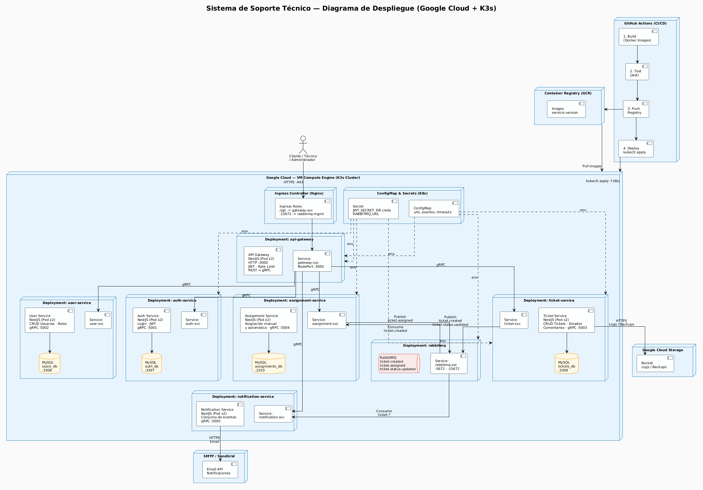

# Sistema de Soporte Técnico (Mesa de Ayuda) Orientado a Eventos

---

<<<<<<< HEAD
## Diagrama de arquitectura de alto nivel

  
  
<i>Figura 2: Diagrama de arquitectura de alto nivel.</i>

=======
## Diagrama general de Casos de Uso de alto nivel

  
  
<i>Figura 1: Diagrama general de casos de Uso de alto nivel.</i>

>>>>>>> origin/feature/202106538

---

<<<<<<< HEAD
## Diagrama de despliegue

  
  
<i>Figura 2: Diagrama de despliegue.</i>

---

## Justificación Técnica del Stack Tecnológico

La selección del stack tecnológico para el Sistema de Soporte Técnico se ha realizado considerando los requerimientos funcionales y no funcionales del proyecto, teniendo en cuenta la mantenibilidad del código y la portabilidad del sistema en entornos de nube.

### 1. Resumen del Stack

| Capa | Tecnología Seleccionada | Propósito |
|------|------------------------|-----------|
| **Lenguaje** | TypeScript | Tipado estático, mejor mantenibilidad y reducción de errores en tiempo de ejecución |
| **Framework Backend** | NestJS | Arquitectura modular, inyección de dependencias nativa y soporte para microservicios |
| **API Gateway** | NestJS + HTTP/REST | Punto único de entrada, autenticación centralizada y rate limiting |
| **Comunicación Interna** | gRPC | Alto rendimiento, contratos tipados y comunicación eficiente entre microservicios |
| **Bus de Mensajería** | RabbitMQ | Mensajería asíncrona confiable con soporte AMQP y fácil integración con NestJS |
| **Base de Datos** | MySQL 8.0 | Consistencia ACID, soporte FULLTEXT para búsquedas y madurez probada |
| **Contenerización** | Docker (multi-stage builds) | Imágenes optimizadas, reproducibilidad y aislamiento |
| **Orquestación Local** | Docker Compose | Levantamiento de todos los servicios con un solo comando |
| **Orquestación en Nube** | K3s | Kubernetes ligero, bajo consumo de recursos y portabilidad |
| **Proveedor Cloud** | Google Cloud Platform | Créditos educativos, integración con GCR y Compute Engine |
| **CI/CD** | GitHub Actions | Automatización de builds, tests y despliegues integrada con el repositorio |

---

## 2. TypeScript y NestJS — Argumentos SOLID explícitos

### TypeScript

| Ventaja | Justificación |
|---------|----------------|
| **Tipado estático** | Reduce errores en tiempo de ejecución, facilita el refactor y mejora la documentación del código. |
| **Interfaces y tipos** | Permite definir contratos claros entre microservicios (DTOs, eventos tipados). |
| **Compatibilidad con JavaScript** | Aprovecha todo el ecosistema de Node.js con seguridad adicional. |

### NestJS — Aplicación de Principios SOLID

| Principio SOLID | Implementación en NestJS | Evidencia en el código |
|----------------|--------------------------|------------------------|
| **S — Responsabilidad Única** | Cada módulo, controlador y servicio tiene una única razón de cambio. | `TicketsService` solo gestiona tickets; `AssignmentsService` solo gestiona asignaciones. |
| **O — Abierto/Cerrado** | Las clases están abiertas para extensión pero cerradas para modificación mediante herencia y composición. | Uso de `extends` y decoradores personalizados sin modificar clases base. |
| **L — Sustitución de Liskov** | Las clases derivadas pueden sustituir a sus clases base sin alterar el comportamiento. | Los repositorios abstractos permiten cambiar implementación (MySQL → PostgreSQL) sin afectar servicios. |
| **I — Segregación de Interfaces** | Interfaces específicas para cada cliente, evitando dependencias innecesarias. | Se definen interfaces pequeñas como `ITicketRepository`, `IUserRepository`. |
| **D — Inversión de Dependencias** | Inyección de dependencias mediante `@Injectable()` y módulos. | Los servicios dependen de abstracciones (repositorios) no de implementaciones concretas. |

---

## 3. HTTP REST (API Gateway) vs gRPC (Microservicios)

### Estrategia de Comunicación Dual

| Capa | Protocolo | Justificación |
|------|-----------|----------------|
| **Cliente → API Gateway** | HTTP/REST | Los clientes externos (web/mobile) requieren compatibilidad universal, facilidad de consumo y soporte nativo en navegadores. |
| **API Gateway → Microservicios** | gRPC | Mayor rendimiento, contratos tipados (Protocol Buffers) y comunicación eficiente en la red interna. |

### Comparativa Técnica

| Criterio | HTTP/REST | gRPC |
|----------|-----------|------|
| **Formato de datos** | JSON (texto, verboso) | Protocol Buffers (binario, compacto) |
| **Rendimiento** | Moderado | Alto (hasta 10x más rápido) |
| **Tipado** | Débil (no nativo) | Fuerte (contratos .proto) |
| **Navegadores** | ✅ Excelente | ⚠️ Limitado (requiere grpc-web) |
| **Streaming** | ❌ Unidireccional | ✅ Bidireccional nativo |
| **Generación de código** | Manual (Swagger/OpenAPI) | Automática desde .proto |

### Decisión final

| Uso | Protocolo | Razón |
|-----|-----------|-------|
| API Gateway expuesta al cliente | **HTTP/REST** | Simplicidad, compatibilidad, facilidad de depuración |
| Comunicación interna entre microservicios | **gRPC** | Rendimiento, tipado fuerte, latencia reducida |

---

## 4. RabbitMQ vs Kafka — Comparativa Técnica Directa

Para este proyecto se ha seleccionado **RabbitMQ** como bus de mensajería asíncrona.

### Tabla Comparativa

| Criterio | RabbitMQ ✅ | Apache Kafka |
|----------|-------------|--------------|
| **Modelo de mensajería** | Smart Broker / Dumb Consumer | Dumb Broker / Smart Consumer |
| **Patrón** | Colas, exchanges, routing keys | Logs particionados (topics) |
| **Persistencia** | Mensajes persistentes opcionales | Retención configurable por tiempo/tamaño |
| **Throughput** | ~50k msg/seg (suficiente) | ~1M msg/seg (sobreingeniería) |
| **Latencia** | Muy baja (microsegundos) | Baja, pero mayor que RabbitMQ |
| **Orden de mensajes** | Garantizado por cola | Garantizado por partición |
| **Complejidad operativa** | Baja | Alta |
| **Integración con NestJS** | Nativa (`@nestjs/microservices`) | Requiere librería externa |
| **Dead Letter Queue** | ✅ Nativa | ❌ Requiere configuración manual |
| **Casos de uso ideales** | RPC, tareas distribuidas, notificaciones | Streaming de eventos, big data, auditoría |

### Justificación de la elección de RabbitMQ

| Razón | Explicación |
|-------|-------------|
| **Volumen esperado** | El sistema de tickets no requiere procesamiento de millones de eventos por segundo. |
| **Simplicidad** | RabbitMQ es más fácil de configurar y operar en un entorno académico. |
| **Patrón de mensajería** | Se necesita routing flexible (exchanges) y colas específicas por tipo de evento. |
| **Integración nativa** | NestJS ofrece soporte oficial con `@nestjs/microservices` para RabbitMQ. |
| **Dead Letter Queue** | Permite manejar eventos fallidos (ej. asignación sin técnicos disponibles). |
| **Consumo de recursos** | Menor huella de memoria y CPU en contenedores Docker. |

---

## 5. MySQL 8.0

### Elección de MySQL 8.0

| Criterio | Justificación |
|----------|----------------|
| **Madurez y estabilidad** | Motor probado en entornos productivos durante décadas. |
| **Consistencia ACID** | Garantiza integridad transaccional para operaciones críticas (creación de tickets, asignaciones). |
| **Rendimiento en lecturas/escrituras** | Excelente para cargas de trabajo mixtas (OLTP). |
| **Facilidad de operación** | Amplia documentación y comunidad. |
| **Soporte en Docker** | Imagen oficial optimizada y fácil de configurar. |

### Modelo de datos por microservicio (Database per Service)

| Microservicio | Base de Datos | Tablas principales |
|---------------|---------------|---------------------|
| users-svc | `users_db` | usuarios, roles |
| tickets-svc | `tickets_db` | tickets, comentarios, historial_estados |
| assignments-svc | `assignments_db` | asignaciones, carga_trabajo |
| notifications-svc | `notifications_db` | notificaciones_enviadas |

### Independencia de datos

Cada microservicio tiene su propia base de datos, evitando acoplamiento directo a nivel de almacenamiento. La comunicación entre servicios se realiza únicamente vía API (gRPC) o eventos (RabbitMQ).

---

## 6. Docker y Docker Compose

### Docker — Contenerización

| Beneficio | Justificación |
|-----------|----------------|
| **Portabilidad** | La misma imagen funciona en desarrollo, testing y producción. |
| **Aislamiento** | Cada microservicio se ejecuta en su propio contenedor sin interferencias. |
| **Reproducibilidad** | El entorno está definido como código (Dockerfile). |
| **Consistencia** | Elimina el "funciona en mi máquina". |

### Ventajas de Docker Compose

| Beneficio | Descripción |
|-----------|-------------|
| **Un solo comando** | `docker-compose up` levanta todo el ecosistema. |
| **Redes automáticas** | Los servicios se descubren por nombre de servicio. |
| **Volúmenes persistentes** | Los datos sobreviven a reinicios de contenedores. |
| **Healthchecks** | Verificación automática del estado de cada servicio. |
| **Dependencias** | Control de orden de inicio (`depends_on`). |

---

## 7. K3s vs GKE nativo — Consumo de recursos y portabilidad

### Elección: K3s para despliegue en la nube

| Criterio | K3s ✅ | GKE nativo (Full K8s) |
|----------|--------|------------------------|
| **Memoria RAM requerida** | ~512 MB por nodo | ~2-4 GB por nodo |
| **Almacenamiento** | ~200 MB | ~1 GB+ |
| **Binarios** | Ejecutable único | Múltiples componentes separados |
| **Certificados** | Automáticos | Configuración manual |
| **Base de datos interna** | SQLite (embebido) | etcd (alto consumo) |
| **Instalación** | Un comando (`curl... \| bash`) | Múltiples pasos |
| **Compatibilidad** | 100% K8s (pasa tests CNCF) | 100% K8s |
| **Actualizaciones** | Simplificadas | Complejas |

### Justificación de K3s

| Razón | Explicación |
|-------|-------------|
| **Bajo consumo de recursos** | Ideal para instancias pequeñas en la nube (nodos de 2 vCPU, 4GB RAM). |
| **Portabilidad** | Los mismos manifiestos (Deployment, Service, Ingress) funcionan en cualquier Kubernetes. |
| **Facilidad de instalación** | Se puede desplegar en Compute Engine en minutos. |
| **K3s + K3d para desarrollo local** | Permite simular el entorno de producción en la máquina local. |
| **Certificación CNCF** | Garantiza compatibilidad con estándares de Kubernetes. |

## 8. Google Cloud Platform — Créditos, GCR y Compute Engine

### Selección de GCP como proveedor cloud

| Criterio | Justificación |
|----------|----------------|
| **Créditos educativos** | Google for Education ofrece $200-$500 en créditos para estudiantes. |
| **Google Container Registry (GCR)** | Almacenamiento de imágenes Docker integrado con el ecosistema GCP. |
| **Compute Engine (GCE)** | Instancias VM flexibles para desplegar K3s (e2-small, e2-medium). |
| **Integración con GitHub Actions** | Autenticación mediante Workload Identity Federation. |
| **Red global** | Baja latencia y alta disponibilidad. |

### Justificación de Compute Engine sobre otros servicios

| Servicio GCP | Uso en este proyecto |
|--------------|----------------------|
| **Compute Engine** | Alojamiento del clúster K3s (máximo control y costo optimizado). |
| **GKE (Google Kubernetes Engine)** | Descartado por costo (cargo por clúster ~$70/mes + nodos). |
| **Cloud Run** | No aplica (requiere microservicios sin estado, no aplica para MySQL). |
| **Cloud SQL** | Costo elevado para proyecto académico (~$15-30/mes). |

---

## 9. GitHub Actions — CI/CD y coherencia general del stack

### Selección de GitHub Actions

| Criterio | Justificación |
|----------|----------------|
| **Integración nativa** | El repositorio ya está alojado en GitHub. |
| **Gratuito para repositorios privados** | 2000 minutos/mes gratis. |
| **Marketplace de acciones** | Acciones predefinidas para Docker, GCR, K3s, etc. |
| **Matriz de pruebas** | Soporta pruebas paralelas en múltiples versiones de Node.js. |
| **Secretos integrados** | Almacenamiento seguro de credenciales (GCP keys, RabbitMQ, MySQL). |

---
=======
## Casos de Uso Expandidos

### Flujo Crítico 1: Creación de Ticket

---

## Caso de Uso: Creación de Ticket

| Campo | Descripción |
|-------|-------------|
| **Nombre** | Creación de Ticket |
| **ID** | UC-07 |
| **Actor(es)** | Cliente (principal), Sistema (secundario) |
| **Descripción** | Permite a un usuario autenticado reportar un incidente o solicitud de soporte mediante la creación de un nuevo ticket en el sistema. |
| **Tipo** | Primario / Esencial |

---

### Precondiciones

| ID | Precondición |
|----|--------------|
| PC-01 | El usuario debe haber iniciado sesión en el sistema (estar autenticado). |
| PC-02 | El usuario debe tener el rol de **Cliente** o **Administrador** (los técnicos también pueden crear tickets en nombre de clientes). |
| PC-03 | El token JWT de autenticación debe ser válido y no haber expirado. |
| PC-04 | El usuario debe tener una conexión activa al sistema. |

---

### Flujo Normal (Básico)

| Paso | Acción del Actor | Respuesta del Sistema |
|------|------------------|----------------------|
| 1 | El cliente accede a la sección "Nuevo Ticket" en la interfaz. | El sistema presenta un formulario con los campos requeridos: título, descripción, categoría y prioridad. |
| 2 | El cliente completa el formulario con la información del incidente. | El sistema valida en tiempo real que los campos obligatorios no estén vacíos. |
| 3 | El cliente hace clic en el botón "Crear Ticket". | El sistema recibe la solicitud POST al endpoint `/tickets`. |
| 4 | - | El sistema valida que el cliente exista y esté activo en la base de datos. |
| 5 | - | El sistema genera un ID único para el ticket. |
| 6 | - | El sistema asigna automáticamente la fecha y hora de creación (timestamp). |
| 7 | - | El sistema establece el estado inicial del ticket como `abierto`. |
| 8 | - | El sistema almacena el ticket en la base de datos MySQL (`tickets_db`). |
| 9 | - | El sistema publica un evento `ticket.created` en el bus RabbitMQ para notificar a otros microservicios. |
| 10 | - | El sistema retorna una respuesta exitosa (HTTP 201 Created) con los datos del ticket creado. |
| 11 | El sistema muestra al cliente un mensaje de confirmación con el número de ticket generado. | - |

---

### Flujos Alternativos

#### Flujo Alternativo 1: Campos obligatorios incompletos

| Paso | Acción del Actor | Respuesta del Sistema |
|------|------------------|----------------------|
| 2a | El cliente intenta enviar el formulario sin completar todos los campos obligatorios. | El sistema detecta la falta de datos y rechaza la solicitud. |
| 3a | - | El sistema retorna un error HTTP 400 Bad Request indicando qué campos son obligatorios. |
| 4a | El sistema muestra mensajes de error específicos junto a cada campo incompleto. | - |

#### Flujo Alternativo 2: Usuario no autenticado

| Paso | Acción del Actor | Respuesta del Sistema |
|------|------------------|----------------------|
| 1a | Un usuario no autenticado intenta acceder al formulario de creación de ticket. | El sistema detecta la ausencia o invalidez del token JWT. |
| 2a | - | El sistema retorna un error HTTP 401 Unauthorized. |
| 3a | El sistema redirige al usuario a la página de inicio de sesión. | - |

#### Flujo Alternativo 3: Usuario con rol no autorizado

| Paso | Acción del Actor | Respuesta del Sistema |
|------|------------------|----------------------|
| 1b | Un usuario con rol no autorizado (ej. solo lectura) intenta crear un ticket. | El sistema verifica los permisos del rol mediante RBAC. |
| 2b | - | El sistema retorna un error HTTP 403 Forbidden. |
| 3b | El sistema muestra un mensaje "No tienes permisos para realizar esta acción". | - |

#### Flujo Alternativo 4: Error en la base de datos

| Paso | Acción del Actor | Respuesta del Sistema |
|------|------------------|----------------------|
| 7a | - | La base de datos no responde o ocurre un error de conexión. |
| 8a | - | El sistema intenta reconectar (máximo 3 reintentos). |
| 9a | - | Si persiste el error, el sistema retorna un error HTTP 503 Service Unavailable. |
| 10a | El sistema muestra un mensaje "Error temporal, intente más tarde". | - |

#### Flujo Alternativo 5: Error en la publicación del evento

| Paso | Acción del Actor | Respuesta del Sistema |
|------|------------------|----------------------|
| 9a | - | El ticket se creó correctamente, pero RabbitMQ no está disponible. |
| 10a | - | El sistema registra el evento en una cola de fallos o log de errores. |
| 11a | - | El sistema programa un reintento para publicar el evento más tarde (retry con backoff exponencial). |
| 12a | El ticket se crea exitosamente, pero las notificaciones automáticas podrían retrasarse. | El sistema continúa funcionando normalmente para el cliente. |

#### Flujo Alternativo 6: Título o descripción demasiado largos

| Paso | Acción del Actor | Respuesta del Sistema |
|------|------------------|----------------------|
| 2c | El cliente ingresa un título superior a 200 caracteres o una descripción superior a 5000 caracteres. | El sistema valida las longitudes máximas permitidas. |
| 3c | - | El sistema retorna un error HTTP 400 Bad Request indicando la longitud máxima permitida. |
| 4c | El sistema muestra mensajes de error específicos. | - |

---

### Postcondiciones

| ID | Postcondición | Estado |
|----|---------------|--------|
| PC-01 | Se ha creado un nuevo ticket en la base de datos con estado `abierto`. | ✅ Siempre (si el flujo se completa) |
| PC-02 | Se ha generado un ID único para el ticket. | ✅ Siempre |
| PC-03 | Se ha registrado la fecha y hora de creación. | ✅ Siempre |
| PC-04 | Se ha asociado el ticket al usuario creador mediante su ID. | ✅ Siempre |
| PC-05 | Se ha publicado un evento `ticket.created` en RabbitMQ (o se ha intentado). | ✅ Siempre (con reintentos si falla) |
| PC-06 | El ticket es visible inmediatamente en los listados del cliente y del administrador. | ✅ Siempre |
| PC-07 | El ticket es elegible para asignación automática por el servicio de asignaciones. | ✅ Siempre |
| PC-08 | Se ha registrado un log de la acción de creación. | ✅ Siempre |

---

### Reglas de Negocio Asociadas

| ID | Regla de Negocio |
|----|------------------|
| RN-01 | Un ticket recién creado siempre comienza en estado `abierto`. |
| RN-02 | El sistema no permite que un ticket sea creado sin un usuario asociado. |
| RN-03 | La prioridad por defecto de un nuevo ticket es `media` si el cliente no la especifica. |
| RN-04 | La categoría por defecto es `general` si el cliente no la especifica. |
| RN-05 | El cliente puede ver únicamente sus propios tickets (no los de otros clientes). |

---

### Requerimientos Funcionales Cubiertos

| RF | Descripción |
|----|-------------|
| RF-06 | Creación de ticket |
| RF-15 | Publicación de evento al crear ticket |

---

## Caso de Uso: Asignación de Ticket

| Campo | Descripción |
|-------|-------------|
| **Nombre** | Asignación de Ticket |
| **ID** | UC-12 |
| **Actor(es)** | Administrador, Técnico de Soporte (principal), Sistema (secundario) |
| **Descripción** | Permite asignar un ticket existente a un técnico de soporte específico para que sea atendido. La asignación puede ser manual (por un administrador o técnico con permisos) o automática (disparada por el sistema al crear un ticket). |
| **Tipo** | Primario / Esencial |

---

### Precondiciones

| ID | Precondición |
|----|--------------|
| PC-01 | El ticket debe existir en el sistema (estar registrado en la base de datos). |
| PC-02 | El ticket debe estar en estado `abierto` o `en_progreso` (no puede estar `resuelto` o `cerrado`). |
| PC-03 | El usuario que realiza la asignación debe tener el rol de **Administrador** o **Técnico de Soporte**. |
| PC-04 | El técnico a asignar debe existir en el sistema y tener el rol de **Técnico de Soporte**. |
| PC-05 | El técnico a asignar debe estar activo (no eliminado/deshabilitado). |

---

### Flujo Normal (Básico) - Asignación Manual

| Paso | Acción del Actor | Respuesta del Sistema |
|------|------------------|----------------------|
| 1 | El administrador accede al detalle de un ticket en estado `abierto` o `en_progreso`. | El sistema muestra la información completa del ticket. |
| 2 | El administrador selecciona la opción "Asignar Ticket". | El sistema presenta una lista desplegable con todos los técnicos de soporte activos. |
| 3 | El administrador selecciona un técnico de la lista. | El sistema valida que el técnico seleccionado sea válido y esté activo. |
| 4 | El administrador confirma la asignación haciendo clic en "Asignar". | El sistema recibe la solicitud PUT/PATCH al endpoint `/tickets/{id}/assign`. |
| 5 | - | El sistema verifica que el ticket no esté ya asignado al mismo técnico (evita duplicados). |
| 6 | - | El sistema actualiza el campo `tecnico_asignado_id` del ticket con el ID del técnico seleccionado. |
| 7 | - | El sistema registra la fecha y hora de asignación. |
| 8 | - | El sistema cambia automáticamente el estado del ticket de `abierto` a `en_progreso` (si estaba en abierto). |
| 9 | - | El sistema almacena un registro histórico de la asignación en la tabla de asignaciones. |
| 10 | - | El sistema publica un evento `ticket.assigned` en el bus RabbitMQ. |
| 11 | - | El sistema retorna una respuesta exitosa (HTTP 200 OK) con los datos actualizados del ticket. |
| 12 | El sistema muestra un mensaje de confirmación "Ticket asignado exitosamente a [Técnico]". | - |

---

### Flujo Normal (Alternativo) - Asignación Automática

| Paso | Acción del Actor | Respuesta del Sistema |
|------|------------------|----------------------|
| 1 | - | El servicio de asignaciones consume el evento `ticket.created` desde RabbitMQ. |
| 2 | - | El sistema extrae el ID del ticket y la categoría/prioridad del evento. |
| 3 | - | El sistema consulta la lista de técnicos disponibles (menos tickets activos asignados). |
| 4 | - | El sistema aplica el algoritmo de asignación (round-robin o por carga mínima). |
| 5 | - | El sistema selecciona al técnico más adecuado. |
| 6 | - | El sistema realiza la asignación automática (mismos pasos 5-11 del flujo manual). |
| 7 | - | El sistema publica un evento `ticket.assigned` (ya cubierto en paso 10 del flujo manual). |
| 8 | - | El sistema genera una notificación para el técnico asignado. |

---

### Flujos Alternativos

#### Flujo Alternativo 1: Ticket no encontrado

| Paso | Acción del Actor | Respuesta del Sistema |
|------|------------------|----------------------|
| 1a | El administrador intenta asignar un ticket con ID inexistente. | El sistema busca el ticket en la base de datos. |
| 2a | - | El sistema no encuentra el ticket. |
| 3a | - | El sistema retorna un error HTTP 404 Not Found con mensaje "Ticket no encontrado". |

#### Flujo Alternativo 2: Ticket en estado no asignable

| Paso | Acción del Actor | Respuesta del Sistema |
|------|------------------|----------------------|
| 1b | El administrador intenta asignar un ticket en estado `resuelto` o `cerrado`. | El sistema verifica el estado actual del ticket. |
| 2b | - | El sistema retorna un error HTTP 409 Conflict con mensaje "No se puede asignar un ticket en estado [estado_actual]". |
| 3b | El sistema sugiere que primero se reabra el ticket si es necesario. | - |

#### Flujo Alternativo 3: Técnico no encontrado o inactivo

| Paso | Acción del Actor | Respuesta del Sistema |
|------|------------------|----------------------|
| 3a | El administrador selecciona un técnico que no existe o está inactivo. | El sistema valida la existencia y estado del técnico. |
| 4a | - | El sistema retorna un error HTTP 404 Not Found o 400 Bad Request. |
| 5a | El sistema muestra mensaje "El técnico seleccionado no está disponible". | - |

#### Flujo Alternativo 4: Ticket ya asignado al mismo técnico

| Paso | Acción del Actor | Respuesta del Sistema |
|------|------------------|----------------------|
| 4b | El administrador intenta asignar un ticket al técnico que ya lo tiene asignado. | El sistema detecta que `tecnico_asignado_id` ya coincide con el ID seleccionado. |
| 5b | - | El sistema retorna un error HTTP 409 Conflict con mensaje "El ticket ya está asignado a este técnico". |

#### Flujo Alternativo 5: Usuario no autorizado

| Paso | Acción del Actor | Respuesta del Sistema |
|------|------------------|----------------------|
| 1c | Un cliente intenta asignar un ticket (sin permisos). | El sistema verifica el rol mediante RBAC. |
| 2c | - | El sistema retorna un error HTTP 403 Forbidden. |
| 3c | El sistema muestra mensaje "No tienes permisos para asignar tickets". | - |

#### Flujo Alternativo 6: Asignación automática sin técnicos disponibles

| Paso | Acción del Actor | Respuesta del Sistema |
|------|------------------|----------------------|
| 4d | - | El sistema consulta técnicos disponibles y no encuentra ninguno. |
| 5d | - | El sistema no realiza la asignación automática. |
| 6d | - | El sistema registra un log de advertencia "No hay técnicos disponibles para asignación automática". |
| 7d | - | El ticket permanece en estado `abierto` sin asignar. |
| 8d | - | El sistema publica un evento `ticket.unassigned` (opcional) para alertar a administradores. |

#### Flujo Alternativo 7: Error en la publicación del evento

| Paso | Acción del Actor | Respuesta del Sistema |
|------|------------------|----------------------|
| 10a | - | La asignación se realizó correctamente, pero RabbitMQ no está disponible. |
| 11a | - | El sistema registra el evento en una cola de fallos o log de errores. |
| 12a | - | El sistema programa un reintento para publicar el evento más tarde. |
| 13a | La asignación es exitosa, pero las notificaciones podrían retrasarse. | - |

---

### Postcondiciones

| ID | Postcondición | Estado |
|----|---------------|--------|
| PC-01 | El ticket tiene un técnico asignado (campo `tecnico_asignado_id` actualizado). | ✅ Siempre (si el flujo se completa) |
| PC-02 | El estado del ticket cambia a `en_progreso` si estaba en `abierto`. | ✅ Siempre (si aplica) |
| PC-03 | Se ha registrado la fecha y hora de asignación. | ✅ Siempre |
| PC-04 | Se ha creado un registro histórico en la tabla de asignaciones. | ✅ Siempre |
| PC-05 | Se ha publicado un evento `ticket.assigned` en RabbitMQ (o se ha intentado). | ✅ Siempre |
| PC-06 | El técnico asignado puede ver el ticket en su lista "Mis Tickets". | ✅ Siempre |
| PC-07 | Se ha generado una notificación al técnico asignado. | ✅ Siempre (si el sistema de notificaciones está operativo) |
| PC-08 | Se ha registrado un log de la acción de asignación. | ✅ Siempre |

---

### Reglas de Negocio Asociadas

| ID | Regla de Negocio |
|----|------------------|
| RN-06 | Un ticket solo puede estar asignado a un técnico a la vez. |
| RN-07 | Un técnico puede tener múltiples tickets asignados simultáneamente. |
| RN-08 | Al asignar un ticket en estado `abierto`, el sistema debe cambiarlo automáticamente a `en_progreso`. |
| RN-09 | Un ticket en estado `resuelto` o `cerrado` no puede ser asignado. |
| RN-10 | La reasignación de un ticket solo puede ser realizada por un Administrador. |
| RN-11 | La asignación automática debe priorizar al técnico con menor carga de trabajo activa. |
| RN-12 | Si un ticket es reasignado, debe conservarse el historial de asignaciones previas. |

---
>>>>>>> origin/feature/202106538
