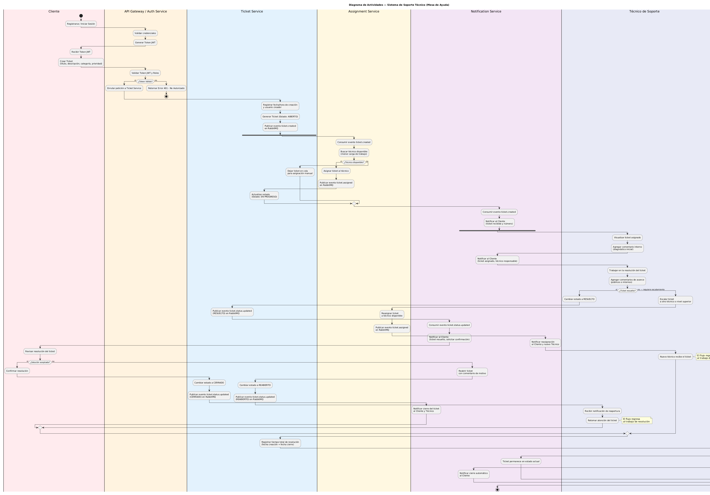
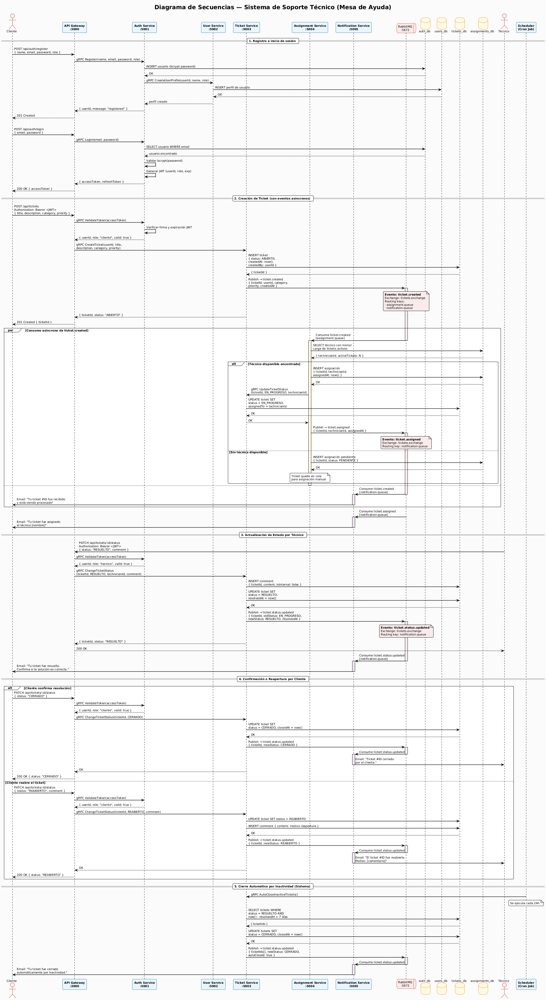
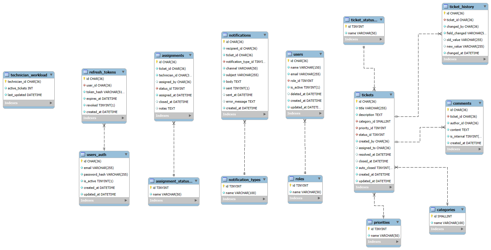

# Sistema de Soporte Técnico (Mesa de Ayuda) Orientado a Eventos

---

## **Actores del Sistema**

Antes de definir los requerimientos, se identifican los actores que interactúan con el sistema:

| Actor | Tipo | Descripción |
|-------|------|-------------|
| **Cliente** | Externo | Usuario que reporta incidentes. Puede crear tickets, ver sus propios tickets, agregar comentarios públicos y recibir notificaciones sobre el avance. |
| **Técnico de Soporte** | Externo | Usuario que atiende y resuelve tickets. Puede ver los tickets asignados, cambiar estados, agregar comentarios internos y públicos. |
| **Administrador** | Externo | Tiene control total del sistema. Puede gestionar usuarios, reasignar tickets, configurar categorías y visualizar reportes y métricas. |
| **Sistema** | Interno | Representa el comportamiento automatizado: publicación y consumo de eventos en RabbitMQ, asignación automática de tickets, cierre automático por inactividad y generación de notificaciones. |

---

## **Requerimientos Funcionales (RF)**

### Módulo de Gestión de Usuarios

| ID | Requerimiento | Descripción |
|----|---------------|-------------|
| **RF-01** | Registro de usuarios | El sistema debe permitir el registro de nuevos usuarios (clientes y técnicos de soporte) con nombre, email, contraseña y rol. |
| **RF-02** | Autenticación de usuarios | El sistema debe autenticar usuarios mediante email y contraseña, generando un token de sesión (JWT). |
| **RF-03** | Listado de usuarios | El sistema debe permitir listar todos los usuarios registrados, con filtros opcionales por rol. |
| **RF-04** | Actualización de perfil | El sistema debe permitir a un usuario actualizar su propia información (nombre, email, contraseña). |
| **RF-05** | Eliminación de usuarios | El sistema debe permitir la eliminación (soft-delete) de usuarios por parte de administradores, conservando la integridad histórica de los tickets asociados. |

### Módulo de Gestión de Tickets

| ID | Requerimiento | Descripción |
|----|---------------|-------------|
| **RF-06** | Creación de ticket | El sistema debe permitir a un usuario autenticado crear un ticket de soporte con título, descripción, categoría y prioridad. El sistema debe registrar automáticamente la fecha/hora de creación y el usuario creador. |
| **RF-07** | Listado de tickets | El sistema debe permitir listar tickets con filtros por estado, prioridad, categoría, fechas y usuario asignado. |
| **RF-08** | Visualización de ticket | El sistema debe permitir ver el detalle completo de un ticket específico, incluyendo su historial de cambios. |
| **RF-09** | Actualización de ticket | El sistema debe permitir actualizar el estado, prioridad, categoría o descripción de un ticket (solo roles autorizados). |
| **RF-10** | Cambio de estado | El sistema debe gestionar la máquina de estados del ticket: `abierto` → `en_progreso` → `resuelto` → `cerrado`. También debe permitir `reabierto` desde resuelto/cerrado. |
| **RF-11** | Asignación de ticket | El sistema debe permitir asignar un ticket a un técnico de soporte específico. |
| **RF-12** | Comentarios en ticket | El sistema debe permitir añadir comentarios a un ticket. Los comentarios pueden ser **públicos** (visibles para el cliente y el técnico) o **internos** (visibles únicamente para técnicos y administradores). |
| **RF-13** | Búsqueda de tickets | El sistema debe permitir realizar búsquedas por texto libre sobre el título y la descripción de los tickets, combinable con los filtros existentes. |
| **RF-14** | Cierre automático por inactividad | El sistema debe cerrar automáticamente los tickets en estado `resuelto` que no hayan recibido actividad en un período configurable (por defecto, 7 días). |

### Módulo de Comunicación Asíncrona (Eventos)

| ID | Requerimiento | Descripción |
|----|---------------|-------------|
| **RF-15** | Publicación de evento al crear ticket | Al crear un ticket, el sistema debe publicar un evento `ticket.created` en el bus de mensajería. |
| **RF-16** | Publicación de evento al asignar ticket | Al asignar un ticket, el sistema debe publicar un evento `ticket.assigned` en el bus de mensajería. |
| **RF-17** | Publicación de evento al cambiar estado | Al cambiar el estado de un ticket, el sistema debe publicar un evento `ticket.status.updated`. |
| **RF-18** | Consumo de evento para asignación automática | El servicio de asignaciones debe consumir eventos `ticket.created` para intentar asignar automáticamente un técnico disponible. |
| **RF-19** | Consumo de evento para notificaciones | El sistema debe consumir eventos de tickets para generar notificaciones (email/sistema) a los involucrados. |

### Módulo de Reportes y Métricas

| ID | Requerimiento | Descripción |
|----|---------------|-------------|
| **RF-20** | Tiempo promedio de resolución | El sistema debe calcular el tiempo promedio entre creación y resolución de tickets por categoría/técnico. |
| **RF-21** | Tickets por estado | El sistema debe reportar la cantidad de tickets agrupados por estado actual. |
| **RF-22** | Carga de trabajo por técnico | El sistema debe mostrar cuántos tickets activos tiene asignado cada técnico. |

---

## **Requerimientos No Funcionales (RNF)**

### Arquitectura y Despliegue

| ID | Requerimiento | Descripción |
|----|---------------|-------------|
| **RNF-01** | Arquitectura de microservicios | El sistema debe estar compuesto por al menos 3 microservicios independientes: Usuarios, Tickets, Asignaciones. |
| **RNF-02** | Comunicación asíncrona | La comunicación entre microservicios para eventos de negocio debe ser asíncrona mediante un bus de mensajería (RabbitMQ). |
| **RNF-03** | Comunicación síncrona | Las operaciones CRUD inmediatas pueden realizarse vía REST síncrono. |
| **RNF-04** | Contenerización | Cada microservicio debe ejecutarse dentro de un contenedor Docker con imágenes optimizadas mediante multi-stage builds. |
| **RNF-05** | Orquestación local | Debe existir un archivo `docker-compose.yml` que levante todos los servicios con un solo comando. |
| **RNF-06** | Despliegue en la nube | El sistema debe ser desplegable en un clúster K3s/Kubernetes en la nube (futura práctica). |

### Rendimiento y Escalabilidad

| ID | Requerimiento | Descripción |
|----|---------------|-------------|
| **RNF-07** | Tiempo de respuesta | Las APIs REST deben responder en menos de 500ms para el 95% de las peticiones en condiciones normales. |
| **RNF-08** | Escalabilidad horizontal | Los microservicios deben poder escalarse horizontalmente (múltiples instancias) sin afectar la consistencia. |
| **RNF-09** | Tolerancia a fallos | El fallo de un microservicio no debe detener por completo al sistema; debe haber degradación controlada. |

### Seguridad

| ID | Requerimiento | Descripción |
|----|---------------|-------------|
| **RNF-10** | Autenticación | Todos los endpoints (excepto registro/login) deben requerir autenticación mediante token JWT. |
| **RNF-11** | Autorización | El sistema debe implementar control de acceso basado en roles (RBAC): cliente, técnico, administrador. |
| **RNF-12** | Protección de datos sensibles | Las contraseñas deben almacenarse hasheadas (bcrypt). |
| **RNF-13** | Variables de entorno | Credenciales de bases de datos, secretos y configuraciones sensibles deben inyectarse vía variables de entorno, no hardcodeadas. |
| **RNF-14** | Rate Limiting | El API Gateway debe implementar límite de tasa por IP para proteger los endpoints contra abuso y ataques de fuerza bruta. |

### Disponibilidad y Resiliencia

| ID | Requerimiento | Descripción |
|----|---------------|-------------|
| **RNF-15** | Health checks | Cada microservicio debe exponer un endpoint `/health` para verificar su estado. |
| **RNF-16** | Reintentos de conexión | Los servicios deben implementar lógica de reintentos al conectarse a RabbitMQ o bases de datos. |
| **RNF-17** | Persistencia de eventos | Los mensajes en RabbitMQ deben ser persistentes para no perderse ante reinicios. |

### Observabilidad

| ID | Requerimiento | Descripción |
|----|---------------|-------------|
| **RNF-18** | Logging estructurado | Cada microservicio debe generar logs en formato JSON (estructurado) que incluyan el nivel de severidad, timestamp, servicio de origen e ID de correlación, para facilitar la trazabilidad entre servicios.

---

## **Diagrama general de Casos de Uso de alto nivel**

<div align="center">
  
  <p><i>Figura 1: Diagrama general de casos de Uso de alto nivel.</i></p>
</div>

## **Casos de Uso Expandidos**

### Flujo Crítico 1: Creación de Ticket

---

## Caso de Uso: Creación de Ticket

| Campo | Descripción |
|-------|-------------|
| **Nombre** | Creación de Ticket |
| **ID** | UC-07 |
| **Actor(es)** | Cliente (principal), Sistema (secundario) |
| **Descripción** | Permite a un usuario autenticado reportar un incidente o solicitud de soporte mediante la creación de un nuevo ticket en el sistema. |
| **Tipo** | Primario / Esencial |

---

### Precondiciones

| ID | Precondición |
|----|--------------|
| PC-01 | El usuario debe haber iniciado sesión en el sistema (estar autenticado). |
| PC-02 | El usuario debe tener el rol de **Cliente** o **Administrador** (los técnicos también pueden crear tickets en nombre de clientes). |
| PC-03 | El token JWT de autenticación debe ser válido y no haber expirado. |
| PC-04 | El usuario debe tener una conexión activa al sistema. |

---

### Flujo Normal (Básico)

| Paso | Acción del Actor | Respuesta del Sistema |
|------|------------------|----------------------|
| 1 | El cliente accede a la sección "Nuevo Ticket" en la interfaz. | El sistema presenta un formulario con los campos requeridos: título, descripción, categoría y prioridad. |
| 2 | El cliente completa el formulario con la información del incidente. | El sistema valida en tiempo real que los campos obligatorios no estén vacíos. |
| 3 | El cliente hace clic en el botón "Crear Ticket". | El sistema recibe la solicitud POST al endpoint `/tickets`. |
| 4 | - | El sistema valida que el cliente exista y esté activo en la base de datos. |
| 5 | - | El sistema genera un ID único para el ticket. |
| 6 | - | El sistema asigna automáticamente la fecha y hora de creación (timestamp). |
| 7 | - | El sistema establece el estado inicial del ticket como `abierto`. |
| 8 | - | El sistema almacena el ticket en la base de datos MySQL (`tickets_db`). |
| 9 | - | El sistema publica un evento `ticket.created` en el bus RabbitMQ para notificar a otros microservicios. |
| 10 | - | El sistema retorna una respuesta exitosa (HTTP 201 Created) con los datos del ticket creado. |
| 11 | El sistema muestra al cliente un mensaje de confirmación con el número de ticket generado. | - |

---

### Flujos Alternativos

#### Flujo Alternativo 1: Campos obligatorios incompletos

| Paso | Acción del Actor | Respuesta del Sistema |
|------|------------------|----------------------|
| 2a | El cliente intenta enviar el formulario sin completar todos los campos obligatorios. | El sistema detecta la falta de datos y rechaza la solicitud. |
| 3a | - | El sistema retorna un error HTTP 400 Bad Request indicando qué campos son obligatorios. |
| 4a | El sistema muestra mensajes de error específicos junto a cada campo incompleto. | - |

#### Flujo Alternativo 2: Usuario no autenticado

| Paso | Acción del Actor | Respuesta del Sistema |
|------|------------------|----------------------|
| 1a | Un usuario no autenticado intenta acceder al formulario de creación de ticket. | El sistema detecta la ausencia o invalidez del token JWT. |
| 2a | - | El sistema retorna un error HTTP 401 Unauthorized. |
| 3a | El sistema redirige al usuario a la página de inicio de sesión. | - |

#### Flujo Alternativo 3: Usuario con rol no autorizado

| Paso | Acción del Actor | Respuesta del Sistema |
|------|------------------|----------------------|
| 1b | Un usuario con rol no autorizado (ej. solo lectura) intenta crear un ticket. | El sistema verifica los permisos del rol mediante RBAC. |
| 2b | - | El sistema retorna un error HTTP 403 Forbidden. |
| 3b | El sistema muestra un mensaje "No tienes permisos para realizar esta acción". | - |

#### Flujo Alternativo 4: Error en la base de datos

| Paso | Acción del Actor | Respuesta del Sistema |
|------|------------------|----------------------|
| 7a | - | La base de datos no responde o ocurre un error de conexión. |
| 8a | - | El sistema intenta reconectar (máximo 3 reintentos). |
| 9a | - | Si persiste el error, el sistema retorna un error HTTP 503 Service Unavailable. |
| 10a | El sistema muestra un mensaje "Error temporal, intente más tarde". | - |

#### Flujo Alternativo 5: Error en la publicación del evento

| Paso | Acción del Actor | Respuesta del Sistema |
|------|------------------|----------------------|
| 9a | - | El ticket se creó correctamente, pero RabbitMQ no está disponible. |
| 10a | - | El sistema registra el evento en una cola de fallos o log de errores. |
| 11a | - | El sistema programa un reintento para publicar el evento más tarde (retry con backoff exponencial). |
| 12a | El ticket se crea exitosamente, pero las notificaciones automáticas podrían retrasarse. | El sistema continúa funcionando normalmente para el cliente. |

#### Flujo Alternativo 6: Título o descripción demasiado largos

| Paso | Acción del Actor | Respuesta del Sistema |
|------|------------------|----------------------|
| 2c | El cliente ingresa un título superior a 200 caracteres o una descripción superior a 5000 caracteres. | El sistema valida las longitudes máximas permitidas. |
| 3c | - | El sistema retorna un error HTTP 400 Bad Request indicando la longitud máxima permitida. |
| 4c | El sistema muestra mensajes de error específicos. | - |

---

### Postcondiciones

| ID | Postcondición | Estado |
|----|---------------|--------|
| PC-01 | Se ha creado un nuevo ticket en la base de datos con estado `abierto`. | ✅ Siempre (si el flujo se completa) |
| PC-02 | Se ha generado un ID único para el ticket. | ✅ Siempre |
| PC-03 | Se ha registrado la fecha y hora de creación. | ✅ Siempre |
| PC-04 | Se ha asociado el ticket al usuario creador mediante su ID. | ✅ Siempre |
| PC-05 | Se ha publicado un evento `ticket.created` en RabbitMQ (o se ha intentado). | ✅ Siempre (con reintentos si falla) |
| PC-06 | El ticket es visible inmediatamente en los listados del cliente y del administrador. | ✅ Siempre |
| PC-07 | El ticket es elegible para asignación automática por el servicio de asignaciones. | ✅ Siempre |
| PC-08 | Se ha registrado un log de la acción de creación. | ✅ Siempre |

---

### Reglas de Negocio Asociadas

| ID | Regla de Negocio |
|----|------------------|
| RN-01 | Un ticket recién creado siempre comienza en estado `abierto`. |
| RN-02 | El sistema no permite que un ticket sea creado sin un usuario asociado. |
| RN-03 | La prioridad por defecto de un nuevo ticket es `media` si el cliente no la especifica. |
| RN-04 | La categoría por defecto es `general` si el cliente no la especifica. |
| RN-05 | El cliente puede ver únicamente sus propios tickets (no los de otros clientes). |

---

### Requerimientos Funcionales Cubiertos

| RF | Descripción |
|----|-------------|
| RF-06 | Creación de ticket |
| RF-15 | Publicación de evento al crear ticket |

---

## Caso de Uso: Asignación de Ticket

| Campo | Descripción |
|-------|-------------|
| **Nombre** | Asignación de Ticket |
| **ID** | UC-12 |
| **Actor(es)** | Administrador, Técnico de Soporte (principal), Sistema (secundario) |
| **Descripción** | Permite asignar un ticket existente a un técnico de soporte específico para que sea atendido. La asignación puede ser manual (por un administrador o técnico con permisos) o automática (disparada por el sistema al crear un ticket). |
| **Tipo** | Primario / Esencial |

---

### Precondiciones

| ID | Precondición |
|----|--------------|
| PC-01 | El ticket debe existir en el sistema (estar registrado en la base de datos). |
| PC-02 | El ticket debe estar en estado `abierto` o `en_progreso` (no puede estar `resuelto` o `cerrado`). |
| PC-03 | El usuario que realiza la asignación debe tener el rol de **Administrador** o **Técnico de Soporte**. |
| PC-04 | El técnico a asignar debe existir en el sistema y tener el rol de **Técnico de Soporte**. |
| PC-05 | El técnico a asignar debe estar activo (no eliminado/deshabilitado). |

---

### Flujo Normal (Básico) - Asignación Manual

| Paso | Acción del Actor | Respuesta del Sistema |
|------|------------------|----------------------|
| 1 | El administrador accede al detalle de un ticket en estado `abierto` o `en_progreso`. | El sistema muestra la información completa del ticket. |
| 2 | El administrador selecciona la opción "Asignar Ticket". | El sistema presenta una lista desplegable con todos los técnicos de soporte activos. |
| 3 | El administrador selecciona un técnico de la lista. | El sistema valida que el técnico seleccionado sea válido y esté activo. |
| 4 | El administrador confirma la asignación haciendo clic en "Asignar". | El sistema recibe la solicitud PUT/PATCH al endpoint `/tickets/{id}/assign`. |
| 5 | - | El sistema verifica que el ticket no esté ya asignado al mismo técnico (evita duplicados). |
| 6 | - | El sistema actualiza el campo `tecnico_asignado_id` del ticket con el ID del técnico seleccionado. |
| 7 | - | El sistema registra la fecha y hora de asignación. |
| 8 | - | El sistema cambia automáticamente el estado del ticket de `abierto` a `en_progreso` (si estaba en abierto). |
| 9 | - | El sistema almacena un registro histórico de la asignación en la tabla de asignaciones. |
| 10 | - | El sistema publica un evento `ticket.assigned` en el bus RabbitMQ. |
| 11 | - | El sistema retorna una respuesta exitosa (HTTP 200 OK) con los datos actualizados del ticket. |
| 12 | El sistema muestra un mensaje de confirmación "Ticket asignado exitosamente a [Técnico]". | - |

---

### Flujo Normal (Alternativo) - Asignación Automática

| Paso | Acción del Actor | Respuesta del Sistema |
|------|------------------|----------------------|
| 1 | - | El servicio de asignaciones consume el evento `ticket.created` desde RabbitMQ. |
| 2 | - | El sistema extrae el ID del ticket y la categoría/prioridad del evento. |
| 3 | - | El sistema consulta la lista de técnicos disponibles (menos tickets activos asignados). |
| 4 | - | El sistema aplica el algoritmo de asignación (round-robin o por carga mínima). |
| 5 | - | El sistema selecciona al técnico más adecuado. |
| 6 | - | El sistema realiza la asignación automática (mismos pasos 5-11 del flujo manual). |
| 7 | - | El sistema publica un evento `ticket.assigned` (ya cubierto en paso 10 del flujo manual). |
| 8 | - | El sistema genera una notificación para el técnico asignado. |

---

### Flujos Alternativos

#### Flujo Alternativo 1: Ticket no encontrado

| Paso | Acción del Actor | Respuesta del Sistema |
|------|------------------|----------------------|
| 1a | El administrador intenta asignar un ticket con ID inexistente. | El sistema busca el ticket en la base de datos. |
| 2a | - | El sistema no encuentra el ticket. |
| 3a | - | El sistema retorna un error HTTP 404 Not Found con mensaje "Ticket no encontrado". |

#### Flujo Alternativo 2: Ticket en estado no asignable

| Paso | Acción del Actor | Respuesta del Sistema |
|------|------------------|----------------------|
| 1b | El administrador intenta asignar un ticket en estado `resuelto` o `cerrado`. | El sistema verifica el estado actual del ticket. |
| 2b | - | El sistema retorna un error HTTP 409 Conflict con mensaje "No se puede asignar un ticket en estado [estado_actual]". |
| 3b | El sistema sugiere que primero se reabra el ticket si es necesario. | - |

#### Flujo Alternativo 3: Técnico no encontrado o inactivo

| Paso | Acción del Actor | Respuesta del Sistema |
|------|------------------|----------------------|
| 3a | El administrador selecciona un técnico que no existe o está inactivo. | El sistema valida la existencia y estado del técnico. |
| 4a | - | El sistema retorna un error HTTP 404 Not Found o 400 Bad Request. |
| 5a | El sistema muestra mensaje "El técnico seleccionado no está disponible". | - |

#### Flujo Alternativo 4: Ticket ya asignado al mismo técnico

| Paso | Acción del Actor | Respuesta del Sistema |
|------|------------------|----------------------|
| 4b | El administrador intenta asignar un ticket al técnico que ya lo tiene asignado. | El sistema detecta que `tecnico_asignado_id` ya coincide con el ID seleccionado. |
| 5b | - | El sistema retorna un error HTTP 409 Conflict con mensaje "El ticket ya está asignado a este técnico". |

#### Flujo Alternativo 5: Usuario no autorizado

| Paso | Acción del Actor | Respuesta del Sistema |
|------|------------------|----------------------|
| 1c | Un cliente intenta asignar un ticket (sin permisos). | El sistema verifica el rol mediante RBAC. |
| 2c | - | El sistema retorna un error HTTP 403 Forbidden. |
| 3c | El sistema muestra mensaje "No tienes permisos para asignar tickets". | - |

#### Flujo Alternativo 6: Asignación automática sin técnicos disponibles

| Paso | Acción del Actor | Respuesta del Sistema |
|------|------------------|----------------------|
| 4d | - | El sistema consulta técnicos disponibles y no encuentra ninguno. |
| 5d | - | El sistema no realiza la asignación automática. |
| 6d | - | El sistema registra un log de advertencia "No hay técnicos disponibles para asignación automática". |
| 7d | - | El ticket permanece en estado `abierto` sin asignar. |
| 8d | - | El sistema publica un evento `ticket.unassigned` (opcional) para alertar a administradores. |

#### Flujo Alternativo 7: Error en la publicación del evento

| Paso | Acción del Actor | Respuesta del Sistema |
|------|------------------|----------------------|
| 10a | - | La asignación se realizó correctamente, pero RabbitMQ no está disponible. |
| 11a | - | El sistema registra el evento en una cola de fallos o log de errores. |
| 12a | - | El sistema programa un reintento para publicar el evento más tarde. |
| 13a | La asignación es exitosa, pero las notificaciones podrían retrasarse. | - |

---

### Postcondiciones

| ID | Postcondición | Estado |
|----|---------------|--------|
| PC-01 | El ticket tiene un técnico asignado (campo `tecnico_asignado_id` actualizado). | ✅ Siempre (si el flujo se completa) |
| PC-02 | El estado del ticket cambia a `en_progreso` si estaba en `abierto`. | ✅ Siempre (si aplica) |
| PC-03 | Se ha registrado la fecha y hora de asignación. | ✅ Siempre |
| PC-04 | Se ha creado un registro histórico en la tabla de asignaciones. | ✅ Siempre |
| PC-05 | Se ha publicado un evento `ticket.assigned` en RabbitMQ (o se ha intentado). | ✅ Siempre |
| PC-06 | El técnico asignado puede ver el ticket en su lista "Mis Tickets". | ✅ Siempre |
| PC-07 | Se ha generado una notificación al técnico asignado. | ✅ Siempre (si el sistema de notificaciones está operativo) |
| PC-08 | Se ha registrado un log de la acción de asignación. | ✅ Siempre |

---

### Reglas de Negocio Asociadas

| ID | Regla de Negocio |
|----|------------------|
| RN-06 | Un ticket solo puede estar asignado a un técnico a la vez. |
| RN-07 | Un técnico puede tener múltiples tickets asignados simultáneamente. |
| RN-08 | Al asignar un ticket en estado `abierto`, el sistema debe cambiarlo automáticamente a `en_progreso`. |
| RN-09 | Un ticket en estado `resuelto` o `cerrado` no puede ser asignado. |
| RN-10 | La reasignación de un ticket solo puede ser realizada por un Administrador. |
| RN-11 | La asignación automática debe priorizar al técnico con menor carga de trabajo activa. |
| RN-12 | Si un ticket es reasignado, debe conservarse el historial de asignaciones previas. |

---

## **Diagrama de arquitectura de alto nivel**

<div align="center">
  
  <p><i>Figura 2: Diagrama de arquitectura de alto nivel.</i></p>
</div>

---

## Diagrama de despliegue

<div align="center">
  
  <p><i>Figura 2: Diagrama de despliegue.</i></p>
</div>

---

## **Diagrama de actividades**

<div align="center">
  
  <p><i>Figura 3: Diagrama de actividades.</i></p>
</div>

---

## **Diagrama de secuencias**

<div align="center">
  
  <p><i>Figura 4: Diagrama de secuencias.</i></p>
</div>

---

## **Diagrama de entidad-relación**

<div align="center">
  
  <p><i>Figura 5: Diagrama de entida relación.</i></p>
</div>

---

## **Justificación Técnica del Stack Tecnológico**

La selección del stack tecnológico para el Sistema de Soporte Técnico se ha realizado considerando los requerimientos funcionales y no funcionales del proyecto, teniendo en cuenta la mantenibilidad del código y la portabilidad del sistema en entornos de nube.

### 1. Resumen del Stack

| Capa | Tecnología Seleccionada | Propósito |
|------|------------------------|-----------|
| **Lenguaje** | TypeScript | Tipado estático, mejor mantenibilidad y reducción de errores en tiempo de ejecución |
| **Framework Backend** | NestJS | Arquitectura modular, inyección de dependencias nativa y soporte para microservicios |
| **API Gateway** | NestJS + HTTP/REST | Punto único de entrada, autenticación centralizada y rate limiting |
| **Comunicación Interna** | gRPC | Alto rendimiento, contratos tipados y comunicación eficiente entre microservicios |
| **Bus de Mensajería** | RabbitMQ | Mensajería asíncrona confiable con soporte AMQP y fácil integración con NestJS |
| **Base de Datos** | MySQL 8.0 | Consistencia ACID, soporte FULLTEXT para búsquedas y madurez probada |
| **Contenerización** | Docker (multi-stage builds) | Imágenes optimizadas, reproducibilidad y aislamiento |
| **Orquestación Local** | Docker Compose | Levantamiento de todos los servicios con un solo comando |
| **Orquestación en Nube** | K3s | Kubernetes ligero, bajo consumo de recursos y portabilidad |
| **Proveedor Cloud** | Google Cloud Platform | Créditos educativos, integración con GCR y Compute Engine |
| **CI/CD** | GitHub Actions | Automatización de builds, tests y despliegues integrada con el repositorio |

---

## 2. TypeScript y NestJS — Argumentos SOLID explícitos

### TypeScript

| Ventaja | Justificación |
|---------|----------------|
| **Tipado estático** | Reduce errores en tiempo de ejecución, facilita el refactor y mejora la documentación del código. |
| **Interfaces y tipos** | Permite definir contratos claros entre microservicios (DTOs, eventos tipados). |
| **Compatibilidad con JavaScript** | Aprovecha todo el ecosistema de Node.js con seguridad adicional. |

### NestJS — Aplicación de Principios SOLID

| Principio SOLID | Implementación en NestJS | Evidencia en el código |
|----------------|--------------------------|------------------------|
| **S — Responsabilidad Única** | Cada módulo, controlador y servicio tiene una única razón de cambio. | `TicketsService` solo gestiona tickets; `AssignmentsService` solo gestiona asignaciones. |
| **O — Abierto/Cerrado** | Las clases están abiertas para extensión pero cerradas para modificación mediante herencia y composición. | Uso de `extends` y decoradores personalizados sin modificar clases base. |
| **L — Sustitución de Liskov** | Las clases derivadas pueden sustituir a sus clases base sin alterar el comportamiento. | Los repositorios abstractos permiten cambiar implementación (MySQL → PostgreSQL) sin afectar servicios. |
| **I — Segregación de Interfaces** | Interfaces específicas para cada cliente, evitando dependencias innecesarias. | Se definen interfaces pequeñas como `ITicketRepository`, `IUserRepository`. |
| **D — Inversión de Dependencias** | Inyección de dependencias mediante `@Injectable()` y módulos. | Los servicios dependen de abstracciones (repositorios) no de implementaciones concretas. |


---

## 3. HTTP REST (API Gateway) vs gRPC (Microservicios)

### Estrategia de Comunicación Dual

| Capa | Protocolo | Justificación |
|------|-----------|----------------|
| **Cliente → API Gateway** | HTTP/REST | Los clientes externos (web/mobile) requieren compatibilidad universal, facilidad de consumo y soporte nativo en navegadores. |
| **API Gateway → Microservicios** | gRPC | Mayor rendimiento, contratos tipados (Protocol Buffers) y comunicación eficiente en la red interna. |

### Comparativa Técnica

| Criterio | HTTP/REST | gRPC |
|----------|-----------|------|
| **Formato de datos** | JSON (texto, verboso) | Protocol Buffers (binario, compacto) |
| **Rendimiento** | Moderado | Alto (hasta 10x más rápido) |
| **Tipado** | Débil (no nativo) | Fuerte (contratos .proto) |
| **Navegadores** | ✅ Excelente | ⚠️ Limitado (requiere grpc-web) |
| **Streaming** | ❌ Unidireccional | ✅ Bidireccional nativo |
| **Generación de código** | Manual (Swagger/OpenAPI) | Automática desde .proto |

### Decisión final

| Uso | Protocolo | Razón |
|-----|-----------|-------|
| API Gateway expuesta al cliente | **HTTP/REST** | Simplicidad, compatibilidad, facilidad de depuración |
| Comunicación interna entre microservicios | **gRPC** | Rendimiento, tipado fuerte, latencia reducida |

---

## 4. RabbitMQ vs Kafka — Comparativa Técnica Directa

Para este proyecto se ha seleccionado **RabbitMQ** como bus de mensajería asíncrona.

### Tabla Comparativa

| Criterio | RabbitMQ ✅ | Apache Kafka |
|----------|-------------|--------------|
| **Modelo de mensajería** | Smart Broker / Dumb Consumer | Dumb Broker / Smart Consumer |
| **Patrón** | Colas, exchanges, routing keys | Logs particionados (topics) |
| **Persistencia** | Mensajes persistentes opcionales | Retención configurable por tiempo/tamaño |
| **Throughput** | ~50k msg/seg (suficiente) | ~1M msg/seg (sobreingeniería) |
| **Latencia** | Muy baja (microsegundos) | Baja, pero mayor que RabbitMQ |
| **Orden de mensajes** | Garantizado por cola | Garantizado por partición |
| **Complejidad operativa** | Baja | Alta |
| **Integración con NestJS** | Nativa (`@nestjs/microservices`) | Requiere librería externa |
| **Dead Letter Queue** | ✅ Nativa | ❌ Requiere configuración manual |
| **Casos de uso ideales** | RPC, tareas distribuidas, notificaciones | Streaming de eventos, big data, auditoría |

### Justificación de la elección de RabbitMQ

| Razón | Explicación |
|-------|-------------|
| **Volumen esperado** | El sistema de tickets no requiere procesamiento de millones de eventos por segundo. |
| **Simplicidad** | RabbitMQ es más fácil de configurar y operar en un entorno académico. |
| **Patrón de mensajería** | Se necesita routing flexible (exchanges) y colas específicas por tipo de evento. |
| **Integración nativa** | NestJS ofrece soporte oficial con `@nestjs/microservices` para RabbitMQ. |
| **Dead Letter Queue** | Permite manejar eventos fallidos (ej. asignación sin técnicos disponibles). |
| **Consumo de recursos** | Menor huella de memoria y CPU en contenedores Docker. |

---

## 5. MySQL 8.0

### Elección de MySQL 8.0

| Criterio | Justificación |
|----------|----------------|
| **Madurez y estabilidad** | Motor probado en entornos productivos durante décadas. |
| **Consistencia ACID** | Garantiza integridad transaccional para operaciones críticas (creación de tickets, asignaciones). |
| **Rendimiento en lecturas/escrituras** | Excelente para cargas de trabajo mixtas (OLTP). |
| **Facilidad de operación** | Amplia documentación y comunidad. |
| **Soporte en Docker** | Imagen oficial optimizada y fácil de configurar. |


### Modelo de datos por microservicio (Database per Service)

| Microservicio | Base de Datos | Tablas principales |
|---------------|---------------|---------------------|
| users-svc | `users_db` | usuarios, roles |
| tickets-svc | `tickets_db` | tickets, comentarios, historial_estados |
| assignments-svc | `assignments_db` | asignaciones, carga_trabajo |
| notifications-svc | `notifications_db` | notificaciones_enviadas |

### Independencia de datos

Cada microservicio tiene su propia base de datos, evitando acoplamiento directo a nivel de almacenamiento. La comunicación entre servicios se realiza únicamente vía API (gRPC) o eventos (RabbitMQ).

---

## 6. Docker y Docker Compose

### Docker — Contenerización

| Beneficio | Justificación |
|-----------|----------------|
| **Portabilidad** | La misma imagen funciona en desarrollo, testing y producción. |
| **Aislamiento** | Cada microservicio se ejecuta en su propio contenedor sin interferencias. |
| **Reproducibilidad** | El entorno está definido como código (Dockerfile). |
| **Consistencia** | Elimina el "funciona en mi máquina". |


### Ventajas de Docker Compose

| Beneficio | Descripción |
|-----------|-------------|
| **Un solo comando** | `docker-compose up` levanta todo el ecosistema. |
| **Redes automáticas** | Los servicios se descubren por nombre de servicio. |
| **Volúmenes persistentes** | Los datos sobreviven a reinicios de contenedores. |
| **Healthchecks** | Verificación automática del estado de cada servicio. |
| **Dependencias** | Control de orden de inicio (`depends_on`). |

---

## 7. K3s vs GKE nativo — Consumo de recursos y portabilidad

### Elección: K3s para despliegue en la nube

| Criterio | K3s ✅ | GKE nativo (Full K8s) |
|----------|--------|------------------------|
| **Memoria RAM requerida** | ~512 MB por nodo | ~2-4 GB por nodo |
| **Almacenamiento** | ~200 MB | ~1 GB+ |
| **Binarios** | Ejecutable único | Múltiples componentes separados |
| **Certificados** | Automáticos | Configuración manual |
| **Base de datos interna** | SQLite (embebido) | etcd (alto consumo) |
| **Instalación** | Un comando (`curl... \| bash`) | Múltiples pasos |
| **Compatibilidad** | 100% K8s (pasa tests CNCF) | 100% K8s |
| **Actualizaciones** | Simplificadas | Complejas |

### Justificación de K3s

| Razón | Explicación |
|-------|-------------|
| **Bajo consumo de recursos** | Ideal para instancias pequeñas en la nube (nodos de 2 vCPU, 4GB RAM). |
| **Portabilidad** | Los mismos manifiestos (Deployment, Service, Ingress) funcionan en cualquier Kubernetes. |
| **Facilidad de instalación** | Se puede desplegar en Compute Engine en minutos. |
| **K3s + K3d para desarrollo local** | Permite simular el entorno de producción en la máquina local. |
| **Certificación CNCF** | Garantiza compatibilidad con estándares de Kubernetes. |


## 8. Google Cloud Platform — Créditos, GCR y Compute Engine

### Selección de GCP como proveedor cloud

| Criterio | Justificación |
|----------|----------------|
| **Créditos educativos** | Google for Education ofrece $200-$500 en créditos para estudiantes. |
| **Google Container Registry (GCR)** | Almacenamiento de imágenes Docker integrado con el ecosistema GCP. |
| **Compute Engine (GCE)** | Instancias VM flexibles para desplegar K3s (e2-small, e2-medium). |
| **Integración con GitHub Actions** | Autenticación mediante Workload Identity Federation. |
| **Red global** | Baja latencia y alta disponibilidad. |


### Justificación de Compute Engine sobre otros servicios

| Servicio GCP | Uso en este proyecto |
|--------------|----------------------|
| **Compute Engine** | Alojamiento del clúster K3s (máximo control y costo optimizado). |
| **GKE (Google Kubernetes Engine)** | Descartado por costo (cargo por clúster ~$70/mes + nodos). |
| **Cloud Run** | No aplica (requiere microservicios sin estado, no aplica para MySQL). |
| **Cloud SQL** | Costo elevado para proyecto académico (~$15-30/mes). |

---

## 9. GitHub Actions — CI/CD y coherencia general del stack

## **Reporte de Principios SOLID Aplicados**

## 1. S — Single Responsibility Principle (SRP) {#srp}

> **"Cada clase debe tener una única razón para cambiar."**

Este es el principio más ampliamente aplicado en el proyecto. Se manifiesta en la separación en capas (domain / application / infrastructure) y en el patrón de **un use-case por operación de negocio**.

---

### `auth-service`

| Archivo | Responsabilidad única |
|---|---|
| `auth/domain/user-auth.entity.ts` | Representa el estado persistido de credenciales. Sin lógica de negocio. |
| `auth/domain/refresh-token.entity.ts` | Representa únicamente un refresh-token almacenado. |
| `auth/application/use-cases/register.use-case.ts` | Solo registra un usuario nuevo (validar email duplicado → hashear password → crear). |
| `auth/application/use-cases/login.use-case.ts` | Solo autentica credenciales y genera tokens. |
| `auth/application/use-cases/logout.use-case.ts` | Solo revoca un refresh-token. |
| `auth/application/use-cases/refresh-token.use-case.ts` | Solo rota el par de tokens dado un refresh-token válido. |
| `auth/application/use-cases/validate-token.use-case.ts` | Solo verifica la firma y vigencia de un access-token. |
| `auth/application/use-cases/admin-register.use-case.ts` | Solo crea usuarios con rol explícito (flujo de administrador). |
| `auth/infrastructure/services/bcrypt.service.ts` | Solo hashea/compara passwords con bcrypt. |
| `auth/infrastructure/services/jwt.service.ts` | Solo firma/verifica JWTs de acceso y refresco. |
| `auth/infrastructure/services/token-hash.service.ts` | Solo aplica SHA-256 determinístico a tokens (necesario para lookup en BD). |
| `auth/infrastructure/repositories/auth.repository.ts` | Solo accede a las tablas `users_auth` y `refresh_tokens`. |
| `auth/auth.controller.ts` | Solo traduce mensajes gRPC a llamadas del servicio de aplicación y viceversa. |
| `auth/application/auth.service.ts` | Solo actúa como orquestador/fachada de los use-cases; delega toda la lógica. |

**¿Por qué?** Separar cada operación de autenticación en su propio use-case garantiza que un cambio en la política de login (p. ej. agregar 2FA) no afecte el código de registro, logout, etc. Cada archivo tiene **una sola razón para cambiar**.

---

### `users-service`

| Archivo | Responsabilidad única |
|---|---|
| `users/domain/user.entity.ts` | Estado de un usuario (columnas de BD, relaciones). Sin lógica de negocio. |
| `users/domain/role.entity.ts` | Catalogo de roles. Sin lógica de negocio. |
| `users/application/use-cases/create-user.use-case.ts` | Solo crea un usuario (valida email duplicado, resuelve rol, persiste). |
| `users/application/use-cases/find-user.use-case.ts` | Solo consulta usuarios (por ID, por email, listado paginado). |
| `users/application/use-cases/update-user.use-case.ts` | Solo actualiza campos de un usuario existente. |
| `users/application/use-cases/delete-user.use-case.ts` | Solo realiza soft-delete de un usuario. |
| `users/infrastructure/repositories/user.repository.ts` | Solo accede a la BD para usuarios y roles. |
| `users/users.mapper.ts` | Solo convierte `UserEntity` → DTO de respuesta gRPC. |
| `users/users.controller.ts` | Solo recibe métodos gRPC y delega al servicio. |

---

### `tickets-service`

| Archivo | Responsabilidad única |
|---|---|
| `tickets/domain/ticket.entity.ts` | Estado persistido de un ticket. |
| `tickets/domain/comment.entity.ts` | Representa un comentario en un ticket. |
| `tickets/domain/ticket-history.entity.ts` | Representa una entrada de historial de cambios. |
| `tickets/domain/category.entity.ts` | Catálogo de categorías. |
| `tickets/domain/priority.entity.ts` | Catálogo de prioridades. |
| `tickets/domain/ticket-status.entity.ts` | Catálogo de estados posibles. |
| `tickets/application/use-cases/create-ticket.use-case.ts` | Solo crea un ticket y publica el evento `ticket.created`. |
| `tickets/application/use-cases/find-ticket.use-case.ts` | Solo consulta tickets (por ID, listados, búsqueda full-text). |
| `tickets/application/use-cases/update-ticket.use-case.ts` | Solo edita descripción/prioridad/categoría y escribe historial. |
| `tickets/application/use-cases/change-status.use-case.ts` | Solo valida y aplica transiciones de estado (máquina de estados). |
| `tickets/application/use-cases/assign-ticket.use-case.ts` | Solo asigna un ticket a un técnico y escribe historial. |
| `tickets/application/use-cases/add-comment.use-case.ts` | Solo agrega un comentario a un ticket. |
| `tickets/application/use-cases/auto-close-tickets.use-case.ts` | Solo cierra tickets resueltos con más de N días de inactividad. |
| `tickets/infrastructure/messaging/rabbitmq-publisher.service.ts` | Solo publica eventos en RabbitMQ. |
| `tickets/infrastructure/scheduler/auto-close.scheduler.ts` | Solo dispara el cron de auto-cierre (sin lógica de negocio propia). |
| `tickets/tickets.mapper.ts` | Solo convierte entidades de dominio → DTOs de respuesta gRPC. |

**Nota destacada — `AutoCloseScheduler` vs `AutoCloseTicketsUseCase`**: el scheduler sabe *cuándo* ejecutar la tarea; el use-case sabe *cómo*. Son dos razones de cambio distintas, por eso están en archivos separados. Si el horario cambia, solo toca el scheduler. Si la lógica de cierre cambia, solo toca el use-case.

---

### `assignments-service`

| Archivo | Responsabilidad única |
|---|---|
| `assignments/domain/assignment.entity.ts` | Estado de una asignación. |
| `assignments/domain/assignment-status.entity.ts` | Catálogo de estados de asignación. |
| `assignments/domain/technician-workload.entity.ts` | Contador de carga de trabajo por técnico. |
| `assignments/application/use-cases/manual-assign.use-case.ts` | Solo realiza asignación manual con validación de conflictos. |
| `assignments/application/use-cases/auto-assign.use-case.ts` | Solo selecciona el técnico con menor carga y crea la asignación automáticamente. |
| `assignments/application/use-cases/update-assignment.use-case.ts` | Solo reasigna o cierra una asignación existente. |
| `assignments/application/use-cases/find-assignment.use-case.ts` | Solo consulta asignaciones (por ID, por ticket, por técnico, listado). |
| `assignments/infrastructure/repositories/assignment.repository.ts` | Solo accede a las tablas de asignaciones y carga de trabajo. |
| `assignments/infrastructure/messaging/rabbitmq-publisher.service.ts` | Solo publica eventos de asignación en RabbitMQ. |
| `assignments/infrastructure/messaging/rabbitmq-consumer.controller.ts` | Solo consume el evento `ticket.created` y dispara el auto-assign. |
| `assignments/infrastructure/messaging/tickets-grpc-client.service.ts` | Solo realiza la llamada gRPC `AssignTicket` al tickets-service. |
| `assignments/assignments.mapper.ts` | Solo convierte entidades → DTOs de respuesta gRPC. |

---

### `api-gateway`

| Archivo | Responsabilidad única |
|---|---|
| `common/filters/all-exceptions.filter.ts` | Solo captura excepciones y las convierte a respuestas HTTP consistentes. |
| `common/interceptors/logging.interceptor.ts` | Solo registra método, URL y tiempo de respuesta de cada petición. |
| `common/guards/jwt-auth.guard.ts` | Solo valida el token JWT y verifica roles. |
| `common/decorators/roles.decorator.ts` | Solo adjunta metadatos de roles a rutas. |
| `grpc/grpc.options.ts` | Solo define opciones de conexión gRPC por servicio. |
| `grpc/grpc-clients.module.ts` | Solo registra y exporta los clientes gRPC. |
| `auth/auth.controller.ts` | Solo traduce peticiones HTTP de autenticación a llamadas gRPC. |
| `tickets/tickets.controller.ts` | Solo traduce peticiones HTTP de tickets a llamadas gRPC. |
| `users/users.controller.ts` | Solo traduce peticiones HTTP de usuarios a llamadas gRPC. |
| `assignments/assignments.controller.ts` | Solo traduce peticiones HTTP de asignaciones a llamadas gRPC. |

---

## 2. O — Open/Closed Principle (OCP) {#ocp}

> **"Las entidades deben estar abiertas a extensión, cerradas a modificación."**

### `tickets-service/src/tickets/application/use-cases/change-status.use-case.ts`

```typescript
const VALID_TRANSITIONS: Record<string, string[]> = {
  abierto:     ['en_progreso'],
  en_progreso: ['resuelto'],
  resuelto:    ['cerrado', 'reabierto'],
  cerrado:     ['reabierto'],
  reabierto:   ['en_progreso'],
};
```

La máquina de estados de tickets está declarada como un mapa de datos. Para agregar un nuevo estado o una nueva transición **no se modifica la lógica del use-case**, solo se extiende el mapa. El algoritmo de validación permanece intacto.

### Interfaces de repositorio e interfaces de publisher

Las interfaces `ITicketRepository`, `IAssignmentRepository`, `IAuthRepository`, `IUserRepository`, `IEventPublisher` e `IAssignmentEventPublisher` están **cerradas para modificación** desde el punto de vista de los use-cases. Si se necesita un nuevo proveedor de base de datos o de mensajería, se crea una nueva clase que implemente la interfaz sin tocar nada de la capa de aplicación.

---

## 3. L — Liskov Substitution Principle (LSP) {#lsp}

> **"Los subtipos deben poder sustituir a sus tipos base sin alterar el comportamiento correcto del programa."**

### `tickets-service` — `RabbitMqPublisherService implements IEventPublisher`

```typescript
// tickets/infrastructure/messaging/rabbitmq-publisher.service.ts
@Injectable()
export class RabbitMqPublisherService implements IEventPublisher { ... }
```

El use-case `CreateTicketUseCase` recibe un `IEventPublisher`. Puede recibir `RabbitMqPublisherService` en producción o un mock `{ publishTicketCreated: jest.fn() }` en tests; en ambos casos el contrato se cumple completamente (misma firma, mismo tipo de retorno `Promise<void>`).

### `auth-service` — `BcryptService implements IHashService` / `JwtTokenService implements ITokenService`

Ambas implementaciones satisfacen completamente el contrato de su interfaz. Un test puede sustituir `JwtTokenService` por cualquier implementación que firme y verifique tokens del mismo modo, sin cambiar los use-cases que la consumen.

### `assignments-service` — `TicketsGrpcClientService implements ITicketsGrpcClient`

El use-case solo llama a `assignTicket(data): Promise<void>`. La implementación concreta usa gRPC; en tests se puede sustituir por un stub que retorne `Promise.resolve()`. La sustitución no altera el comportamiento de los use-cases.

---

## 4. I — Interface Segregation Principle (ISP) {#isp}

> **"Los clientes no deben depender de interfaces que no usan."**

### `auth-service/src/auth/application/interfaces/token-service.interface.ts`

En lugar de una única interfaz `IAuthServices` monolítica, el proyecto define tres interfaces pequeñas y específicas:

```typescript
export interface ITokenService {    // Firma y verifica JWTs
  signAccessToken(payload: TokenPayload): string;
  verifyAccessToken(token: string): TokenPayload | null;
  signRefreshToken(payload: TokenPayload): string;
  verifyRefreshToken(token: string): TokenPayload | null;
}

export interface IHashService {     // Hashea y compara passwords
  hash(plain: string): Promise<string>;
  compare(plain: string, hashed: string): Promise<boolean>;
}

export interface ITokenHashService { // Hash determinístico de tokens
  hash(token: string): string;
}
```

- `ValidateTokenUseCase` solo inyecta `ITokenService` — no sabe nada de hashing de passwords.
- `RegisterUseCase` solo inyecta `IHashService` — no sabe nada de tokens JWT.
- `LogoutUseCase` inyecta `ITokenService` y `ITokenHashService` — solo lo que necesita para revocar.

Cada use-case depende únicamente de los métodos que realmente usa.

### `assignments-service/src/assignments/application/interfaces/`

Se definen tres interfaces separadas:

- `IAssignmentRepository` — operaciones de persistencia.
- `IAssignmentEventPublisher` — solo `publishAssignmentCreated`.
- `ITicketsGrpcClient` — solo `assignTicket`.

`FindAssignmentUseCase` solo inyecta `IAssignmentRepository` (no necesita publicar eventos ni llamar a gRPC). `UpdateAssignmentUseCase` inyecta `IAssignmentRepository` y `ITicketsGrpcClient` (no necesita publicar eventos). Esta granularidad evita que un use-case dependa de métodos que nunca llamará.

---

## 5. D — Dependency Inversion Principle (DIP) {#dip}

> **"Los módulos de alto nivel no deben depender de módulos de bajo nivel. Ambos deben depender de abstracciones."**

Este es el principio más enfatizado estructuralmente en el proyecto. Se aplica de forma **sistemática y consistente** en todos los servicios mediante el patrón de inyección de dependencias de NestJS con tokens de símbolo (`Symbol`).

---

### Patrón general aplicado

#### 1. Se define una interfaz (abstracción) en la capa de aplicación

```typescript
// application/interfaces/assignment-repository.interface.ts
export interface IAssignmentRepository { ... }
export const ASSIGNMENT_REPOSITORY = Symbol('IAssignmentRepository');
```

#### 2. Los use-cases dependen de la abstracción, nunca de la implementación concreta

```typescript
// application/use-cases/auto-assign.use-case.ts
@Injectable()
export class AutoAssignUseCase {
  constructor(
    @Inject(ASSIGNMENT_REPOSITORY)      private readonly assignRepo:    IAssignmentRepository,
    @Inject(ASSIGNMENT_EVENT_PUBLISHER) private readonly publisher:     IAssignmentEventPublisher,
    @Inject(TICKETS_GRPC_CLIENT_TOKEN)  private readonly ticketsClient: ITicketsGrpcClient,
  ) {}
```

Los tipos de las dependencias son **interfaces**, no clases concretas.

#### 3. El módulo conecta la abstracción con la implementación concreta

```typescript
// assignments.module.ts
providers: [
  AssignmentRepository,
  { provide: ASSIGNMENT_REPOSITORY, useExisting: AssignmentRepository },

  RabbitMqPublisherService,
  { provide: ASSIGNMENT_EVENT_PUBLISHER, useExisting: RabbitMqPublisherService },

  TicketsGrpcClientService,
  { provide: TICKETS_GRPC_CLIENT_TOKEN, useExisting: TicketsGrpcClientService },
]
```

El módulo es el único lugar donde se "conoce" la implementación concreta. El resto del código de aplicación no lo sabe.

---

### Mapa completo de aplicaciones DIP por servicio

#### `auth-service`

| Abstracción (interfaz + símbolo) | Implementación concreta | Archivo del vínculo |
|---|---|---|
| `IAuthRepository` / `AUTH_REPOSITORY` | `AuthRepository` | `auth.module.ts` |
| `ITokenService` / `TOKEN_SERVICE` | `JwtTokenService` | `auth.module.ts` |
| `IHashService` / `HASH_SERVICE` | `BcryptService` | `auth.module.ts` |
| `ITokenHashService` / `TOKEN_HASH_SERVICE` | `TokenHashService` | `auth.module.ts` |

Use-cases dependientes:

- `LoginUseCase` → inyecta `IAuthRepository`, `IHashService`, `ITokenService`, `ITokenHashService`
- `RefreshTokenUseCase` → inyecta `IAuthRepository`, `ITokenService`, `ITokenHashService`
- `ValidateTokenUseCase` → inyecta solo `ITokenService`
- `RegisterUseCase` → inyecta `IAuthRepository`, `IHashService`

**¿Por qué importa?** Si mañana se reemplaza bcrypt por Argon2, solo se crea `Argon2Service implements IHashService` y se actualiza el binding en `auth.module.ts`. Los use-cases (`RegisterUseCase`, `LoginUseCase`) **no se tocan**.

---

#### `users-service`

| Abstracción | Implementación concreta | Archivo del vínculo |
|---|---|---|
| `IUserRepository` / `USER_REPOSITORY` | `UserRepository` | `users.module.ts` |

Todos los use-cases (`CreateUserUseCase`, `FindUserUseCase`, `UpdateUserUseCase`, `DeleteUserUseCase`) inyectan `IUserRepository`. Ninguno importa ni referencia `UserRepository` directamente.

---

#### `tickets-service`

| Abstracción | Implementación concreta | Archivo del vínculo |
|---|---|---|
| `ITicketRepository` / `TICKET_REPOSITORY` | `TicketRepository` | `tickets.module.ts` |
| `IEventPublisher` / `EVENT_PUBLISHER` | `RabbitMqPublisherService` | `tickets.module.ts` |

```typescript
// tickets.module.ts
{ provide: TICKET_REPOSITORY, useExisting: TicketRepository },
{ provide: EVENT_PUBLISHER,   useExisting: RabbitMqPublisherService },
```

Los use-cases `CreateTicketUseCase`, `ChangeStatusUseCase` y `AssignTicketUseCase` publican eventos llamando a `IEventPublisher` — nunca a `ClientProxy` de RabbitMQ directamente. Si se migra a Kafka, solo se implementa `KafkaPublisherService implements IEventPublisher` y se cambia el binding.

El comentario en el código de la interfaz lo declara explícitamente:

```typescript
// event-publisher.interface.ts
// Abstracción sobre RabbitMQ (o cualquier broker futuro).
// Los use-cases dependen solo de esta interfaz — nunca de RabbitMQ directamente (DIP).
```

---

#### `assignments-service`

Es el servicio donde el DIP se aplica con mayor profundidad, dado que tiene **tres dependencias de infraestructura** diferentes:

| Abstracción | Implementación concreta | Uso |
|---|---|---|
| `IAssignmentRepository` / `ASSIGNMENT_REPOSITORY` | `AssignmentRepository` (TypeORM/MySQL) | Todos los use-cases |
| `IAssignmentEventPublisher` / `ASSIGNMENT_EVENT_PUBLISHER` | `RabbitMqPublisherService` | `ManualAssignUseCase`, `AutoAssignUseCase` |
| `ITicketsGrpcClient` / `TICKETS_GRPC_CLIENT_TOKEN` | `TicketsGrpcClientService` | `ManualAssignUseCase`, `AutoAssignUseCase`, `UpdateAssignmentUseCase` |

El comentario en `tickets-grpc-client.interface.ts` lo expresa claramente:

```typescript
// Abstracción que permite a assignments-service actualizar el campo assigned_to
// en un ticket sin depender de un cliente gRPC concreto (DIP).
// La implementación inyecta el cliente gRPC real; los tests inyectan un mock.
```

**Caso de prueba de testabilidad:** `AutoAssignUseCase` puede probarse en aislamiento completo inyectando:
- Un `IAssignmentRepository` en memoria (sin BD real).
- Un `IAssignmentEventPublisher` mock (sin RabbitMQ real).
- Un `ITicketsGrpcClient` stub (sin servidor gRPC real).

Esto es la consecuencia directa y práctica del DIP aplicado correctamente.

---

### Diagrama de dependencias (DIP aplicado)

```
Use-Cases (aplicación)
    │
    ├── @Inject(TICKET_REPOSITORY)         →  ITicketRepository  ←── TicketRepository (TypeORM)
    ├── @Inject(EVENT_PUBLISHER)           →  IEventPublisher    ←── RabbitMqPublisherService
    ├── @Inject(AUTH_REPOSITORY)           →  IAuthRepository    ←── AuthRepository (TypeORM)
    ├── @Inject(TOKEN_SERVICE)             →  ITokenService      ←── JwtTokenService
    ├── @Inject(HASH_SERVICE)              →  IHashService       ←── BcryptService
    ├── @Inject(TOKEN_HASH_SERVICE)        →  ITokenHashService  ←── TokenHashService
    ├── @Inject(USER_REPOSITORY)           →  IUserRepository    ←── UserRepository (TypeORM)
    ├── @Inject(ASSIGNMENT_REPOSITORY)     →  IAssignmentRepository ←── AssignmentRepository
    ├── @Inject(ASSIGNMENT_EVENT_PUBLISHER)→  IAssignmentEventPublisher ←── RabbitMqPublisherService
    └── @Inject(TICKETS_GRPC_CLIENT_TOKEN) →  ITicketsGrpcClient ←── TicketsGrpcClientService

Módulos (*.module.ts)  ←── único lugar donde se conocen las implementaciones concretas
```

---


## **Manejo de la prioridad en los tickes**

Se creo 6 categorías con varios posibles problemas que el cliente pueda tener, la prioridad se elíge en base a estos posibles problemas ya que si se le da la posibiidad al cliente de elegir la prioridad este siempre elegirá la prioridad crítica para que el técnico de soporte le conteste más rapido.

## 🖥️ Hardware
- La computadora no enciende al presionar el botón de encendido. **(Prioridad: Crítica)**  
- El equipo se apaga repentinamente después de unos minutos de uso. **(Prioridad: Alta)**  
- El disco duro no es reconocido por el sistema. **(Prioridad: Crítica)**  
- El teclado o mouse dejan de responder de forma intermitente. **(Prioridad: Media)**  
- La pantalla muestra líneas o no da imagen correctamente. **(Prioridad: Alta)**  

## 💾 Software
- Una aplicación se cierra inesperadamente al intentar abrirla. **(Prioridad: Media)**  
- El sistema operativo se vuelve lento después de una actualización. **(Prioridad: Baja)**  
- No se puede instalar un programa por errores de compatibilidad. **(Prioridad: Media)**  
- Aparece un mensaje de error al iniciar el sistema. **(Prioridad: Alta)**  
- El antivirus detecta amenazas constantemente en el equipo. **(Prioridad: Crítica)**  

## 🌐 Red / Conectividad
- No hay conexión a internet aunque el cable esté conectado. **(Prioridad: Crítica)**  
- La red WiFi aparece pero no permite navegar. **(Prioridad: Alta)**  
- La conexión es muy lenta en comparación con lo habitual. **(Prioridad: Media)**  
- No se puede acceder a recursos compartidos en la red. **(Prioridad: Media)**  
- El equipo pierde la conexión de forma intermitente. **(Prioridad: Alta)**  

## 🔐 Accesos y Permisos
- El usuario no puede iniciar sesión con sus credenciales. **(Prioridad: Crítica)**  
- Se deniega el acceso a ciertas carpetas o archivos. **(Prioridad: Media)**  
- La cuenta se bloquea después de varios intentos fallidos. **(Prioridad: Alta)**  
- No se tienen permisos para instalar aplicaciones. **(Prioridad: Media)**  
- El sistema solicita permisos de administrador constantemente. **(Prioridad: Baja)**  

## 📧 Correo Electrónico
- No se pueden enviar correos desde la cuenta. **(Prioridad: Alta)**  
- Los correos no llegan a la bandeja de entrada. **(Prioridad: Alta)**  
- El cliente de correo no sincroniza correctamente. **(Prioridad: Media)**  
- Los archivos adjuntos no se pueden abrir. **(Prioridad: Media)**  
- Se reciben correos sospechosos o de spam constantemente. **(Prioridad: Baja)**  

## 📋 Otro
- El sistema presenta comportamientos inesperados sin causa aparente. **(Prioridad: Alta)**  
- Se requiere capacitación para el uso de una herramienta. **(Prioridad: Baja)**  
- El usuario necesita configurar un nuevo dispositivo. **(Prioridad: Media)**  
- Se solicita asesoría sobre buenas prácticas de seguridad. **(Prioridad: Baja)**  
- Se reporta un problema que no encaja en las categorías anteriores. **(Prioridad: Media)**  
- Mi pregunta no esta en las anteriores. **(Prioridad: Media)**

---

## **Manejo de casos comunes**

El técnico podrá responder automáticamente a las preguntas dependiendo de lo común que esta sea. Los mensajes que se incluyen son los siguientes:

## 🖥️ Hardware

### La computadora no enciende al presionar el botón de encendido. *(Crítica)*

```markdown
**Respuesta automática - Prioridad Crítica**

1. Verifica que el cable de poder esté bien conectado tanto al equipo como al tomacorriente.
2. Prueba enchufando otro dispositivo (como una lámpara) al mismo tomacorriente para descartar fallo eléctrico.
3. Si es una laptop, asegúrate de que el cargador esté conectado y que el LED de carga se encienda.
4. Mantén presionado el botón de encendido por 15 segundos, suelta, espera 5 segundos y vuelve a intentar.

Si después de esto sigue sin encender, **solicitamos que nos prestes el equipo para revisión física** (posible falla en fuente de poder, placa madre o botón de encendido).
```

---

### El equipo se apaga repentinamente después de unos minutos de uso. *(Alta)*

```markdown
**Respuesta automática - Prioridad Alta**

Posibles causas:
- Sobrecalentamiento: Verifica que los ventiladores giren y que las rejillas no estén obstruidas por polvo.
- Fuente de poder insuficiente: ¿Agregaste nuevo hardware recientemente (disco, RAM, tarjeta gráfica)?
- Configuración de energía: Ve a *Panel de control > Opciones de energía* y selecciona "Alto rendimiento" o restaura valores predeterminados.

**Pasos inmediatos**:
1. Descarga e instala HWMonitor para revisar temperaturas (CPU > 90°C es peligroso).
2. Si se apaga solo al jugar o editar video, probablemente sea sobrecalentamiento o fuente débil.

Abre un nuevo ticket si el problema persiste después de limpiar el polvo interno.
```

---

### El disco duro no es reconocido por el sistema. *(Crítica)*

```markdown
**Respuesta automática - Prioridad Crítica**

⚠️ **No apagues el equipo abruptamente si crees que el disco tiene datos importantes.**

Pasos:
1. Reinicia y entra a la BIOS (F2, F10, DEL al encender). Si el disco no aparece allí → problema físico.
2. Si aparece en BIOS pero no en Windows:
   - Abre *Administración de discos* (Win + R → `diskmgmt.msc`)
   - Busca el disco sin letra → Asigna una letra.
3. Si el disco es externo: prueba otro cable USB y otro puerto.

Si el disco no es detectado en BIOS ni en otra computadora, **es probable que haya fallado físicamente**. Recomendamos reemplazo inmediato y recuperación de datos con servicio especializado.
```

---

### El teclado o mouse dejan de responder de forma intermitente. *(Media)*

```markdown
**Respuesta automática - Prioridad Media**

1. Para equipos de escritorio:
   - Desconecta y vuelve a conectar el USB.
   - Prueba en otro puerto USB (preferiblemente 2.0 si es 3.0).
2. Para laptops:
   - Limpia el área del teclado con aire comprimido.
   - Desactiva el "Filtro de teclas" en Configuración > Accesibilidad.
3. Actualiza o reinstala el controlador desde Administrador de dispositivos.
4. Prueba el teclado/mouse en otra computadora para descartar falla del periférico.

Si solo falla en una aplicación específica, puede ser conflicto de software. Avísanos si eso ocurre.
```

---

### La pantalla muestra líneas o no da imagen correctamente. *(Alta)*

```markdown
**Respuesta automática - Prioridad Alta**

1. Verifica que el cable de video (HDMI, VGA, DisplayPort) esté firmemente conectado en ambos extremos.
2. Prueba con otro cable o monitor (si es posible).
3. Actualiza los controladores de la tarjeta gráfica desde el sitio oficial (NVIDIA, AMD, Intel).
4. Si es una laptop: conecta un monitor externo.
   - Si el externo funciona bien → problema de la pantalla LCD o flexor.
   - Si también da líneas → problema de tarjeta gráfica.

**Solución temporal**: Si ves líneas pero aún operas, baja la resolución y la tasa de refresco hasta recibir revisión.
```

---

## 💾 Software

### Una aplicación se cierra inesperadamente al intentar abrirla. *(Media)*

```markdown
**Respuesta automática - Prioridad Media**

1. Reinicia la computadora (suena básico, pero resuelve el 60% de estos casos).
2. Desinstala y vuelve a instalar la aplicación.
3. Busca actualizaciones: muchas apps fallan por versiones desactualizadas.
4. Ejecuta la aplicación como administrador (clic derecho > Ejecutar como administrador).
5. Revisa el Visor de eventos de Windows (Win + R → `eventvwr.msc`) en *Registros de Windows > Aplicación* para ver el código de error.

Si el error persiste, indícanos el **nombre exacto de la app** y el **código de error** si aparece.
```

---

### El sistema operativo se vuelve lento después de una actualización. *(Baja)*

```markdown
**Respuesta automática - Prioridad Baja**

Pasos recomendados (no requieren soporte urgente):

1. Espera unas horas: a veces Windows sigue instalando actualizaciones en segundo plano.
2. Desinstala la última actualización:
   - Ve a *Configuración > Actualización y seguridad > Ver historial de actualizaciones > Desinstalar actualizaciones*
3. Libera espacio en disco:
   - Ejecuta "Liberador de espacio en disco" (busca en inicio)
4. Desactiva efectos visuales:
   - *Configuración > Personalización > Colores > Transparencias* (desactivar)

Si después de 48 horas sigue lento, haremos una restauración del sistema a un punto anterior.
```

---

### No se puede instalar un programa por errores de compatibilidad. *(Media)*

```markdown
**Respuesta automática - Prioridad Media**

Prueba estas soluciones en orden:

1. Ejecuta el instalador como administrador.
2. Cambia el modo de compatibilidad:
   - Clic derecho en el instalador > Propiedades > Compatibilidad
   - Ejecutar en modo compatibilidad para Windows 7/8.
3. Desactiva temporalmente el antivirus (a veces bloquea instaladores legítimos).
4. Si el error menciona "Microsoft Visual C++" o ".NET Framework", instala esas dependencias desde Microsoft.

Si el programa es muy antiguo (anterior a 2010), considera usar una máquina virtual o buscar una alternativa moderna.
```

---

### Aparece un mensaje de error al iniciar el sistema. *(Alta)*

```markdown
**Respuesta automática - Prioridad Alta**

**Paso 1**: Anota el mensaje de error completo o toma una foto.

**Paso 2**: Prueba estos arreglos generales:
- Inicia en **Modo seguro** (presiona F8 antes de que cargue Windows) – si no hay error en modo seguro, es un programa o driver problemático.
- Ejecuta `SFC /SCANNOW` en Símbolo del sistema como administrador.
- Abre *MSCONFIG* y desmarca servicios no de Microsoft en "Inicio".

**Paso 3**: Si el error es como `0xc00000e9` o `MACHINE_CHECK_EXCEPTION`, puede ser falla de hardware (disco o RAM). Te ayudamos a correr diagnósticos.

Envía la foto del error en tu respuesta.
```

---

### El antivirus detecta amenazas constantemente en el equipo. *(Crítica)*

```markdown
**Respuesta automática - Prioridad Crítica**

⚠️ **No ingreses contraseñas bancarias ni personales hasta resolver esto.**

Acción inmediata:
1. Ejecuta un análisis completo con Windows Defender (o tu antivirus) fuera de línea.
2. Instala y corre **Malwarebytes Free** (análisis completo).
3. Revisa extensiones del navegador: desinstala cualquier extensión que no reconozcas.
4. Si el antivirus detecta el mismo archivo repetidas veces, anota su ruta y súbela a [VirusTotal](https://www.virustotal.com).

Si después de limpiar sigue apareciendo, **recomendamos formateo completo del sistema operativo** (respalda solo documentos personales, NO programas).
```

---

## 🌐 Red / Conectividad

### No hay conexión a internet aunque el cable esté conectado. *(Crítica)*

```markdown
**Respuesta automática - Prioridad Crítica**

1. Prueba otro dispositivo en el mismo cable (si funciona → problema de tu PC).
2. En tu PC:
   - Abre *Símbolo del sistema* y escribe: `ipconfig /release` → luego `ipconfig /renew`
   - Luego: `ipconfig /flushdns`
3. Desactiva y reactiva la tarjeta de red desde *Panel de control > Centro de redes > Cambiar configuración adaptador*.
4. Si el icono de red muestra una "x" roja, prueba otro cable o puerto del switch/router.

Si nada funciona, reinicia el router/módem desconectándolo 30 segundos. Si el problema persiste, puede ser falla de la tarjeta de red.
```

---

### La red WiFi aparece pero no permite navegar. *(Alta)*

```markdown
**Respuesta automática - Prioridad Alta**

Estás conectado a la WiFi pero sin internet (posible puerta de enlace caída).

Soluciones:
1. Olvida la red WiFi y vuelve a conectarte.
2. Cambia la dirección DNS a la de Google:
   - Centro de redes > Cambiar configuración adaptador > Propiedades de WiFi > IPv4
   - DNS: `8.8.8.8` y `8.8.4.4`
3. Abre CMD como admin y ejecuta:
   ```
   netsh winsock reset
   netsh int ip reset
   ipconfig /flushdns
   ```
   Luego reinicia.
4. Si el problema es solo en tu equipo pero otros dispositivos sí navegan, actualiza el driver de la tarjeta WiFi.

Si todos los dispositivos tienen el mismo problema → reinicia el router.
```

---

### La conexión es muy lenta en comparación con lo habitual. *(Media)*

```markdown
**Respuesta automática - Prioridad Media**

Antes de reportar, haz esto:

1. Mide tu velocidad en [speedtest.net](https://speedtest.net) y compárala con lo contratado.
2. Si la velocidad es baja solo en tu PC:
   - Cierra aplicaciones que usan red en segundo plano (OneDrive, Steam, actualizaciones).
   - Escanea con Malwarebytes (puede haber un miner o botnet).
3. Si es lenta en todos los dispositivos:
   - Reinicia el router.
   - Conéctate por cable Ethernet para descartar interferencia WiFi.
4. Cambia el canal WiFi desde la configuración del router (evita canales saturados).

Si la lentitud persiste por más de un día, contacta a tu ISP (proveedor de internet) para revisar la señal.
```

---

### No se puede acceder a recursos compartidos en la red. *(Media)*

```markdown
**Respuesta automática - Prioridad Media**

Esto suele ser por permisos o configuración de red.

Pasos:
1. Verifica que estés en el perfil de red **Privada** (no Pública).
   - Configuración > Red e Internet > Ethernet/WiFi > Perfil de red > Privado.
2. Habilita "Detección de redes y uso compartido de archivos" en *Centro de redes > Configuración avanzada de uso compartido*.
3. Intenta acceder por IP en lugar de nombre de equipo: `\\192.168.x.x`
4. En el equipo que comparte la carpeta: asegura que "Invitado" o el usuario tenga permisos.

Si el error es de acceso denegado, puede que el servidor tenga bloqueado tu usuario. Solicita a tu administrador de red que revise los permisos.
```

---

### El equipo pierde la conexión de forma intermitente. *(Alta)*

```markdown
**Respuesta automática - Prioridad Alta**

Causa más común: **conflicto de IP** o **driver inestable**.

Pruebas rápidas:
1. Asigna una IP fija (estática) en lugar de DHCP.
   - Propiedades de IPv4 > Usar siguiente dirección IP (ej: 192.168.1.150)
2. Actualiza el driver de red desde el fabricante (no desde Windows Update).
3. Si es WiFi:
   - Cambia la banda de 2.4 GHz a 5 GHz (menos interferencia)
   - En propiedades del adaptador WiFi > Configuración avanzada > Desactiva "Ahorro de energía"
4. Si es cableado: prueba otro cable.

Si se desconecta cada cierto tiempo exacto (ej: cada 30 min), puede ser configuración de energía del adaptador: desactiva "Permitir que el equipo apague este dispositivo" en Administrador de dispositivos.
```

---

## 🔐 Accesos y Permisos

### El usuario no puede iniciar sesión con sus credenciales. *(Crítica)*

```markdown
**Respuesta automática - Prioridad Crítica**

No intentes más de 3 veces para evitar bloqueo.

Soluciones:
1. Verifica que el teclado esté en el idioma correcto (ej: @ vs ").
2. Usa la opción "¿Olvidaste tu contraseña?" si está disponible.
3. Si es dominio corporativo:
   - Conéctate a otra red (ej: hotspot móvil) para que valide contra el controlador de dominio.
   - Prueba con el usuario `.\nombre_usuario` para cuenta local.
4. Si es cuenta local de Windows:
   - Inicia en Modo seguro y crea un nuevo usuario desde `net user nuevo_usuario contraseña /add`

Si todo falla, necesitamos que un administrador de sistemas restablezca tu contraseña manualmente.
```

---

### Se deniega el acceso a ciertas carpetas o archivos. *(Media)*

```markdown
**Respuesta automática - Prioridad Media**

No es una falla, es configuración de permisos.

Para resolverlo tú mismo:
1. Clic derecho en la carpeta > Propiedades > Seguridad
2. Haz clic en "Editar" y agrega tu usuario con control total.
3. Si los botones están grises, la carpeta pertenece a otro usuario o sistema. Debes pedir al propietario que te comparta el acceso.

Si es una carpeta de red (servidor):
- El administrador debe agregar tu usuario al grupo de permisos.
- A veces basta cerrar sesión y volver a abrirla.

**No muevas ni borres archivos desde ubicaciones del sistema (C:\Windows) aunque tengas acceso.**
```

---

### La cuenta se bloquea después de varios intentos fallidos. *(Alta)*

```markdown
**Respuesta automática - Prioridad Alta**

Tu cuenta se bloqueó por política de seguridad (generalmente 5 intentos fallidos).

¿Qué hacer?
1. Espera 15-30 minutos. Algunas políticas desbloquean automáticamente.
2. Si no se desbloquea: contacta al administrador del sistema para que la desbloquee manualmente.
3. **Para evitar que vuelva a pasar**:
   - Revisa si tienes guardada una contraseña vieja en aplicaciones (Outlook, Teams, red WiFi corporativa).
   - Cambia tu contraseña a una que no tengas en otros servicios.

**Importante**: Si se bloquea incluso con la contraseña correcta, puede haber un ataque de fuerza bruta sobre tu cuenta. Avisa al equipo de seguridad.
```

---

### No se tienen permisos para instalar aplicaciones. *(Media)*

```markdown
**Respuesta automática - Prioridad Media**

Esto es normal si tu usuario no es administrador. No es un error, es una política de seguridad.

Opciones:
1. Si la aplicación es necesaria para tu trabajo: solicita a TI que la instale remotamente.
2. Pide que te otorguen permisos temporales de instalación (muchas empresas usan herramientas como ManageEngine o PolicyPak).
3. Busca una versión portable de la app (no necesita instalación).

**No intentes usar trucos como "runas" o software para bypassear permisos** – eso puede activar alertas de seguridad y suspender tu cuenta.
```

---

### El sistema solicita permisos de administrador constantemente. *(Baja)*

```markdown
**Respuesta automática - Prioridad Baja**

Esto es molesto pero no crítico. Soluciones:

1. Baja el nivel del Control de cuentas de usuario (UAC):
   - Escribe "UAC" en inicio → Baja la barra a "Nunca notificar"
   - ⚠️ No recomendado si usas el equipo para cosas personales o navegas sitios no confiables.
2. Ejecuta la aplicación problemática una vez como administrador y marca "Ejecutar siempre como administrador" en sus propiedades.
3. Si son muchas apps diferentes, tu perfil de usuario puede estar corrupto. Crea un nuevo usuario local.

Para entornos corporativos: consulta con TI si pueden agregar las apps frecuentes a una lista de confianza.
```

---

## 📧 Correo Electrónico

### No se pueden enviar correos desde la cuenta. *(Alta)*

```markdown
**Respuesta automática - Prioridad Alta**

Primero verifica:
1. Que tengas conexión a internet.
2. Que el servidor de correo saliente (SMTP) sea correcto:
   - Outlook/Hotmail: `smtp-mail.outlook.com`, puerto 587
   - Gmail: `smtp.gmail.com`, puerto 465 o 587
   - Corporativo: consulta con TI.
3. Si usas autenticación en dos pasos: genera una "contraseña de aplicación".

Errores típicos:
- `0x800CCC0F` → El servidor no responde. Cambia puerto a 587 con TLS.
- `Correo rechazado por spam` → Tu IP o dominio está en lista negra temporal.

Si envías y no llegan (pero no da error): revisa la bandeja de "enviados" – si está allí, el problema es del receptor o filtro antispam.
```

---

### Los correos no llegan a la bandeja de entrada. *(Alta)*

```markdown
**Respuesta automática - Prioridad Alta**

No entres en pánico, los correos rara vez se pierden.

Busca en:
1. **Correo no deseado (spam)** – revisa bien.
2. **Otras pestañas** (si usas Gmail: Social, Promociones)
3. **Filtros o reglas** que hayas creado sin querer.
4. **Carpeta de correo no deseado del servidor** (accede vía webmail).

Si es un correo esperado de un remitente específico:
- Agrégalo a la lista de contactos.
- Pídele que reenvíe el mensaje.

**Caso especial**: Si no te llega ningún correo de nadie, puede que tu cuenta esté llena (liberar espacio) o que el proveedor tenga caída (revisar estado del servicio).
```

---

### El cliente de correo no sincroniza correctamente. *(Media)*

```markdown
**Respuesta automática - Prioridad Media**

Pasos progresivos:

1. **Modo desconectado/Conectado**: En Outlook, ve a *Enviar/Recibir > Preferencias > Trabajar sin conexión* y desmárcalo.
2. **Elimina y vuelve a agregar la cuenta** (no perderás correos locales si usas IMAP).
3. **Cambia el servidor entrante**:
   - Si da error de autenticación, regenera contraseña de app.
   - Si se queda en "Sin conexión", revisa el firewall.
4. **Reduce el tamaño de la caché**:
   - Outlook: Configuración avanzada > Enviar/Recibir > Sincronizar solo los últimos 12 meses.

Para Thunderbird, Apple Mail, etc.: el problema suele ser el mismo. Indícanos tu cliente y versión.
```

---

### Los archivos adjuntos no se pueden abrir. *(Media)*

```markdown
**Respuesta automática - Prioridad Media**

Causas y soluciones:

1. **Archivo dañado** durante envío → pide al remitente que lo reenvíe o comprima en ZIP.
2. **Extensión bloqueada** (ej: .exe, .js, .vbs):
   - Guarda el adjunto en tu PC y cambia la extensión a .txt temporalmente (no ejecutes nada sospechoso).
3. **No hay programa asociado**:
   - .pdf → instala Adobe Reader o usa navegador.
   - .docx → Word Online gratuito.
4. **El adjunto supera el tamaño permitido** (muchos servidores limitan a 25MB). Pide un enlace de descarga (OneDrive, Google Drive).

⚠️ **Nunca abras adjuntos .exe, .scr, .js de remitentes desconocidos aunque el antivirus lo permita.**
```

---

### Se reciben correos sospechosos o de spam constantemente. *(Baja)*

```markdown
**Respuesta automática - Prioridad Baja**

No es un fallo técnico, es higiene digital.

Acciones inmediatas:
1. Marca como **Spam/Correo no deseado** cada vez que llegue uno.
2. **No des clic en "Desuscribir"** en correos sospechosos – eso confirma que tu cuenta está activa.
3. Bloquea remitentes en tu cliente de correo.
4. Cambia tu dirección de correo si el spam es masivo (más de 50 al día).

Si tu correo corporativo recibe mucho spam: solicita a TI que active un filtro antispam más agresivo (ej: Proofpoint, Barracuda).

Nunca respondas ni reenvíes esos correos a compañeros.
```

---

## 📋 Otro

### El sistema presenta comportamientos inesperados sin causa aparente. *(Alta)*

```markdown
**Respuesta automática - Prioridad Alta**

"Comportamiento inesperado" puede ser desde ventanas que se mueven solas hasta apagados mágicos.

Guía genérica:
1. Reinicia el equipo (resuelve fallos de memoria temporal).
2. Abre **Visor de eventos** → *Administrativos* y busca errores rojos en la última hora.
3. Ejecuta `chkdsk /f /r` en CMD como administrador (revisa disco duro).
4. Prueba a iniciar en Modo seguro – si allí no falla, el problema es un driver o programa de inicio.

**Pide ayuda con más detalles**: ¿Cuándo ocurre? ¿Cada cuánto? ¿Qué estabas haciendo justo antes?
```

---

### Se requiere capacitación para el uso de una herramienta. *(Baja)*

```markdown
**Respuesta automática - Prioridad Baja**

Este sistema es para reportes de fallos técnicos, no para capacitación.

Sin embargo, te dejamos recursos útiles:
- **YouTube**: Busca "[nombre herramienta] tutorial básico"
- **LinkedIn Learning / Coursera** (si tu empresa tiene suscripción)
- **Documentación oficial** de la herramienta (suele tener guías paso a paso)

Si la herramienta es interna de la empresa, solicita a tu jefe directo que organice una sesión de capacitación con el equipo de TI o superusuarios.
```

---

### El usuario necesita configurar un nuevo dispositivo. *(Media)*

```markdown
**Respuesta automática - Prioridad Media**

Indícanos:
- Tipo de dispositivo (impresora, monitor, mouse, teléfono, tablet)
- Sistema operativo (Windows, macOS, Linux, iOS, Android)

Mientras tanto:
1. **Impresoras**: La mayoría son plug-and-play por USB o WiFi. Descarga el driver desde la web oficial.
2. **Monitores**: Conecta, selecciona entrada correcta (HDMI 1/2, DisplayPort), luego ajusta resolución en Windows.
3. **Periféricos USB**: Si no funcionan, prueba otro puerto o reinicia.

Si el dispositivo es corporativo (ej: lector de huella, VPN hardware), necesitamos que nos des el modelo exacto para darte una guía personalizada.
```

---

### Se solicita asesoría sobre buenas prácticas de seguridad. *(Baja)*

```markdown
**Respuesta automática - Prioridad Baja**

Buenas prácticas básicas (aplican siempre):

1. **Contraseñas**: mínimo 12 caracteres, mayúsculas, números, símbolos. No reutilices.
2. **Autenticación en dos pasos (2FA)** – actívala en correo, redes sociales y banca.
3. **Actualizaciones**: No pospongas las actualizaciones de sistema y navegador.
4. **Correos**: No descargues adjuntos sospechosos ni hagas clic en enlaces acortados.
5. **Redes WiFi**: No uses redes públicas sin VPN.

Para asesoría más profunda (normativas como ISO 27001, GDPR, PCI DSS), solicita una reunión con el área de seguridad informática.

Este canal es solo para incidentes técnicos, no para consultas estratégicas.
```

---

### Se reporta un problema que no encaja en las categorías anteriores. *(Media)*

```markdown
**Respuesta automática - Prioridad Media**

Entendido. Como no está en nuestra base de problemas conocidos:

1. Descríbenos con el mayor detalle posible:
   - ¿Qué estabas haciendo justo antes del problema?
   - ¿Recibes algún mensaje de error? (texto exacto o captura)
   - ¿El problema ocurre siempre o a veces?
   - ¿Desde cuándo sucede?

2. Si es posible, graba un video corto con tu teléfono mostrando el comportamiento.

Con esa información, lo escalaremos al área técnica correspondiente. Mientras tanto, intenta reiniciar el equipo y la aplicación involucrada.
```

---

### Mi pregunta no está en las anteriores. *(Media)*

```markdown
**Respuesta automática - Prioridad Media**

No te preocupes. Para darte una respuesta útil, necesitamos que reformules tu problema respondiendo estas preguntas:

1. **¿Qué intentabas hacer?** (ej: "imprimir un PDF", "iniciar sesión en SAP")
2. **¿Qué pasó exactamente?** (ej: "no pasó nada", "apareció una ventana roja")
3. **¿Qué esperabas que pasara?**
4. **¿Has probado algo para solucionarlo?** (reiniciar, reinstalar, etc.)

Cuanto más específico seas, más rápido podremos ayudarte. Si es urgente y el problema te impide trabajar, indícalo con la palabra **#URGENTE** en tu respuesta.

Mientras esperas, reinicia el equipo. Resuelve el 40% de los problemas raros.
```

---

