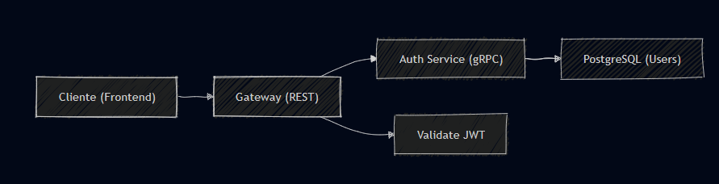

# Pipeline CI/CD - Delivery Eats System

## Descripción General

Pipeline de integración y despliegue continuo para el sistema Delivery Eats, que gestiona el build, test y deployment automático de microservicios a Google Kubernetes Engine (GKE).

## Arquitectura del Pipeline
 
  

## Etapas del Pipeline

### 1. **Build Stage**
- Construcción de imágenes Docker para cada microservicio
- Validación de sintaxis de archivos de configuración
- Compilación de código Go

### 2. **Test Stage**
- Ejecución de pruebas unitarias
- Análisis de calidad de código
- Validación de proto

### 3. **Push Stage**
- Tagging de imágenes con versión
- Push a Google Artifact Registry
- Verificación de imágenes publicadas

### 4. **Deploy Stage**
- Actualización de manifiestos de Kubernetes
- Despliegue a GKE
- Verificación de salud de servicios

---

## Variables de Entorno

### Variables Generales del Proyecto

| Variable | Descripción | Valor de Ejemplo  |
|----------|-------------|------------------|
| `PROJECT_ID` | ID del proyecto de Google Cloud | `enduring-guard-457223-c4` | 
| `REGION` | Región de GCP | `us-central1` |
| `ZONE` | Zona de GCP | `us-central1-a` |
| `CLUSTER_NAME` | Nombre del cluster de GKE | `deliver-eats-cluster` | 
| `REGISTRY` | URL del registry | `us-central1-docker.pkg.dev` | 
| `REPOSITORY_NAME` | Nombre del repositorio de imágenes | `deliver-eats-repo` | 
| `IMAGE_TAG` | Tag de la imagen | `latest` | 
| `NAMESPACE` | Namespace de Kubernetes | `deliver-eats` | 

### Variables de Servicios

#### Gateway Service
| Variable | Descripción | Valor de Ejemplo |
|----------|-------------|------------------|
| `GATEWAY_PORT` | Puerto del API Gateway | `8080` |
| `GATEWAY_IMAGE` | Nombre de imagen del gateway | `gateway` |

#### Auth Service
| Variable | Descripción | Valor de Ejemplo |
|----------|-------------|------------------|
| `AUTH_SERVICE_PORT` | Puerto del servicio de autenticación | `50051` |
| `AUTH_IMAGE` | Nombre de imagen del auth service | `auth-service` |

#### User Service
| Variable | Descripción | Valor de Ejemplo |
|----------|-------------|------------------|
| `USER_SERVICE_PORT` | Puerto del servicio de usuarios | `50052` |
| `USER_IMAGE` | Nombre de imagen del user service | `user-service` |

#### Catalog Service
| Variable | Descripción | Valor de Ejemplo |
|----------|-------------|------------------|
| `CATALOG_SERVICE_PORT` | Puerto del servicio de catálogo | `50053` |
| `CATALOG_IMAGE` | Nombre de imagen del catalog service | `catalog-service` |

#### Restaurant Service
| Variable | Descripción | Valor de Ejemplo |
|----------|-------------|------------------|
| `RESTAURANT_SERVICE_PORT` | Puerto del servicio de restaurantes | `50054` |
| `RESTAURANT_IMAGE` | Nombre de imagen del restaurant service | `restaurant-service` |

#### Order Service
| Variable | Descripción | Valor de Ejemplo |
|----------|-------------|------------------|
| `ORDER_SERVICE_PORT` | Puerto del servicio de órdenes | `50055` |
| `ORDER_IMAGE` | Nombre de imagen del order service | `order-service` |

#### Notification Service
| Variable | Descripción | Valor de Ejemplo |
|----------|-------------|------------------|
| `NOTIFICATION_SERVICE_PORT` | Puerto del servicio de notificaciones | `50056` |
| `NOTIFICATION_IMAGE` | Nombre de imagen del notification service | `notification-service` |

---

## Secrets (Información Sensible)

###  Secrets de Google Cloud Platform

| Secret | Descripción | Formato | Uso |
|--------|-------------|---------|-----|
| `GCP_SERVICE_ACCOUNT_KEY` | Credenciales de cuenta de servicio de GCP | JSON | Autenticación en GCP para CI/CD |
| `GCP_PROJECT_ID` | ID del proyecto (puede ser secret) | String | Identificación del proyecto |

### Secrets de Base de Datos

| Secret | Descripción | Valor de Ejemplo | Uso |
|--------|-------------|------------------|-----|
| `MYSQL_HOST` | Host de la base de datos MySQL | `34.61.237.171` | Conexión a BD |
| `MYSQL_PORT` | Puerto de MySQL | `3306` | Conexión a BD |
| `MYSQL_USER` | Usuario de MySQL | `delivereats` | Autenticación BD |
| `MYSQL_PASSWORD` | Contraseña de MySQL | `DeliverEats123` | Autenticación BD |
| `MYSQL_DATABASE` | Nombre de la base de datos | `auth_db` | Selección de BD |

### Secrets de Autenticación JWT

| Secret | Descripción | Valor de Ejemplo | Uso |
|--------|-------------|------------------|-----|
| `JWT_SECRET` | Clave secreta para firmar JWT | `deliver-eats-secret-key-2026` | Generación de tokens |
| `JWT_EXPIRE` | Tiempo de expiración del JWT | `7d` | Configuración de tokens |

### Secrets de Docker Registry

| Secret | Descripción | Formato | Uso |
|--------|-------------|---------|-----|
| `DOCKER_USERNAME` | Usuario de Docker Hub | String | Push a Docker Hub (opcional) |
| `DOCKER_PASSWORD` | Password de Docker Hub | String | Push a Docker Hub (opcional) |

### Secrets de Notificaciones (Email)

| Secret | Descripción | Valor de Ejemplo | Uso |
|--------|-------------|------------------|-----|
| `SMTP_HOST` | Host del servidor SMTP | `smtp.gmail.com` | Envío de emails |
| `SMTP_PORT` | Puerto SMTP | `587` | Envío de emails |
| `SMTP_USER` | Usuario del email | `noreply@delivereats.com` | Autenticación SMTP |
| `SMTP_PASSWORD` | Contraseña del email | `********` | Autenticación SMTP |

---

## Configuración del Pipeline

### GitHub Actions

Crear el archivo `.github/workflows/cicd.yml`:

```yaml
name: CI/CD Pipeline - Delivery Eats

on:
  push:
    branches: [ main, master, develop ]
  pull_request:
    branches: [ main, master ]

env:
  PROJECT_ID: ${{ secrets.GCP_PROJECT_ID }}
  REGION: us-central1
  ZONE: us-central1-a
  CLUSTER_NAME: deliver-eats-cluster
  REPOSITORY_NAME: deliver-eats-repo
  NAMESPACE: deliver-eats

jobs:
  
  # ============================================
  # JOB 1: BUILD & TEST
  # ============================================
  build-and-test:
    name: Build and Test Services
    runs-on: ubuntu-latest
    
    steps:
    - name: Checkout code
      uses: actions/checkout@v3
    
    - name: Set up Go
      uses: actions/setup-go@v4
      with:
        go-version: '1.21'
    
    - name: Run tests for all services
      run: |
        cd Practica2/Delivery-system
        # Test Auth Service
        cd auth-service && go test ./... && cd ..
        # Test Catalog Service
        cd catalog-service && go test ./... && cd ..
        # Test Order Service
        cd order-service && go test ./... && cd ..
        # Test Restaurant Service
        cd restaurant-service && go test ./... && cd ..
        # Test User Service
        cd user-service && go test ./... && cd ..
        # Test Gateway
        cd gateaway && go test ./... && cd ..
    
    - name: Build verification
      run: |
        cd Practica2/Delivery-system
        echo "Building all services..."
        cd auth-service && go build ./cmd/server && cd ..
        cd catalog-service && go build ./cmd/server && cd ..
        cd order-service && go build ./cmd/server && cd ..

  # ============================================
  # JOB 2: BUILD & PUSH DOCKER IMAGES
  # ============================================
  build-push-images:
    name: Build and Push Docker Images
    runs-on: ubuntu-latest
    needs: build-and-test
    if: github.ref == 'refs/heads/master' || github.ref == 'refs/heads/main'
    
    steps:
    - name: Checkout code
      uses: actions/checkout@v3
    
    - name: Authenticate to Google Cloud
      uses: google-github-actions/auth@v1
      with:
        credentials_json: ${{ secrets.GCP_SERVICE_ACCOUNT_KEY }}
    
    - name: Set up Cloud SDK
      uses: google-github-actions/setup-gcloud@v1
    
    - name: Configure Docker for Artifact Registry
      run: |
        gcloud auth configure-docker ${{ env.REGION }}-docker.pkg.dev
    
    - name: Build and Push Gateway
      run: |
        cd Practica2/Delivery-system/gateaway
        IMAGE_PATH="${{ env.REGION }}-docker.pkg.dev/${{ env.PROJECT_ID }}/${{ env.REPOSITORY_NAME }}/gateway:${{ github.sha }}"
        IMAGE_PATH_LATEST="${{ env.REGION }}-docker.pkg.dev/${{ env.PROJECT_ID }}/${{ env.REPOSITORY_NAME }}/gateway:latest"
        docker build -t $IMAGE_PATH -t $IMAGE_PATH_LATEST -f Dockerfile .
        docker push $IMAGE_PATH
        docker push $IMAGE_PATH_LATEST
    
    - name: Build and Push Auth Service
      run: |
        cd Practica2/Delivery-system/auth-service
        IMAGE_PATH="${{ env.REGION }}-docker.pkg.dev/${{ env.PROJECT_ID }}/${{ env.REPOSITORY_NAME }}/auth-service:${{ github.sha }}"
        IMAGE_PATH_LATEST="${{ env.REGION }}-docker.pkg.dev/${{ env.PROJECT_ID }}/${{ env.REPOSITORY_NAME }}/auth-service:latest"
        docker build -t $IMAGE_PATH -t $IMAGE_PATH_LATEST -f Dockerfile .
        docker push $IMAGE_PATH
        docker push $IMAGE_PATH_LATEST
    
    - name: Build and Push User Service
      run: |
        cd Practica2/Delivery-system/user-service
        IMAGE_PATH="${{ env.REGION }}-docker.pkg.dev/${{ env.PROJECT_ID }}/${{ env.REPOSITORY_NAME }}/user-service:${{ github.sha }}"
        IMAGE_PATH_LATEST="${{ env.REGION }}-docker.pkg.dev/${{ env.PROJECT_ID }}/${{ env.REPOSITORY_NAME }}/user-service:latest"
        docker build -t $IMAGE_PATH -t $IMAGE_PATH_LATEST -f Dockerfile .
        docker push $IMAGE_PATH
        docker push $IMAGE_PATH_LATEST
    
    - name: Build and Push Catalog Service
      run: |
        cd Practica2/Delivery-system/catalog-service
        IMAGE_PATH="${{ env.REGION }}-docker.pkg.dev/${{ env.PROJECT_ID }}/${{ env.REPOSITORY_NAME }}/catalog-service:${{ github.sha }}"
        IMAGE_PATH_LATEST="${{ env.REGION }}-docker.pkg.dev/${{ env.PROJECT_ID }}/${{ env.REPOSITORY_NAME }}/catalog-service:latest"
        docker build -t $IMAGE_PATH -t $IMAGE_PATH_LATEST -f Dockerfile .
        docker push $IMAGE_PATH
        docker push $IMAGE_PATH_LATEST
    
    - name: Build and Push Restaurant Service
      run: |
        cd Practica2/Delivery-system/restaurant-service
        IMAGE_PATH="${{ env.REGION }}-docker.pkg.dev/${{ env.PROJECT_ID }}/${{ env.REPOSITORY_NAME }}/restaurant-service:${{ github.sha }}"
        IMAGE_PATH_LATEST="${{ env.REGION }}-docker.pkg.dev/${{ env.PROJECT_ID }}/${{ env.REPOSITORY_NAME }}/restaurant-service:latest"
        docker build -t $IMAGE_PATH -t $IMAGE_PATH_LATEST -f Dockerfile .
        docker push $IMAGE_PATH
        docker push $IMAGE_PATH_LATEST
    
    - name: Build and Push Order Service
      run: |
        cd Practica2/Delivery-system/order-service
        IMAGE_PATH="${{ env.REGION }}-docker.pkg.dev/${{ env.PROJECT_ID }}/${{ env.REPOSITORY_NAME }}/order-service:${{ github.sha }}"
        IMAGE_PATH_LATEST="${{ env.REGION }}-docker.pkg.dev/${{ env.PROJECT_ID }}/${{ env.REPOSITORY_NAME }}/order-service:latest"
        docker build -t $IMAGE_PATH -t $IMAGE_PATH_LATEST -f Dockerfile .
        docker push $IMAGE_PATH
        docker push $IMAGE_PATH_LATEST
    
    - name: Build and Push Notification Service
      run: |
        cd Practica2/Delivery-system/notification-service
        IMAGE_PATH="${{ env.REGION }}-docker.pkg.dev/${{ env.PROJECT_ID }}/${{ env.REPOSITORY_NAME }}/notification-service:${{ github.sha }}"
        IMAGE_PATH_LATEST="${{ env.REGION }}-docker.pkg.dev/${{ env.PROJECT_ID }}/${{ env.REPOSITORY_NAME }}/notification-service:latest"
        docker build -t $IMAGE_PATH -t $IMAGE_PATH_LATEST -f Dockerfile .
        docker push $IMAGE_PATH
        docker push $IMAGE_PATH_LATEST

  # ============================================
  # JOB 3: DEPLOY TO GKE
  # ============================================
  deploy-to-gke:
    name: Deploy to Google Kubernetes Engine
    runs-on: ubuntu-latest
    needs: build-push-images
    if: github.ref == 'refs/heads/master' || github.ref == 'refs/heads/main'
    
    steps:
    - name: Checkout code
      uses: actions/checkout@v3
    
    - name: Authenticate to Google Cloud
      uses: google-github-actions/auth@v1
      with:
        credentials_json: ${{ secrets.GCP_SERVICE_ACCOUNT_KEY }}
    
    - name: Set up Cloud SDK
      uses: google-github-actions/setup-gcloud@v1
    
    - name: Get GKE credentials
      run: |
        gcloud container clusters get-credentials ${{ env.CLUSTER_NAME }} \
          --zone ${{ env.ZONE }} \
          --project ${{ env.PROJECT_ID }}
    
    - name: Create Kubernetes Secrets
      run: |
        kubectl create secret generic db-credentials \
          --from-literal=MYSQL_HOST="${{ secrets.MYSQL_HOST }}" \
          --from-literal=MYSQL_PORT="${{ secrets.MYSQL_PORT }}" \
          --from-literal=MYSQL_USER="${{ secrets.MYSQL_USER }}" \
          --from-literal=MYSQL_PASSWORD="${{ secrets.MYSQL_PASSWORD }}" \
          --from-literal=MYSQL_DATABASE="${{ secrets.MYSQL_DATABASE }}" \
          --from-literal=JWT_SECRET="${{ secrets.JWT_SECRET }}" \
          --from-literal=JWT_EXPIRE="${{ secrets.JWT_EXPIRE }}" \
          --namespace=${{ env.NAMESPACE }} \
          --dry-run=client -o yaml | kubectl apply -f -
    
    - name: Deploy services to GKE
      run: |
        # Aplicar manifiestos de Kubernetes
        kubectl apply -f kubernetes/ --recursive
        
        # Actualizar imágenes con el nuevo tag
        kubectl set image deployment/gateway \
          gateway=${{ env.REGION }}-docker.pkg.dev/${{ env.PROJECT_ID }}/${{ env.REPOSITORY_NAME }}/gateway:${{ github.sha }} \
          --namespace=${{ env.NAMESPACE }}
        
        kubectl set image deployment/auth-service \
          auth-service=${{ env.REGION }}-docker.pkg.dev/${{ env.PROJECT_ID }}/${{ env.REPOSITORY_NAME }}/auth-service:${{ github.sha }} \
          --namespace=${{ env.NAMESPACE }}
        
        kubectl set image deployment/user-service \
          user-service=${{ env.REGION }}-docker.pkg.dev/${{ env.PROJECT_ID }}/${{ env.REPOSITORY_NAME }}/user-service:${{ github.sha }} \
          --namespace=${{ env.NAMESPACE }}
        
        kubectl set image deployment/catalog-service \
          catalog-service=${{ env.REGION }}-docker.pkg.dev/${{ env.PROJECT_ID }}/${{ env.REPOSITORY_NAME }}/catalog-service:${{ github.sha }} \
          --namespace=${{ env.NAMESPACE }}
        
        kubectl set image deployment/restaurant-service \
          restaurant-service=${{ env.REGION }}-docker.pkg.dev/${{ env.PROJECT_ID }}/${{ env.REPOSITORY_NAME }}/restaurant-service:${{ github.sha }} \
          --namespace=${{ env.NAMESPACE }}
        
        kubectl set image deployment/order-service \
          order-service=${{ env.REGION }}-docker.pkg.dev/${{ env.PROJECT_ID }}/${{ env.REPOSITORY_NAME }}/order-service:${{ github.sha }} \
          --namespace=${{ env.NAMESPACE }}
        
        kubectl set image deployment/notification-service \
          notification-service=${{ env.REGION }}-docker.pkg.dev/${{ env.PROJECT_ID }}/${{ env.REPOSITORY_NAME }}/notification-service:${{ github.sha }} \
          --namespace=${{ env.NAMESPACE }}
    
    - name: Wait for rollout to complete
      run: |
        kubectl rollout status deployment/gateway --namespace=${{ env.NAMESPACE }}
        kubectl rollout status deployment/auth-service --namespace=${{ env.NAMESPACE }}
        kubectl rollout status deployment/user-service --namespace=${{ env.NAMESPACE }}
        kubectl rollout status deployment/catalog-service --namespace=${{ env.NAMESPACE }}
        kubectl rollout status deployment/restaurant-service --namespace=${{ env.NAMESPACE }}
        kubectl rollout status deployment/order-service --namespace=${{ env.NAMESPACE }}
        kubectl rollout status deployment/notification-service --namespace=${{ env.NAMESPACE }}
    
    - name: Verify deployment
      run: |
        kubectl get pods --namespace=${{ env.NAMESPACE }}
        kubectl get services --namespace=${{ env.NAMESPACE }}
```

---

## Configuración de Secrets en GitHub

### Pasos para configurar secrets:

1. Ir a tu repositorio en GitHub
2. Navegar a: **Settings** → **Secrets and variables** → **Actions**
3. Click en **New repository secret**
4. Agregar cada uno de los siguientes secrets:

#### Secrets Requeridos:

```
GCP_SERVICE_ACCOUNT_KEY    - (JSON completo de la cuenta de servicio)
GCP_PROJECT_ID             - enduring-guard-457223-c4
MYSQL_HOST                 - 34.61.237.171
MYSQL_PORT                 - 3306
MYSQL_USER                 - delivereats
MYSQL_PASSWORD             - DeliverEats123
MYSQL_DATABASE             - auth_db
JWT_SECRET                 - deliver-eats-secret-key-2026
JWT_EXPIRE                 - 30m
```

---

## Alternativa: GitLab CI/CD

Crear el archivo `.gitlab-ci.yml`:

```yaml
stages:
  - test
  - build
  - push
  - deploy

variables:
  PROJECT_ID: "enduring-guard-457223-c4"
  REGION: "us-central1"
  ZONE: "us-central1-a"
  CLUSTER_NAME: "deliver-eats-cluster"
  REPOSITORY_NAME: "deliver-eats-repo"
  NAMESPACE: "deliver-eats"

# ============================================
# STAGE: TEST
# ============================================
test-services:
  stage: test
  image: golang:1.21
  script:
    - cd Practica2/Delivery-system
    - cd auth-service && go test ./... && cd ..
    - cd catalog-service && go test ./... && cd ..
    - cd order-service && go test ./... && cd ..
    - cd restaurant-service && go test ./... && cd ..
    - cd user-service && go test ./... && cd ..
  only:
    - master
    - develop
    - merge_requests

# ============================================
# STAGE: BUILD
# ============================================
build-gateway:
  stage: build
  image: docker:latest
  services:
    - docker:dind
  script:
    - cd Practica2/Delivery-system/gateaway
    - docker build -t gateway:$CI_COMMIT_SHORT_SHA .
  only:
    - master

build-auth-service:
  stage: build
  image: docker:latest
  services:
    - docker:dind
  script:
    - cd Practica2/Delivery-system/auth-service
    - docker build -t auth-service:$CI_COMMIT_SHORT_SHA .
  only:
    - master

 

# ============================================
# STAGE: PUSH
# ============================================
push-images:
  stage: push
  image: google/cloud-sdk:latest
  script:
    - echo $GCP_SERVICE_ACCOUNT_KEY | gcloud auth activate-service-account --key-file=-
    - gcloud config set project $PROJECT_ID
    - gcloud auth configure-docker ${REGION}-docker.pkg.dev
    - docker tag gateway:$CI_COMMIT_SHORT_SHA ${REGION}-docker.pkg.dev/${PROJECT_ID}/${REPOSITORY_NAME}/gateway:$CI_COMMIT_SHORT_SHA
    - docker push ${REGION}-docker.pkg.dev/${PROJECT_ID}/${REPOSITORY_NAME}/gateway:$CI_COMMIT_SHORT_SHA
  only:
    - master

# ============================================
# STAGE: DEPLOY
# ============================================
deploy-to-gke:
  stage: deploy
  image: google/cloud-sdk:latest
  script:
    - echo $GCP_SERVICE_ACCOUNT_KEY | gcloud auth activate-service-account --key-file=-
    - gcloud config set project $PROJECT_ID
    - gcloud container clusters get-credentials $CLUSTER_NAME --zone $ZONE
    - kubectl apply -f kubernetes/ --recursive
    - kubectl set image deployment/gateway gateway=${REGION}-docker.pkg.dev/${PROJECT_ID}/${REPOSITORY_NAME}/gateway:$CI_COMMIT_SHORT_SHA --namespace=$NAMESPACE
  only:
    - master
  environment:
    name: production
```

---

## Creación de Service Account en GCP

Para obtener el `GCP_SERVICE_ACCOUNT_KEY`:

```bash
# 1. Crear service account
gcloud iam service-accounts create github-actions-sa \
  --display-name="GitHub Actions Service Account"

# 2. Asignar roles necesarios
gcloud projects add-iam-policy-binding $PROJECT_ID \
  --member="serviceAccount:github-actions-sa@${PROJECT_ID}.iam.gserviceaccount.com" \
  --role="roles/container.developer"

gcloud projects add-iam-policy-binding $PROJECT_ID \
  --member="serviceAccount:github-actions-sa@${PROJECT_ID}.iam.gserviceaccount.com" \
  --role="roles/artifactregistry.writer"

gcloud projects add-iam-policy-binding $PROJECT_ID \
  --member="serviceAccount:github-actions-sa@${PROJECT_ID}.iam.gserviceaccount.com" \
  --role="roles/storage.admin"

# 3. Crear key JSON
gcloud iam service-accounts keys create ~/gcp-key.json \
  --iam-account=github-actions-sa@${PROJECT_ID}.iam.gserviceaccount.com

# 4. Copiar el contenido del archivo ~/gcp-key.json y usarlo como secret
cat ~/gcp-key.json
```

---

## Triggers Automáticos

El pipeline se ejecuta automáticamente cuando:

- Se hace push a las ramas `master`, `main` o `develop`
- Se crea un Pull Request hacia `master` o `main`
- Se crea un tag de versión  

---

## Estrategias de Rollout y Rollback

### Tipos de Estrategias de Rollout

Kubernetes soporta diferentes estrategias para actualizar deployments de manera controlada y segura.

#### 1. **Rolling Update (Actualización Progresiva)**

Es la estrategia por defecto en Kubernetes. Actualiza los pods gradualmente, manteniendo la disponibilidad del servicio.

**Configuración en Deployment:**

```yaml
apiVersion: apps/v1
kind: Deployment
metadata:
  name: gateway
  namespace: deliver-eats
spec:
  replicas: 3
  strategy:
    type: RollingUpdate
    rollingUpdate:
      maxSurge: 1        # Número máximo de pods adicionales durante la actualización
      maxUnavailable: 1  # Número máximo de pods que pueden estar no disponibles
  template:
    metadata:
      labels:
        app: gateway
    spec:
      containers:
      - name: gateway
        image: us-central1-docker.pkg.dev/enduring-guard-457223-c4/deliver-eats-repo/gateway:latest
        ports:
        - containerPort: 8080
        readinessProbe:
          httpGet:
            path: /health
            port: 8080
          initialDelaySeconds: 5
          periodSeconds: 10
        livenessProbe:
          httpGet:
            path: /health
            port: 8080
          initialDelaySeconds: 15
          periodSeconds: 20
```

**Ventajas:**
- Sin downtime
- Actualización gradual
- Fácil de revertir

**Desventajas:**
- Puede tener versiones mixtas temporalmente
- Más lento que Recreate

**Cuándo usar:**
- Aplicaciones stateless
- Cuando se requiere alta disponibilidad
- Actualizaciones compatibles hacia atrás

---

#### 2. **Recreate**

Elimina todos los pods existentes antes de crear los nuevos.

**Configuración en Deployment:**

```yaml
apiVersion: apps/v1
kind: Deployment
metadata:
  name: auth-service
  namespace: deliver-eats
spec:
  replicas: 3
  strategy:
    type: Recreate
  template:
    metadata:
      labels:
        app: auth-service
    spec:
      containers:
      - name: auth-service
        image: us-central1-docker.pkg.dev/enduring-guard-457223-c4/deliver-eats-repo/auth-service:latest
```

**Ventajas:**
-Rápido y simple
-Solo una versión corriendo a la vez
-Útil para cambios de esquema de BD

**Desventajas:**
-Downtime durante la actualización
-No apto para producción de alta disponibilidad

**Cuándo usar:**
- Entornos de desarrollo/staging
- Actualizaciones que requieren que solo una versión esté activa
- Cambios incompatibles de base de datos

---


### Estrategias de Rollback

#### 1. **Rollback Automático con Kubernetes**

Kubernetes mantiene un historial de revisiones que permite hacer rollback fácilmente.

**Ver historial de revisiones:**

```bash
# Ver historial de un deployment
kubectl rollout history deployment/gateway -n deliver-eats

# Ver detalles de una revisión específica
kubectl rollout history deployment/gateway --revision=2 -n deliver-eats
```

**Hacer rollback:**

```bash
# Rollback a la revisión anterior  
kubectl rollout undo deployment/gateway -n deliver-eats

# Rollback a una revisión específica
kubectl rollout undo deployment/gateway --to-revision=3 -n deliver-eats

# Verificar el estado del rollback
kubectl rollout status deployment/gateway -n deliver-eats
```

**Configurar límite de revisiones en el Deployment:**

```yaml
apiVersion: apps/v1
kind: Deployment
metadata:
  name: gateway
  namespace: deliver-eats
spec:
  revisionHistoryLimit: 10   
  replicas: 3
   
```

---

#### 2. **Rollback Manual con Tags de Imágenes**

Cambiar manualmente la versión de la imagen a una versión anterior conocida.

```bash
# Cambiar a una versión específica anterior
kubectl set image deployment/gateway \
  gateway=us-central1-docker.pkg.dev/enduring-guard-457223-c4/deliver-eats-repo/gateway:v1.2.3 \
  -n deliver-eats

# Verificar la actualización
kubectl rollout status deployment/gateway -n deliver-eats

# Ver la imagen actual de los pods
kubectl get pods -n deliver-eats -o jsonpath='{.items[*].spec.containers[*].image}'
```
  